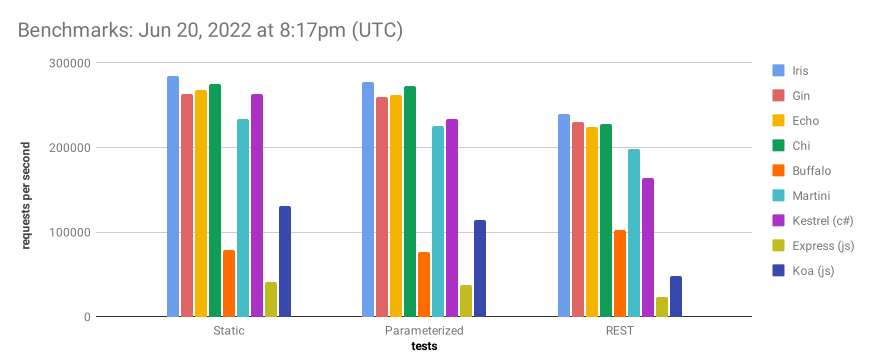

+++
title = "Iris在pkg.go.dev上的文档"
date = 2024-02-01T10:14:33+08:00
weight = 2
type = "docs"
description = ""
isCJKLanguage = true
draft = false

+++

> 原文：[https://pkg.go.dev/github.com/kataras/iris/v12](https://pkg.go.dev/github.com/kataras/iris/v12)
>
> 版本：v12.2.10
>
> 发布日期：2024.1.18
>
> github网址：[https://github.com/kataras/iris](https://github.com/kataras/iris)

###  Iris Web Framework

Iris is a fast, simple yet fully featured and very efficient web framework for Go.

​	Iris 是一个快速、简单但功能齐全且非常高效的 Go Web 框架。

It provides a beautifully expressive and easy to use foundation for your next website or API.

​	它为您的下一个网站或 API 提供了一个表达优美且易于使用的基础。

Learn what [others saying about Iris](https://www.iris-go.com/#review) and **[star](https://github.com/kataras/iris/stargazers)** this open-source project to support its potentials.

​	了解其他人对 Iris 的评价，并为这个开源项目加星以支持其潜力。


> 原文：[https://github.com/kataras/server-benchmarks](https://github.com/kataras/server-benchmarks)



``` go
package main

import "github.com/kataras/iris/v12"

func main() {
  app := iris.New()
  app.Use(iris.Compression)

  app.Get("/", func(ctx iris.Context) {
    ctx.HTML("Hello <strong>%s</strong>!", "World")
  })

  app.Listen(":8080")
}
```

As one [Go developer](https://twitter.com/dkuye/status/1532087942696554497) once said, **Iris got you covered all-round and standing strong over the years**.

​	正如一位 Go 开发者曾经说过的，Iris 多年来一直全面覆盖并保持强劲。

Some of the features Iris offers:

​	Iris 提供的部分功能：

- HTTP/2 (Push, even Embedded data)
- Middleware (Accesslog, Basicauth, CORS, gRPC, Anti-Bot hCaptcha, JWT, MethodOverride, ModRevision, Monitor, PPROF, Ratelimit, Anti-Bot reCaptcha, Recovery, RequestID, Rewrite)
- API Versioning
- Model-View-Controller
- Websockets
- gRPC
- Auto-HTTPS
- Builtin support for ngrok to put your app on the internet, the fastest way
- 内置对 ngrok 的支持，以最快的方式将您的应用放到互联网上
- Unique Router with dynamic path as parameter with standard types like :uuid, :string, :int... and the ability to create your own
- 独特的路由器，具有动态路径作为参数，具有标准类型，如： :uuid, :string, :int…以及创建您自己的能力
- Compression
- View Engines (HTML, Django, Handlebars, Pug/Jade and more)
- 视图引擎（HTML、Django、Handlebars、Pug/Jade 等）
- Create your own File Server and host your own WebDAV server
- 创建您自己的文件服务器并托管您自己的 WebDAV 服务器
- Cache
- Localization (i18n, sitemap)
- Sessions
- Rich Responses (HTML, Text, Markdown, XML, YAML, Binary, JSON, JSONP, Protocol Buffers, MessagePack, Content Negotiation, Streaming, Server-Sent Events and more)
- Response Compression (gzip, deflate, brotli, snappy, s2)
- Rich Requests (Bind URL Query, Headers, Form, Text, XML, YAML, Binary, JSON, Validation, Protocol Buffers, MessagePack and more)
- Dependency Injection (MVC, Handlers, API Routers) 依赖注入
- Testing Suite
- And the most important... you get fast answers and support from the 1st day until now - that's six full years!
- 最重要的是……从第一天到现在，您都能获得快速解答和支持——整整六年！

#### 👑 [Supporters](https://iris-go.com/donate)

With your help, we can improve Open Source web development for everyone!

​	在您的帮助下，我们可以为每个人改进开源 Web 开发！

#### 📖 Learning Iris

##### Installation

The only requirement is the [Go Programming Language](https://go.dev/dl/).

​	唯一的要求是 Go 编程语言。

###### Create a new project

```
$ mkdir myapp
$ cd myapp
$ go mod init myapp
$ go get github.com/kataras/iris/v12@latest # or @v
```

> Install on existing project
>
> ```cmd
> $ cd myapp
> $ go get github.com/kataras/iris/v12@latest
> ```
>
> Run
>
> ```cmd
> $ go mod tidy -compat=1.21 # -compat="1.21" for windows.
> $ go run .
> ```
>
> 


Iris contains extensive and thorough **[documentation](https://www.iris-go.com/docs)** making it easy to get started with the framework.

​	Iris 包含广泛而全面的文档，使您可以轻松开始使用该框架。

For a more detailed technical documentation you can head over to our [godocs](https://pkg.go.dev/github.com/kataras/iris/v12@main). And for executable code you can always visit the [./_examples](https://github.com/kataras/iris/blob/v12.2.10/_examples) repository's subdirectory.

​	有关更详细的技术文档，您可以前往我们的 godocs。对于可执行代码，您始终可以访问 ./_examples 存储库的子目录。

##### Do you like to read while traveling?

[](https://iris-go.com/#book)

You can [request](https://www.iris-go.com/#ebookDonateForm) a PDF and online access of the **Iris E-Book** (New Edition, **future v12.2.0+**) today and be participated in the development of Iris.

​	您今天可以请求 Iris 电子书（新版本，未来 v12.2.0+）的 PDF 和在线访问权限，并参与 Iris 的开发。

#### 🙌 Contributing

We'd love to see your contribution to the Iris Web Framework! For more information about contributing to the Iris project please check the [CONTRIBUTING.md](https://github.com/kataras/iris/blob/v12.2.10/CONTRIBUTING.md) file.

​	我们很乐意看到您对 Iris Web 框架的贡献！有关对 Iris 项目做出贡献的更多信息，请查看 CONTRIBUTING.md 文件。

[List of all Contributors 所有贡献者的列表](https://github.com/kataras/iris/graphs/contributors)

#### 🛡 Security Vulnerabilities

If you discover a security vulnerability within Iris, please send an e-mail to [iris-go@outlook.com](mailto:iris-go@outlook.com). All security vulnerabilities will be promptly addressed.

​	如果您在 Iris 中发现安全漏洞，请发送电子邮件至 iris-go@outlook.com。所有安全漏洞都将得到迅速解决。

#### 📝 License

This project is licensed under the [BSD 3-clause license](https://github.com/kataras/iris/blob/v12.2.10/LICENSE), just like the Go project itself.

​	该项目采用 BSD 3 条款许可证，就像 Go 项目本身一样。

The project name "Iris" was inspired by the Greek mythology.

​	项目名称“Iris”的灵感来自希腊神话。

### Overview 

- [Current Version](https://pkg.go.dev/github.com/kataras/iris/v12#hdr-Current_Version)
- [Installation](https://pkg.go.dev/github.com/kataras/iris/v12#hdr-Installation)

Package iris implements the highest realistic performance, easy to learn Go web framework. Iris provides a beautifully expressive and easy to use foundation for your next website, API, or distributed app. Low-level handlers compatible with `net/http` and high-level fastest MVC implementation and handlers dependency injection. Easy to learn for new gophers and advanced features for experienced, it goes as far as you dive into it!

​	Package iris 实现了最高实际性能，易于学习的 Go Web 框架。Iris 为您的下一个网站、API 或分布式应用程序提供了一个美观、富有表现力和易于使用的基础。与 `net/http` 兼容的低级处理程序以及高级最快的 MVC 实现和处理程序依赖项注入。对于新手来说很容易学习，对于有经验的人来说具有高级功能，它会随着您的深入学习而不断深入！

Source code and other details for the project are available at GitHub:

​	项目源代码和其他详细信息可在 GitHub 上获得：

```
https://github.com/kataras/iris
```

#### Current Version 

12.2.10

#### Installation 

The only requirement is the Go Programming Language, at least version 1.21.

​	唯一的要求是 Go 编程语言，至少为 1.21 版。

```
$ go get github.com/kataras/iris/v12@latest
```

Wiki:

​	Wiki：

```
https://www.iris-go.com/#ebookDonateForm
```

Examples:

​	示例：

```
https://github.com/kataras/iris/tree/main/_examples
```

Middleware:

​	中间件：

```
https://github.com/kataras/iris/tree/main/middleware
https://github.com/iris-contrib/middleware
```

Home Page:

​	主页：

```
https://iris-go.com
```


### 常量

[View Source](https://github.com/kataras/iris/blob/v12.2.10/aliases.go#L32)

``` go
const (
	SameSiteDefaultMode = http.SameSiteDefaultMode
	SameSiteLaxMode     = http.SameSiteLaxMode
	SameSiteStrictMode  = http.SameSiteStrictMode
	SameSiteNoneMode    = http.SameSiteNoneMode
)
```

SameSite attributes. ​	SameSite 属性。

[View Source](https://github.com/kataras/iris/blob/v12.2.10/aliases.go#L221)

``` go
const (
	// RouteOverride replaces an existing route with the new one, the default rule.
	RouteOverride = router.RouteOverride
	// RouteSkip keeps the original route and skips the new one.
	RouteSkip = router.RouteSkip
	// RouteError log when a route already exists, shown after the `Build` state,
	// server never starts.
	RouteError = router.RouteError
	// RouteOverlap will overlap the new route to the previous one.
	// If the route stopped and its response can be reset then the new route will be execute.
	RouteOverlap = router.RouteOverlap
)
```

Constants for input argument at `router.RouteRegisterRule`. See `Party#SetRegisterRule`. ​	`router.RouteRegisterRule` 中的输入参数常量。请参阅 `Party#SetRegisterRule`。

[View Source](https://github.com/kataras/iris/blob/v12.2.10/aliases.go#L236)

``` go
const (
	ReferrerInvalid  = context.ReferrerInvalid
	ReferrerIndirect = context.ReferrerIndirect
	ReferrerDirect   = context.ReferrerDirect
	ReferrerEmail    = context.ReferrerEmail
	ReferrerSearch   = context.ReferrerSearch
	ReferrerSocial   = context.ReferrerSocial

	ReferrerNotGoogleSearch     = context.ReferrerNotGoogleSearch
	ReferrerGoogleOrganicSearch = context.ReferrerGoogleOrganicSearch
	ReferrerGoogleAdwords       = context.ReferrerGoogleAdwords
)
```

Contains the enum values of the `Context.GetReferrer()` method, shortcuts of the context subpackage. ​	包含 `Context.GetReferrer()` 方法的枚举值，上下文子包的快捷方式。

[View Source](https://github.com/kataras/iris/blob/v12.2.10/aliases.go#L645)

``` go
const (
	MethodGet     = http.MethodGet
	MethodPost    = http.MethodPost
	MethodPut     = http.MethodPut
	MethodDelete  = http.MethodDelete
	MethodConnect = http.MethodConnect
	MethodHead    = http.MethodHead
	MethodPatch   = http.MethodPatch
	MethodOptions = http.MethodOptions
	MethodTrace   = http.MethodTrace
	// MethodNone is an iris-specific "virtual" method
	// to store the "offline" routes.
	MethodNone = router.MethodNone
)
```

HTTP Methods copied from `net/http`. ​	从 `net/http` 复制的 HTTP 方法。

[View Source](https://github.com/kataras/iris/blob/v12.2.10/aliases.go#L663)

``` go
const (
	StatusContinue           = http.StatusContinue           // RFC 7231, 6.2.1
	StatusSwitchingProtocols = http.StatusSwitchingProtocols // RFC 7231, 6.2.2
	StatusProcessing         = http.StatusProcessing         // RFC 2518, 10.1
	StatusEarlyHints         = http.StatusEarlyHints         // RFC 8297

	StatusOK                   = http.StatusOK                   // RFC 7231, 6.3.1
	StatusCreated              = http.StatusCreated              // RFC 7231, 6.3.2
	StatusAccepted             = http.StatusAccepted             // RFC 7231, 6.3.3
	StatusNonAuthoritativeInfo = http.StatusNonAuthoritativeInfo // RFC 7231, 6.3.4
	StatusNoContent            = http.StatusNoContent            // RFC 7231, 6.3.5
	StatusResetContent         = http.StatusResetContent         // RFC 7231, 6.3.6
	StatusPartialContent       = http.StatusPartialContent       // RFC 7233, 4.1
	StatusMultiStatus          = http.StatusMultiStatus          // RFC 4918, 11.1
	StatusAlreadyReported      = http.StatusAlreadyReported      // RFC 5842, 7.1
	StatusIMUsed               = http.StatusIMUsed               // RFC 3229, 10.4.1

	StatusMultipleChoices  = http.StatusMultipleChoices  // RFC 7231, 6.4.1
	StatusMovedPermanently = http.StatusMovedPermanently // RFC 7231, 6.4.2
	StatusFound            = http.StatusFound            // RFC 7231, 6.4.3
	StatusSeeOther         = http.StatusSeeOther         // RFC 7231, 6.4.4
	StatusNotModified      = http.StatusNotModified      // RFC 7232, 4.1
	StatusUseProxy         = http.StatusUseProxy         // RFC 7231, 6.4.5

	StatusTemporaryRedirect = http.StatusTemporaryRedirect // RFC 7231, 6.4.7
	StatusPermanentRedirect = http.StatusPermanentRedirect // RFC 7538, 3

	StatusBadRequest                   = http.StatusBadRequest                   // RFC 7231, 6.5.1
	StatusUnauthorized                 = http.StatusUnauthorized                 // RFC 7235, 3.1
	StatusPaymentRequired              = http.StatusPaymentRequired              // RFC 7231, 6.5.2
	StatusForbidden                    = http.StatusForbidden                    // RFC 7231, 6.5.3
	StatusNotFound                     = http.StatusNotFound                     // RFC 7231, 6.5.4
	StatusMethodNotAllowed             = http.StatusMethodNotAllowed             // RFC 7231, 6.5.5
	StatusNotAcceptable                = http.StatusNotAcceptable                // RFC 7231, 6.5.6
	StatusProxyAuthRequired            = http.StatusProxyAuthRequired            // RFC 7235, 3.2
	StatusRequestTimeout               = http.StatusRequestTimeout               // RFC 7231, 6.5.7
	StatusConflict                     = http.StatusConflict                     // RFC 7231, 6.5.8
	StatusGone                         = http.StatusGone                         // RFC 7231, 6.5.9
	StatusLengthRequired               = http.StatusLengthRequired               // RFC 7231, 6.5.10
	StatusPreconditionFailed           = http.StatusPreconditionFailed           // RFC 7232, 4.2
	StatusRequestEntityTooLarge        = http.StatusRequestEntityTooLarge        // RFC 7231, 6.5.11
	StatusRequestURITooLong            = http.StatusRequestURITooLong            // RFC 7231, 6.5.12
	StatusUnsupportedMediaType         = http.StatusUnsupportedMediaType         // RFC 7231, 6.5.13
	StatusRequestedRangeNotSatisfiable = http.StatusRequestedRangeNotSatisfiable // RFC 7233, 4.4
	StatusExpectationFailed            = http.StatusExpectationFailed            // RFC 7231, 6.5.14
	StatusTeapot                       = http.StatusTeapot                       // RFC 7168, 2.3.3
	StatusMisdirectedRequest           = http.StatusMisdirectedRequest           // RFC 7540, 9.1.2
	StatusUnprocessableEntity          = http.StatusUnprocessableEntity          // RFC 4918, 11.2
	StatusLocked                       = http.StatusLocked                       // RFC 4918, 11.3
	StatusFailedDependency             = http.StatusFailedDependency             // RFC 4918, 11.4
	StatusTooEarly                     = http.StatusTooEarly                     // RFC 8470, 5.2.
	StatusUpgradeRequired              = http.StatusUpgradeRequired              // RFC 7231, 6.5.15
	StatusPreconditionRequired         = http.StatusPreconditionRequired         // RFC 6585, 3
	StatusTooManyRequests              = http.StatusTooManyRequests              // RFC 6585, 4
	StatusRequestHeaderFieldsTooLarge  = http.StatusRequestHeaderFieldsTooLarge  // RFC 6585, 5
	StatusUnavailableForLegalReasons   = http.StatusUnavailableForLegalReasons   // RFC 7725, 3
	// Unofficial Client Errors.
	StatusPageExpired                      = context.StatusPageExpired
	StatusBlockedByWindowsParentalControls = context.StatusBlockedByWindowsParentalControls
	StatusInvalidToken                     = context.StatusInvalidToken
	StatusTokenRequired                    = context.StatusTokenRequired
	//
	StatusInternalServerError           = http.StatusInternalServerError           // RFC 7231, 6.6.1
	StatusNotImplemented                = http.StatusNotImplemented                // RFC 7231, 6.6.2
	StatusBadGateway                    = http.StatusBadGateway                    // RFC 7231, 6.6.3
	StatusServiceUnavailable            = http.StatusServiceUnavailable            // RFC 7231, 6.6.4
	StatusGatewayTimeout                = http.StatusGatewayTimeout                // RFC 7231, 6.6.5
	StatusHTTPVersionNotSupported       = http.StatusHTTPVersionNotSupported       // RFC 7231, 6.6.6
	StatusVariantAlsoNegotiates         = http.StatusVariantAlsoNegotiates         // RFC 2295, 8.1
	StatusInsufficientStorage           = http.StatusInsufficientStorage           // RFC 4918, 11.5
	StatusLoopDetected                  = http.StatusLoopDetected                  // RFC 5842, 7.2
	StatusNotExtended                   = http.StatusNotExtended                   // RFC 2774, 7
	StatusNetworkAuthenticationRequired = http.StatusNetworkAuthenticationRequired // RFC 6585, 6
	// Unofficial Server Errors.
	StatusBandwidthLimitExceeded = context.StatusBandwidthLimitExceeded
	StatusInvalidSSLCertificate  = context.StatusInvalidSSLCertificate
	StatusSiteOverloaded         = context.StatusSiteOverloaded
	StatusSiteFrozen             = context.StatusSiteFrozen
	StatusNetworkReadTimeout     = context.StatusNetworkReadTimeout
)
```

HTTP status codes as registered with IANA. See: http://www.iana.org/assignments/http-status-codes/http-status-codes.xhtml. Raw Copy from the future(tip) net/http std package in order to recude the import path of "net/http" for the users. ​	在 IANA 注册的 HTTP 状态代码。请参阅：http://www.iana.org/assignments/http-status-codes/http-status-codes.xhtml。从未来的 (tip) net/http std 包中进行原始复制，以便为用户减少“net/http”的导入路径。

[View Source](https://github.com/kataras/iris/blob/v12.2.10/iris.go#L45)

``` go
const (
	B = 1 << (10 * iota)
	KB
	MB
	GB
	TB
	PB
	EB
)
```

Byte unit helpers. ​	字节单位帮助器。

[View Source](https://github.com/kataras/iris/blob/v12.2.10/aliases.go#L251)

``` go
const NoLayout = view.NoLayout
```

NoLayout to disable layout for a particular template file A shortcut for the `view#NoLayout`. ​	NoLayout 用于禁用特定模板文件的布局 `view#NoLayout` 的快捷方式。

[View Source](https://github.com/kataras/iris/blob/v12.2.10/iris.go#L42)

``` go
const Version = "12.2.10"
```

Version is the current version of the Iris Web Framework. ​	版本是 Iris Web 框架的当前版本。

### 变量

[View Source](https://github.com/kataras/iris/blob/v12.2.10/aliases.go#L21)

``` go
var (
	// BuildRevision holds the vcs commit id information of the program's build.
	// To display the Iris' version please use the iris.Version constant instead.
	// Available at go version 1.18+
	BuildRevision = context.BuildRevision
	// BuildTime holds the vcs commit time information of the program's build.
	// Available at go version 1.18+
	BuildTime = context.BuildTime
)
```

[View Source](https://github.com/kataras/iris/blob/v12.2.10/aliases.go#L253)

``` go
var (
	// HTML view engine.
	// Shortcut of the view.HTML.
	HTML = view.HTML
	// Blocks view engine.
	// Can be used as a faster alternative of the HTML engine.
	// Shortcut of the view.Blocks.
	Blocks = view.Blocks
	// Django view engine.
	// Shortcut of the view.Django.
	Django = view.Django
	// Handlebars view engine.
	// Shortcut of the view.Handlebars.
	Handlebars = view.Handlebars
	// Pug view engine.
	// Shortcut of the view.Pug.
	Pug = view.Pug
	// Jet view engine.
	// Shortcut of the view.Jet.
	Jet = view.Jet
	// Ace view engine.
	// Shortcut of the view.Ace.
	Ace = view.Ace
)
```

[View Source](https://github.com/kataras/iris/blob/v12.2.10/aliases.go#L358)

``` go
var (
	// AllowQuerySemicolons returns a middleware that serves requests by converting any
	// unescaped semicolons(;) in the URL query to ampersands(&).
	//
	// This restores the pre-Go 1.17 behavior of splitting query parameters on both
	// semicolons and ampersands.
	// (See golang.org/issue/25192 and https://github.com/kataras/iris/issues/1875).
	// Note that this behavior doesn't match that of many proxies,
	// and the mismatch can lead to security issues.
	//
	// AllowQuerySemicolons should be invoked before any Context read query or
	// form methods are called.
	//
	// To skip HTTP Server logging for this type of warning:
	// app.Listen/Run(..., iris.WithoutServerError(iris.ErrURLQuerySemicolon)).
	AllowQuerySemicolons = func(ctx Context) {

		r := ctx.Request()
		if s := r.URL.RawQuery; strings.Contains(s, ";") {
			r2 := new(http.Request)
			*r2 = *r
			r2.URL = new(url.URL)
			*r2.URL = *r.URL
			r2.URL.RawQuery = strings.ReplaceAll(s, ";", "&")
			ctx.ResetRequest(r2)
		}

		ctx.Next()
	}

	// MatchImagesAssets is a simple regex expression
	// that can be passed to the DirOptions.Cache.CompressIgnore field
	// in order to skip compression on already-compressed file types
	// such as images and pdf.
	MatchImagesAssets = regexp.MustCompile("((.*).pdf|(.*).jpg|(.*).jpeg|(.*).gif|(.*).tif|(.*).tiff)$")
	// MatchCommonAssets is a simple regex expression which
	// can be used on `DirOptions.PushTargetsRegexp`.
	// It will match and Push
	// all available js, css, font and media files.
	// Ideal for Single Page Applications.
	MatchCommonAssets = regexp.MustCompile("((.*).js|(.*).css|(.*).ico|(.*).png|(.*).ttf|(.*).svg|(.*).webp|(.*).gif)$")
)
```

[View Source](https://github.com/kataras/iris/blob/v12.2.10/aliases.go#L401)

``` go
var (
	// RegisterOnInterrupt registers a global function to call when CTRL+C/CMD+C pressed or a unix kill command received.
	//
	// A shortcut for the `host#RegisterOnInterrupt`.
	RegisterOnInterrupt = host.RegisterOnInterrupt

	// LimitRequestBodySize is a middleware which sets a request body size limit
	// for all next handlers in the chain.
	//
	// A shortcut for the `context#LimitRequestBodySize`.
	LimitRequestBodySize = context.LimitRequestBodySize
	// NewConditionalHandler returns a single Handler which can be registered
	// as a middleware.
	// Filter is just a type of Handler which returns a boolean.
	// Handlers here should act like middleware, they should contain `ctx.Next` to proceed
	// to the next handler of the chain. Those "handlers" are registered to the per-request context.
	//
	//
	// It checks the "filter" and if passed then
	// it, correctly, executes the "handlers".
	//
	// If passed, this function makes sure that the Context's information
	// about its per-request handler chain based on the new "handlers" is always updated.
	//
	// If not passed, then simply the Next handler(if any) is executed and "handlers" are ignored.
	// Example can be found at: _examples/routing/conditional-chain.
	//
	// A shortcut for the `context#NewConditionalHandler`.
	NewConditionalHandler = context.NewConditionalHandler
	// FileServer returns a Handler which serves files from a specific system, phyisical, directory
	// or an embedded one.
	// The first parameter is the directory, relative to the executable program.
	// The second optional parameter is any optional settings that the caller can use.
	//
	// See `Party#HandleDir` too.
	// Examples can be found at: https://github.com/kataras/iris/tree/main/_examples/file-server
	// A shortcut for the `router.FileServer`.
	FileServer = router.FileServer
	// DirList is the default `DirOptions.DirList` field.
	// Read more at: `core/router.DirList`.
	DirList = router.DirList
	// DirListRich can be passed to `DirOptions.DirList` field
	// to override the default file listing appearance.
	// Read more at: `core/router.DirListRich`.
	DirListRich = router.DirListRich
	// StripPrefix returns a handler that serves HTTP requests
	// by removing the given prefix from the request URL's Path
	// and invoking the handler h. StripPrefix handles a
	// request for a path that doesn't begin with prefix by
	// replying with an HTTP 404 not found error.
	//
	// Usage:
	// fileserver := iris.FileServer("./static_files", DirOptions {...})
	// h := iris.StripPrefix("/static", fileserver)
	// app.Get("/static/{file:path}", h)
	// app.Head("/static/{file:path}", h)
	StripPrefix = router.StripPrefix
	// FromStd converts native http.Handler, http.HandlerFunc & func(w, r, next) to context.Handler.
	//
	// Supported form types:
	// 		 .FromStd(h http.Handler)
	// 		 .FromStd(func(w http.ResponseWriter, r *http.Request))
	// 		 .FromStd(func(w http.ResponseWriter, r *http.Request, next http.HandlerFunc))
	//
	// A shortcut for the `handlerconv#FromStd`.
	FromStd = handlerconv.FromStd
	// Cache is a middleware providing server-side cache functionalities
	// to the next handlers, can be used as: `app.Get("/", iris.Cache, aboutHandler)`.
	// It should be used after Static methods.
	// See `iris#Cache304` for an alternative, faster way.
	//
	// Examples can be found at: https://github.com/kataras/iris/tree/main/_examples/#caching
	Cache = cache.Handler
	// NoCache is a middleware which overrides the Cache-Control, Pragma and Expires headers
	// in order to disable the cache during the browser's back and forward feature.
	//
	// A good use of this middleware is on HTML routes; to refresh the page even on "back" and "forward" browser's arrow buttons.
	//
	// See `iris#StaticCache` for the opposite behavior.
	//
	// A shortcut of the `cache#NoCache`
	NoCache = cache.NoCache
	// StaticCache middleware for caching static files by sending the "Cache-Control" and "Expires" headers to the client.
	// It accepts a single input parameter, the "cacheDur", a time.Duration that it's used to calculate the expiration.
	//
	// If "cacheDur" <=0 then it returns the `NoCache` middleware instaed to disable the caching between browser's "back" and "forward" actions.
	//
	// Usage: `app.Use(iris.StaticCache(24 * time.Hour))` or `app.Use(iris.StaticCache(-1))`.
	// A middleware, which is a simple Handler can be called inside another handler as well, example:
	// cacheMiddleware := iris.StaticCache(...)
	// func(ctx iris.Context){
	//  cacheMiddleware(ctx)
	//  [...]
	// }
	//
	// A shortcut of the `cache#StaticCache`
	StaticCache = cache.StaticCache
	// Cache304 sends a `StatusNotModified` (304) whenever
	// the "If-Modified-Since" request header (time) is before the
	// time.Now() + expiresEvery (always compared to their UTC values).
	// Use this, which is a shortcut of the, `chache#Cache304` instead of the "github.com/kataras/iris/v12/cache" or iris.Cache
	// for better performance.
	// Clients that are compatible with the http RCF (all browsers are and tools like postman)
	// will handle the caching.
	// The only disadvantage of using that instead of server-side caching
	// is that this method will send a 304 status code instead of 200,
	// So, if you use it side by side with other micro services
	// you have to check for that status code as well for a valid response.
	//
	// Developers are free to extend this method's behavior
	// by watching system directories changes manually and use of the `ctx.WriteWithExpiration`
	// with a "modtime" based on the file modified date,
	// similar to the `HandleDir`(which sends status OK(200) and browser disk caching instead of 304).
	//
	// A shortcut of the `cache#Cache304`.
	Cache304 = cache.Cache304

	// CookieOverride is a CookieOption which overrides the cookie explicitly to the given "cookie".
	//
	// A shortcut for the `context#CookieOverride`.
	CookieOverride = context.CookieOverride
	// CookieDomain is a CookieOption which sets the cookie's Domain field.
	// If empty then the current domain is used.
	//
	// A shortcut for the `context#CookieDomain`.
	CookieDomain = context.CookieDomain
	// CookieAllowReclaim accepts the Context itself.
	// If set it will add the cookie to (on `CookieSet`, `CookieSetKV`, `CookieUpsert`)
	// or remove the cookie from (on `CookieRemove`) the Request object too.
	//
	// A shortcut for the `context#CookieAllowReclaim`.
	CookieAllowReclaim = context.CookieAllowReclaim
	// CookieAllowSubdomains set to the Cookie Options
	// in order to allow subdomains to have access to the cookies.
	// It sets the cookie's Domain field (if was empty) and
	// it also sets the cookie's SameSite to lax mode too.
	//
	// A shortcut for the `context#CookieAllowSubdomains`.
	CookieAllowSubdomains = context.CookieAllowSubdomains
	// CookieSameSite sets a same-site rule for cookies to set.
	// SameSite allows a server to define a cookie attribute making it impossible for
	// the browser to send this cookie along with cross-site requests. The main
	// goal is to mitigate the risk of cross-origin information leakage, and provide
	// some protection against cross-site request forgery attacks.
	//
	// See https://tools.ietf.org/html/draft-ietf-httpbis-cookie-same-site-00 for details.
	//
	// A shortcut for the `context#CookieSameSite`.
	CookieSameSite = context.CookieSameSite
	// CookieSecure sets the cookie's Secure option if the current request's
	// connection is using TLS. See `CookieHTTPOnly` too.
	//
	// A shortcut for the `context#CookieSecure`.
	CookieSecure = context.CookieSecure
	// CookieHTTPOnly is a `CookieOption`.
	// Use it to set the cookie's HttpOnly field to false or true.
	// HttpOnly field defaults to true for `RemoveCookie` and `SetCookieKV`.
	//
	// A shortcut for the `context#CookieHTTPOnly`.
	CookieHTTPOnly = context.CookieHTTPOnly
	// CookiePath is a `CookieOption`.
	// Use it to change the cookie's Path field.
	//
	// A shortcut for the `context#CookiePath`.
	CookiePath = context.CookiePath
	// CookieCleanPath is a `CookieOption`.
	// Use it to clear the cookie's Path field, exactly the same as `CookiePath("")`.
	//
	// A shortcut for the `context#CookieCleanPath`.
	CookieCleanPath = context.CookieCleanPath
	// CookieExpires is a `CookieOption`.
	// Use it to change the cookie's Expires and MaxAge fields by passing the lifetime of the cookie.
	//
	// A shortcut for the `context#CookieExpires`.
	CookieExpires = context.CookieExpires
	// CookieEncoding accepts a value which implements `Encode` and `Decode` methods.
	// It calls its `Encode` on `Context.SetCookie, UpsertCookie, and SetCookieKV` methods.
	// And on `Context.GetCookie` method it calls its `Decode`.
	//
	// A shortcut for the `context#CookieEncoding`.
	CookieEncoding = context.CookieEncoding

	// IsErrEmptyJSON reports whether the given "err" is caused by a
	// Context.ReadJSON call when the request body
	// didn't start with { or it was totally empty.
	IsErrEmptyJSON = context.IsErrEmptyJSON
	// IsErrPath can be used at `context#ReadForm` and `context#ReadQuery`.
	// It reports whether the incoming error is type of `schema.ErrPath`,
	// which can be ignored when server allows unknown post values to be sent by the client.
	//
	// A shortcut for the `context#IsErrPath`.
	IsErrPath = context.IsErrPath
	// IsErrCanceled reports whether the "err" is caused by a cancellation or timeout.
	//
	// A shortcut for the `context#IsErrCanceled`.
	IsErrCanceled = context.IsErrCanceled
	// ErrEmptyForm is the type error which API users can make use of
	// to check if a form was empty on `Context.ReadForm`.
	//
	// A shortcut for the `context#ErrEmptyForm`.
	ErrEmptyForm = context.ErrEmptyForm
	// ErrEmptyFormField reports whether if form value is empty.
	// An alias of `context.ErrEmptyFormField`.
	ErrEmptyFormField = context.ErrEmptyFormField
	// ErrNotFound reports whether a key was not found, useful
	// on post data, versioning feature and others.
	// An alias of `context.ErrNotFound`.
	ErrNotFound = context.ErrNotFound
	// NewProblem returns a new Problem.
	// Head over to the `Problem` type godoc for more.
	//
	// A shortcut for the `context#NewProblem`.
	NewProblem = context.NewProblem
	// XMLMap wraps a map[string]interface{} to compatible xml marshaler,
	// in order to be able to render maps as XML on the `Context.XML` method.
	//
	// Example: `Context.XML(XMLMap("Root", map[string]interface{}{...})`.
	//
	// A shortcut for the `context#XMLMap`.
	XMLMap = context.XMLMap
	// ErrStopExecution if returned from a hero middleware or a request-scope dependency
	// stops the handler's execution, see _examples/dependency-injection/basic/middleware.
	ErrStopExecution = hero.ErrStopExecution
	// ErrHijackNotSupported is returned by the Hijack method to
	// indicate that Hijack feature is not available.
	//
	// A shortcut for the `context#ErrHijackNotSupported`.
	ErrHijackNotSupported = context.ErrHijackNotSupported
	// ErrPushNotSupported is returned by the Push method to
	// indicate that HTTP/2 Push support is not available.
	//
	// A shortcut for the `context#ErrPushNotSupported`.
	ErrPushNotSupported = context.ErrPushNotSupported
	// PrivateError accepts an error and returns a wrapped private one.
	// A shortcut for the `context#PrivateError` function.
	PrivateError = context.PrivateError

	// TrimParamFilePart is a middleware which trims any last part after a dot (.) character
	// of the current route's dynamic path parameters.
	// A shortcut for the `context#TrimParamFilePart` function.
	TrimParamFilePart Handler = context.TrimParamFilePart
)
```

[View Source](https://github.com/kataras/iris/blob/v12.2.10/aliases.go#L744)

``` go
var (
	// StatusText returns a text for the HTTP status code. It returns the empty
	// string if the code is unknown.
	//
	// Shortcut for core/router#StatusText.
	StatusText = context.StatusText
	// RegisterMethods adds custom http methods to the "AllMethods" list.
	// Use it on initialization of your program.
	//
	// Shortcut for core/router#RegisterMethods.
	RegisterMethods = router.RegisterMethods

	// WebDAVMethods contains a list of WebDAV HTTP Verbs.
	// Register using RegiterMethods package-level function or
	// through HandleMany party-level method.
	WebDAVMethods = []string{
		MethodGet,
		MethodHead,
		MethodPatch,
		MethodPut,
		MethodPost,
		MethodDelete,
		MethodOptions,
		MethodConnect,
		MethodTrace,
		"MKCOL",
		"COPY",
		"MOVE",
		"LOCK",
		"UNLOCK",
		"PROPFIND",
		"PROPPATCH",
		"LINK",
		"UNLINK",
		"PURGE",
		"VIEW",
	}
)
```

[View Source](https://github.com/kataras/iris/blob/v12.2.10/iris.go#L881)

``` go
var (
	// TLSNoRedirect is a `host.Configurator` which can be passed as last argument
	// to the `TLS` runner function. It disables the automatic
	// registration of redirection from "http://" to "https://" requests.
	// Applies only to the `TLS` runner.
	// See `AutoTLSNoRedirect` to register a custom fallback server for `AutoTLS` runner.
	TLSNoRedirect = func(su *host.Supervisor) { su.NoRedirect() }
	// AutoTLSNoRedirect is a `host.Configurator`.
	// It registers a fallback HTTP/1.1 server for the `AutoTLS` one.
	// The function accepts the letsencrypt wrapper and it
	// should return a valid instance of http.Server which its handler should be the result
	// of the "acmeHandler" wrapper.
	// Usage:
	//	 getServer := func(acme func(http.Handler) http.Handler) *http.Server {
	//	     srv := &http.Server{Handler: acme(yourCustomHandler), ...otherOptions}
	//	     go srv.ListenAndServe()
	//	     return srv
	//   }
	//   app.Run(iris.AutoTLS(":443", "example.com example2.com", "mail@example.com", getServer))
	//
	// Note that if Server.Handler is nil then the server is automatically ran
	// by the framework and the handler set to automatic redirection, it's still
	// a valid option when the caller wants just to customize the server's fields (except Addr).
	// With this host configurator the caller can customize the server
	// that letsencrypt relies to perform the challenge.
	// LetsEncrypt Certification Manager relies on http://example.com/.well-known/acme-challenge/<TOKEN>.
	AutoTLSNoRedirect = func(getFallbackServer func(acmeHandler func(fallback http.Handler) http.Handler) *http.Server) host.Configurator {
		return func(su *host.Supervisor) {
			su.NoRedirect()
			su.Fallback = getFallbackServer
		}
	}
)
```

[View Source](https://github.com/kataras/iris/blob/v12.2.10/iris.go#L1004)

``` go
var (
	// ErrServerClosed is logged by the standard net/http server when the server is terminated.
	// Ignore it by passing this error to the `iris.WithoutServerError` configurator
	// on `Application.Run/Listen` method.
	//
	// An alias of the `http#ErrServerClosed`.
	ErrServerClosed = http.ErrServerClosed

	// ErrURLQuerySemicolon is logged by the standard net/http server when
	// the request contains a semicolon (;) wihch, after go1.17 it's not used as a key-value separator character.
	//
	// Ignore it by passing this error to the `iris.WithoutServerError` configurator
	// on `Application.Run/Listen` method.
	//
	// An alias of the `http#ErrServerClosed`.
	ErrURLQuerySemicolon = errors.New("http: URL query contains semicolon, which is no longer a supported separator; parts of the query may be stripped when parsed; see golang.org/issue/25192")
)
```

[View Source](https://github.com/kataras/iris/blob/v12.2.10/configuration.go#L1390)

``` go
var DefaultTimeoutMessage = `` /* 235-byte string literal not displayed */
```

DefaultTimeoutMessage is the default timeout message which is rendered on expired handlers when timeout handler is registered (see Timeout configuration field). ​	DefaultTimeoutMessage 是在注册超时处理程序时在过期的处理程序上呈现的默认超时消息（请参阅超时配置字段）。

[View Source](https://github.com/kataras/iris/blob/v12.2.10/configuration.go#L322)

``` go
var WithDynamicHandler = func(app *Application) {
	app.config.EnableDynamicHandler = true
}
```

WithDynamicHandler enables for dynamic routing by setting the `EnableDynamicHandler` to true. ​	WithDynamicHandler 通过将 `EnableDynamicHandler` 设置为 true 来启用动态路由。

See `Configuration`. ​	请参阅 `Configuration`。

[View Source](https://github.com/kataras/iris/blob/v12.2.10/configuration.go#L343)

``` go
var WithEasyJSON = func(app *Application) {
	app.config.EnableEasyJSON = true
}
```

WithEasyJSON enables the fast easy json marshaler on Context.JSON method. ​	WithEasyJSON 在 Context.JSON 方法上启用快速简便的 json 编码器。

See `Configuration` for more. ​	有关更多信息，请参阅 `Configuration`。

[View Source](https://github.com/kataras/iris/blob/v12.2.10/configuration.go#L299)

``` go
var WithEmptyFormError = func(app *Application) {
	app.config.FireEmptyFormError = true
}
```

WithEmptyFormError enables the setting `FireEmptyFormError`. ​	WithEmptyFormError 启用设置 `FireEmptyFormError`。

See `Configuration`. ​	请参阅 `Configuration`。

[View Source](https://github.com/kataras/iris/blob/v12.2.10/configuration.go#L350)

``` go
var WithFireMethodNotAllowed = func(app *Application) {
	app.config.FireMethodNotAllowed = true
}
```

WithFireMethodNotAllowed enables the FireMethodNotAllowed setting. ​	WithFireMethodNotAllowed 启用 FireMethodNotAllowed 设置。

See `Configuration`. ​	请参阅 `Configuration`。

[View Source](https://github.com/kataras/iris/blob/v12.2.10/configuration.go#L179)

``` go
var WithGlobalConfiguration = func(app *Application) {
	app.Configure(WithConfiguration(YAML(globalConfigurationKeyword)))
}
```

WithGlobalConfiguration will load the global yaml configuration file from the home directory and it will set/override the whole app's configuration to that file's contents. The global configuration file can be modified by user and be used by multiple iris instances. ​	WithGlobalConfiguration 将从主目录加载全局 yaml 配置文件，并将整个应用程序的配置设置/覆盖为该文件的内容。全局配置文件可以由用户修改，并可供多个 iris 实例使用。

This is useful when we run multiple iris servers that share the same configuration, even with custom values at its "Other" field. ​	当我们运行多个共享相同配置的 iris 服务器时，即使其“其他”字段具有自定义值，这也很有用。

Usage: `app.Configure(iris.WithGlobalConfiguration)` or `app.Run([iris.Runner](https://pkg.go.dev/github.com/kataras/iris/v12#Runner), iris.WithGlobalConfiguration)`. ​	用法：`app.Configure(iris.WithGlobalConfiguration)` 或 `app.Run( iris.Runner, iris.WithGlobalConfiguration)`.

[View Source](https://github.com/kataras/iris/blob/v12.2.10/configuration.go#L314)

``` go
var WithLowercaseRouting = func(app *Application) {
	app.config.ForceLowercaseRouting = true
}
```

WithLowercaseRouting enables for lowercase routing by setting the `ForceLowercaseRoutes` to true. ​	WithLowercaseRouting 通过将 `ForceLowercaseRoutes` 设置为 true 来启用小写路由。

See `Configuration`. ​	请参阅 `Configuration`。

[View Source](https://github.com/kataras/iris/blob/v12.2.10/configuration.go#L329)

``` go
var WithOptimizations = func(app *Application) {
	app.config.EnableOptimizations = true
}
```

WithOptimizations can force the application to optimize for the best performance where is possible. ​	WithOptimizations 可以强制应用程序优化为尽可能获得最佳性能。

See `Configuration`. ​	请参阅 `Configuration`。

[View Source](https://github.com/kataras/iris/blob/v12.2.10/configuration.go#L306)

``` go
var WithPathEscape = func(app *Application) {
	app.config.EnablePathEscape = true
}
```

WithPathEscape sets the EnablePathEscape setting to true. ​	WithPathEscape 将 EnablePathEscape 设置设置为 true。

See `Configuration`. ​	请参阅 `Configuration`。

[View Source](https://github.com/kataras/iris/blob/v12.2.10/configuration.go#L277)

``` go
var WithPathIntelligence = func(app *Application) {
	app.config.EnablePathIntelligence = true
}
```

WithPathIntelligence enables the EnablePathIntelligence setting. ​	WithPathIntelligence 启用 EnablePathIntelligence 设置。

See `Configuration`. ​	请参阅 `Configuration`。

[View Source](https://github.com/kataras/iris/blob/v12.2.10/configuration.go#L336)

``` go
var WithProtoJSON = func(app *Application) {
	app.config.EnableProtoJSON = true
}
```

WithProtoJSON enables the proto marshaler on Context.JSON method. ​	WithProtoJSON 在 Context.JSON 方法上启用 proto 序列化程序。

See `Configuration` for more. ​	有关更多信息，请参阅 `Configuration`。

[View Source](https://github.com/kataras/iris/blob/v12.2.10/configuration.go#L364)

``` go
var WithResetOnFireErrorCode = func(app *Application) {
	app.config.ResetOnFireErrorCode = true
}
```

WithResetOnFireErrorCode sets the ResetOnFireErrorCode setting to true. ​	WithResetOnFireErrorCode 将 ResetOnFireErrorCode 设置设为 true。

See `Configuration`. ​	请参阅 `Configuration`。

[View Source](https://github.com/kataras/iris/blob/v12.2.10/configuration.go#L611)

``` go
var WithTunneling = func(app *Application) {
	conf := TunnelingConfiguration{
		Tunnels: []Tunnel{{}},
	}

	app.config.Tunneling = conf
}
```

WithTunneling is the `iris.Configurator` for the `iris.Configuration.Tunneling` field. It's used to enable http tunneling for an Iris Application, per registered host ​	WithTunneling 是 `iris.Configuration.Tunneling` 字段的 `iris.Configurator`。它用于为 Iris 应用程序启用 http 隧道传输，每个注册的主机

Alternatively use the `iris.WithConfiguration(iris.Configuration{Tunneling: iris.TunnelingConfiguration{ ...}}}`. ​	或者使用 `iris.WithConfiguration(iris.Configuration{Tunneling: iris.TunnelingConfiguration{ ...}}}`。

[View Source](https://github.com/kataras/iris/blob/v12.2.10/configuration.go#L371)

``` go
var WithURLParamSeparator = func(sep string) Configurator {
	return func(app *Application) {
		app.config.URLParamSeparator = &sep
	}
}
```

WithURLParamSeparator sets the URLParamSeparator setting to "sep". ​	WithURLParamSeparator 将 URLParamSeparator 设置设为“sep”。

See `Configuration`. ​	请参阅 `Configuration`。

[View Source](https://github.com/kataras/iris/blob/v12.2.10/configuration.go#L357)

``` go
var WithoutAutoFireStatusCode = func(app *Application) {
	app.config.DisableAutoFireStatusCode = true
}
```

WithoutAutoFireStatusCode sets the DisableAutoFireStatusCode setting to true. ​	WithoutAutoFireStatusCode 将 DisableAutoFireStatusCode 设置设为 true。

See `Configuration`. ​	请参阅“配置”。

[View Source](https://github.com/kataras/iris/blob/v12.2.10/configuration.go#L259)

``` go
var WithoutBanner = WithoutStartupLog
```

WithoutBanner is a conversion for the `WithoutStartupLog` option. ​	WithoutBanner 是 `WithoutStartupLog` 选项的转换。

Turns off the information send, once, to the terminal when the main server is open. ​	在主服务器打开时，关闭向终端发送一次信息的功能。

[View Source](https://github.com/kataras/iris/blob/v12.2.10/configuration.go#L292)

``` go
var WithoutBodyConsumptionOnUnmarshal = func(app *Application) {
	app.config.DisableBodyConsumptionOnUnmarshal = true
}
```

WithoutBodyConsumptionOnUnmarshal disables BodyConsumptionOnUnmarshal setting. ​	WithoutBodyConsumptionOnUnmarshal 禁用 BodyConsumptionOnUnmarshal 设置。

See `Configuration`. ​	请参阅“配置”。

[View Source](https://github.com/kataras/iris/blob/v12.2.10/configuration.go#L263)

``` go
var WithoutInterruptHandler = func(app *Application) {
	app.config.DisableInterruptHandler = true
}
```

WithoutInterruptHandler disables the automatic graceful server shutdown when control/cmd+C pressed. ​	WithoutInterruptHandler 禁用在按下 control/cmd+C 时自动执行的优雅服务器关机。

[View Source](https://github.com/kataras/iris/blob/v12.2.10/configuration.go#L270)

``` go
var WithoutPathCorrection = func(app *Application) {
	app.config.DisablePathCorrection = true
}
```

WithoutPathCorrection disables the PathCorrection setting. ​	WithoutPathCorrection 禁用 PathCorrection 设置。

See `Configuration`. ​	请参阅“配置”。

[View Source](https://github.com/kataras/iris/blob/v12.2.10/configuration.go#L284)

``` go
var WithoutPathCorrectionRedirection = func(app *Application) {
	app.config.DisablePathCorrection = false
	app.config.DisablePathCorrectionRedirection = true
}
```

WithoutPathCorrectionRedirection disables the PathCorrectionRedirection setting. ​	WithoutPathCorrectionRedirection 禁用 PathCorrectionRedirection 设置。

See `Configuration`. ​	请参阅“配置”。

[View Source](https://github.com/kataras/iris/blob/v12.2.10/configuration.go#L252)

``` go
var WithoutStartupLog = func(app *Application) {
	app.config.DisableStartupLog = true
}
```

WithoutStartupLog turns off the information send, once, to the terminal when the main server is open. ​	WithoutStartupLog 在主服务器打开时关闭一次向终端发送的信息。

### 函数 

### func Compression <- 12.2.0

``` go
func Compression(ctx Context)
```

Compression is a middleware which enables writing and reading using the best offered compression. Usage: app.Use (for matched routes) app.UseRouter (for both matched and 404s or other HTTP errors).

​	Compression 是一个中间件，它可以使用最佳提供的压缩进行写入和读取。用法：app.Use（对于匹配的路由）app.UseRouter（对于匹配的和 404 或其他 HTTP 错误）。

### func ConfigureMiddleware <- 12.2.0

``` go
func ConfigureMiddleware(handlers ...Handler) router.PartyConfigurator
```

ConfigureMiddleware is a PartyConfigurator which can be used as a shortcut to add middlewares on Party.PartyConfigure("/path", WithMiddleware(handler), new(example.API)).

​	ConfigureMiddleware 是一个 PartyConfigurator，可以用作在 Party 上添加中间件的快捷方式。PartyConfigure("/path", WithMiddleware(handler), new(example.API))。

### func Minify <- 12.2.0

``` go
func Minify(ctx Context)
```

Minify is a middleware which minifies the responses based on the response content type. Note that minification might be slower, caching is advised. Customize the minifier through `Application.Minifier()`. Usage: app.Use(iris.Minify)

​	Minify 是一个根据响应内容类型缩小响应的中间件。请注意，缩小可能会更慢，建议使用缓存。通过 `Application.Minifier()` 自定义缩小器。用法：app.Use(iris.Minify)

### func PrefixDir <- 12.2.0

``` go
func PrefixDir(prefix string, fs http.FileSystem) http.FileSystem
```

PrefixDir returns a new FileSystem that opens files by adding the given "prefix" to the directory tree of "fs".

​	PrefixDir 返回一个新的 FileSystem，它通过将给定的“前缀”添加到“fs”的目录树中来打开文件。

Useful when having templates and static files in the same bindata AssetFile method. This way you can select which one to serve as static files and what for templates. All view engines have a `RootDir` method for that reason too but alternatively, you can wrap the given file system with this `PrefixDir`.

​	在同一个 bindata AssetFile 方法中拥有模板和静态文件时很有用。这样，您可以选择将哪个作为静态文件提供，哪个作为模板。出于这个原因，所有视图引擎都有一个 `RootDir` 方法，但作为替代，您可以使用此 `PrefixDir` 包装给定的文件系统。

Example: https://github.com/kataras/iris/blob/main/_examples/file-server/single-page-application/embedded-single-page-application/main.go

​	示例: https://github.com/kataras/iris/blob/main/_examples/file-server/single-page-application/embedded-single-page-application/main.go

### func PrefixFS <- 12.2.0

``` go
func PrefixFS(fileSystem fs.FS, dir string) (fs.FS, error)
```

PrefixFS same as "PrefixDir" but for `fs.FS` type.

​	PrefixFS 与 “PrefixDir” 相同，但适用于 `fs.FS` 类型。

### func WithSocketSharding <- 12.2.0

``` go
func WithSocketSharding(app *Application)
```

WithSocketSharding sets the `Configuration.SocketSharding` field to true.

​	WithSocketSharding 将 `Configuration.SocketSharding` 字段设置为 true。

### 类型

#### type APIContainer <- 12.2.0

``` go
type APIContainer = router.APIContainer
```

APIContainer is a wrapper of a common `Party` featured by Dependency Injection. See `Party.ConfigureContainer` for more.

​	APIContainer 是一个通用 `Party` 的包装器，具有依赖注入功能。有关更多信息，请参阅 `Party.ConfigureContainer`。

A shortcut for the `core/router#APIContainer`.

​	`core/router#APIContainer` 的快捷方式。

#### type Application 

``` go
type Application struct {
	// routing embedded | exposing APIBuilder's and Router's public API.
	*router.APIBuilder
	*router.Router
	router.HTTPErrorHandler // if Router is Downgraded this is nil.
	ContextPool             *context.Pool

	// I18n contains localization and internationalization support.
	// Use the `Load` or `LoadAssets` to locale language files.
	//
	// See `Context#Tr` method for request-based translations.
	I18n *i18n.I18n

	// Validator is the request body validator, defaults to nil.
	Validator context.Validator

	// OnBuild is a single function which
	// is fired on the first `Build` method call.
	// If reports an error then the execution
	// is stopped and the error is logged.
	// It's nil by default except when `Switch` instead of `New` or `Default`
	// is used to initialize the Application.
	// Users can wrap it to accept more events.
	OnBuild func() error

	// Hosts contains a list of all servers (Host Supervisors) that this app is running on.
	//
	// Hosts may be empty only if application ran(`app.Run`) with `iris.Raw` option runner,
	// otherwise it contains a single host (`app.Hosts[0]`).
	//
	// Additional Host Supervisors can be added to that list by calling the `app.NewHost` manually.
	//
	// Hosts field is available after `Run` or `NewHost`.
	Hosts []*host.Supervisor
	// contains filtered or unexported fields
}
```

Application is responsible to manage the state of the application. It contains and handles all the necessary parts to create a fast web server.

​	Application 负责管理应用程序的状态。它包含并处理创建快速 Web 服务器所需的所有必要部分。

##### func Default 

``` go
func Default() *Application
```

Default returns a new Application. Default with "debug" Logger Level. Localization enabled on "./locales" directory and HTML templates on "./views" or "./templates" directory. CORS (allow all), Recovery and Request ID middleware already registered.

​	Default 返回一个新的 Application。默认情况下，使用 “debug” 日志级别。在 “./locales” 目录中启用本地化，在 “./views” 或 “./templates” 目录中启用 HTML 模板。已经注册了 CORS（允许所有）、恢复和请求 ID 中间件。

##### func New 

``` go
func New() *Application
```

New creates and returns a fresh empty iris *Application instance.

​	New 创建并返回一个新的空 iris *Application 实例。

##### (*Application) Build 

``` go
func (app *Application) Build() error
```

Build sets up, once, the framework. It builds the default router with its default macros and the template functions that are very-closed to iris.

​	Build 一次性设置框架。它使用其默认宏和与 iris 非常接近的模板函数构建默认路由器。

If error occurred while building the Application, the returns type of error will be an *errgroup.Group which let the callers to inspect the errors and cause, usage:

​	如果在构建 Application 时发生错误，则错误的返回类型将是 *errgroup.Group，它允许调用者检查错误和原因，用法:

import "github.com/kataras/iris/v12/core/errgroup"

​	导入 "github.com/kataras/iris/v12/core/errgroup"

```
errgroup.Walk(app.Build(), func(typ interface{}, err error) {
	app.Logger().Errorf("%s: %s", typ, err)
})
```

##### (*Application) ConfigurationReadOnly 

``` go
func (app *Application) ConfigurationReadOnly() context.ConfigurationReadOnly
```

ConfigurationReadOnly returns an object which doesn't allow field writing.

​	ConfigurationReadOnly 返回一个不允许字段写入的对象。

##### (*Application) Configure 

``` go
func (app *Application) Configure(configurators ...Configurator) *Application
```

Configure can called when modifications to the framework instance needed. It accepts the framework instance and returns an error which if it's not nil it's printed to the logger. See configuration.go for more.

​	当需要修改框架实例时，可以调用 Configure。它接受框架实例并返回一个错误，如果该错误不是 nil，则会将其打印到日志记录器。有关更多信息，请参阅 configuration.go。

Returns itself in order to be used like `app:= New().Configure(...)`

​	返回自身以便像 `app:= New().Configure(...)` 一样使用

##### (*Application) ConfigureHost 

``` go
func (app *Application) ConfigureHost(configurators ...host.Configurator) *Application
```

ConfigureHost accepts one or more `host#Configuration`, these configurators functions can access the host created by `app.Run` or `app.Listen`, they're being executed when application is ready to being served to the public.

​	ConfigureHost 接受一个或多个 `host#Configuration`，这些配置器函数可以访问由 `app.Run` 或 `app.Listen` 创建的主机，它们在应用程序准备向公众提供服务时执行。

It's an alternative way to interact with a host that is automatically created by `app.Run`.

​	这是与由 `app.Run` 自动创建的主机交互的另一种方式。

These "configurators" can work side-by-side with the `iris#Addr, iris#Server, iris#TLS, iris#AutoTLS, iris#Listener` final arguments("hostConfigs") too.

​	这些“配置器”也可以与 `iris#Addr, iris#Server, iris#TLS, iris#AutoTLS, iris#Listener` 最终参数（“hostConfigs”）并行工作。

Note that these application's host "configurators" will be shared with the rest of the hosts that this app will may create (using `app.NewHost`), meaning that `app.NewHost` will execute these "configurators" everytime that is being called as well.

​	请注意，这些应用程序的主机“配置器”将与该应用程序可能创建的其余主机共享（使用 `app.NewHost`），这意味着 `app.NewHost` 在每次被调用时也会执行这些“配置器”。

These "configurators" should be registered before the `app.Run` or `host.Serve/Listen` functions.

​	这些“配置器”应在 `app.Run` 或 `host.Serve/Listen` 函数之前注册。

##### (*Application) GetContextErrorHandler <- 12.2.0

``` go
func (app *Application) GetContextErrorHandler() context.ErrorHandler
```

GetContextErrorHandler returns the handler which handles errors on JSON write failures.

​	GetContextErrorHandler 返回处理 JSON 写入失败错误的处理程序。

##### (*Application) GetContextPool <- 12.2.0

``` go
func (app *Application) GetContextPool() *context.Pool
```

GetContextPool returns the Iris sync.Pool which holds the contexts values. Iris automatically releases the request context, so you don't have to use it. It's only useful to manually release the context on cases that connection is hijacked by a third-party middleware and the http handler return too fast.

​	GetContextPool 返回 Iris sync.Pool，其中包含上下文值。Iris 会自动释放请求上下文，因此您不必使用它。它仅在连接被第三方中间件劫持并且 http 处理程序返回过快的情况下手动释放上下文时才有用。

##### (*Application) I18nReadOnly <- 12.1.0

``` go
func (app *Application) I18nReadOnly() context.I18nReadOnly
```

I18nReadOnly returns the i18n's read-only features. See `I18n` method for more.

​	I18nReadOnly 返回 i18n 的只读功能。有关更多信息，请参阅 `I18n` 方法。

##### (*Application) IsDebug <- 12.2.0

``` go
func (app *Application) IsDebug() bool
```

IsDebug reports whether the application is running under debug/development mode. It's just a shortcut of Logger().Level >= golog.DebugLevel. The same method existss as Context.IsDebug() too.

​	IsDebug 报告应用程序是否在调试/开发模式下运行。它只是 Logger().Level >= golog.DebugLevel 的快捷方式。Context.IsDebug() 中也存在相同的方法。

##### (*Application) Listen <- 12.1.7

``` go
func (app *Application) Listen(hostPort string, withOrWithout ...Configurator) error
```

Listen builds the application and starts the server on the TCP network address "host:port" which handles requests on incoming connections.

​	Listen 构建应用程序并在 TCP 网络地址“host:port”上启动服务器，该地址处理传入连接上的请求。

Listen always returns a non-nil error except when NonBlocking option is being passed, so the error goes to the Wait method. Ignore specific errors by using an `iris.WithoutServerError(iris.ErrServerClosed)` as a second input argument.

​	Listen 始终返回一个非 nil 错误，除非正在传递 NonBlocking 选项，因此错误转到 Wait 方法。通过使用 `iris.WithoutServerError(iris.ErrServerClosed)` 作为第二个输入参数来忽略特定错误。

Listen is a shortcut of `app.Run(iris.Addr(hostPort, withOrWithout...))`. See `Run` for details.

​	Listen 是 `app.Run(iris.Addr(hostPort, withOrWithout...))` 的快捷方式。有关详细信息，请参阅 `Run`。

##### (*Application) Logger 

``` go
func (app *Application) Logger() *golog.Logger
```

Logger returns the golog logger instance(pointer) that is being used inside the "app".

​	Logger 返回在“app”内部使用的 golog 日志记录器实例（指针）。

Available levels: - "disable" - "fatal" - "error" - "warn" - "info" - "debug" Usage: app.Logger().SetLevel("error") Or set the level through Configurartion's LogLevel or WithLogLevel functional option. Defaults to "info" level.

​	可用级别：- "disable" - "fatal" - "error" - "warn" - "info" - "debug" 用法：app.Logger().SetLevel("error") 或通过 Configurartion 的 LogLevel 或 WithLogLevel 功能选项设置级别。默认为 "info" 级别。

Callers can use the application's logger which is the same `golog.Default.LastChild()` logger, to print custom logs too. Usage: app.Logger().Error/Errorf("...") app.Logger().Warn/Warnf("...") app.Logger().Info/Infof("...") app.Logger().Debug/Debugf("...")

​	调用者可以使用应用程序的日志记录器，它是相同的 `golog.Default.LastChild()` 日志记录器，也可以打印自定义日志。用法：app.Logger().Error/Errorf("...") app.Logger().Warn/Warnf("...") app.Logger().Info/Infof("...") app.Logger().Debug/Debugf("...")

Setting one or more outputs: app.Logger().SetOutput(io.Writer...) Adding one or more outputs : app.Logger().AddOutput(io.Writer...)

​	设置一个或多个输出：app.Logger().SetOutput(io.Writer...) 添加一个或多个输出：app.Logger().AddOutput(io.Writer...)

Adding custom levels requires import of the `github.com/kataras/golog` package:

​	添加自定义级别需要导入 `github.com/kataras/golog` 包：

```
First we create our level to a golog.Level
in order to be used in the Log functions.
var SuccessLevel golog.Level = 6
Register our level, just three fields.
golog.Levels[SuccessLevel] = &golog.LevelMetadata{
	Name:    "success",
	RawText: "[SUCC]",
	// ColorfulText (Green Color[SUCC])
	ColorfulText: "\x1b[32m[SUCC]\x1b[0m",
}
```

Usage: app.Logger().SetLevel("success") app.Logger().Logf(SuccessLevel, "a custom leveled log message")

​	用法：app.Logger().SetLevel("success") app.Logger().Logf(SuccessLevel, "自定义级别日志消息")

##### (*Application) Minifier <- 12.2.0

``` go
func (app *Application) Minifier() *minify.M
```

Minifier returns the minifier instance. By default it can minifies: - text/html - text/css - image/svg+xml - application/text(javascript, ecmascript, json, xml). Use that instance to add custom Minifiers before server ran.

​	Minifier 返回 minifier 实例。默认情况下，它可以压缩：- text/html - text/css - image/svg+xml - application/text(javascript, ecmascript, json, xml)。在服务器运行之前，使用该实例添加自定义 Minifier。

##### (*Application) NewHost 

``` go
func (app *Application) NewHost(srv *http.Server) *host.Supervisor
```

NewHost accepts a standard *http.Server object, completes the necessary missing parts of that "srv" and returns a new, ready-to-use, host (supervisor).

​	NewHost 接受一个标准的 *http.Server 对象，完成该“srv”中缺少的必要部分，并返回一个新的、可供使用的主机（supervisor）。

##### (*Application) RegisterView 

``` go
func (app *Application) RegisterView(viewEngine view.Engine)
```

RegisterView registers a view engine for the application. Children can register their own too. If no Party view Engine is registered then this one will be used to render the templates instead.

​	RegisterView 为应用程序注册一个视图引擎。子级也可以注册自己的视图引擎。如果没有注册 Party 视图引擎，那么将使用此视图引擎来呈现模板。

##### (*Application) Run 

``` go
func (app *Application) Run(serve Runner, withOrWithout ...Configurator) error
```

Run builds the framework and starts the desired `Runner` with or without configuration edits.

​	Run 构建框架并使用或不使用配置编辑启动所需的 `Runner`。

Run should be called only once per Application instance, it blocks like http.Server.

​	每个应用程序实例只应调用一次 Run，它会像 http.Server 一样阻塞。

If more than one server needed to run on the same iris instance then create a new host and run it manually by `go NewHost(*http.Server).Serve/ListenAndServe` etc... or use an already created host: h := NewHost(*http.Server) Run(Raw(h.ListenAndServe), WithCharset("utf-8"), WithRemoteAddrHeader("CF-Connecting-IP"))

​	如果需要在同一个 iris 实例上运行多个服务器，那么创建一个新的主机并通过 `go NewHost(*http.Server).Serve/ListenAndServe` 等手动运行它，或者使用已经创建的主机：h := NewHost(*http.Server) Run(Raw(h.ListenAndServe), WithCharset("utf-8"), WithRemoteAddrHeader("CF-Connecting-IP"))

The Application can go online with any type of server or iris's host with the help of the following runners: `Listener`, `Server`, `Addr`, `TLS`, `AutoTLS` and `Raw`.

​	借助以下运行器，应用程序可以与任何类型的服务器或 iris 主机联机：`Listener`、`Server`、`Addr`、`TLS`、`AutoTLS` 和 `Raw`。

##### (*Application) SetContextErrorHandler <- 12.2.0

``` go
func (app *Application) SetContextErrorHandler(errHandler context.ErrorHandler) *Application
```

SetContextErrorHandler can optionally register a handler to handle and fire a customized error body to the client on JSON write failures.

​	SetContextErrorHandler 可以选择注册一个处理程序来处理和向客户端发送自定义错误主体，以应对 JSON 写入失败。

ExampleCode:

​	示例代码：

```
 type contextErrorHandler struct{}
 func (e *contextErrorHandler) HandleContextError(ctx iris.Context, err error) {
	 errors.HandleError(ctx, err)
 }
 ...
 app.SetContextErrorHandler(new(contextErrorHandler))
```

##### (*Application) SetName <- 12.2.0

``` go
func (app *Application) SetName(appName string) *Application
```

SetName sets a unique name to this Iris Application. It sets a child prefix for the current Application's Logger. Look `String` method too.

​	SetName 为此 Iris 应用程序设置一个唯一名称。它为当前应用程序的 Logger 设置一个子前缀。请参阅 `String` 方法。

It returns this Application.

​	它返回此应用程序。

##### (*Application) Shutdown 

``` go
func (app *Application) Shutdown(ctx stdContext.Context) error
```

Shutdown gracefully terminates all the application's server hosts and any tunnels. Returns an error on the first failure, otherwise nil.

​	Shutdown 正常终止所有应用程序的服务器主机和任何隧道。在首次失败时返回错误，否则返回 nil。

##### (*Application) String <- 12.2.0

``` go
func (app *Application) String() string
```

String completes the fmt.Stringer interface and it returns the application's name. If name was not set by `SetName` or `IRIS_APP_NAME` environment variable then this will return an empty string.

​	String 完成 fmt.Stringer 接口，并返回应用程序的名称。如果名称未通过 `SetName` 或 `IRIS_APP_NAME` 环境变量设置，则这将返回一个空字符串。

##### (*Application) SubdomainRedirect 

``` go
func (app *Application) SubdomainRedirect(from, to router.Party) router.Party
```

SubdomainRedirect registers a router wrapper which redirects(StatusMovedPermanently) a (sub)domain to another subdomain or to the root domain as fast as possible, before the router's try to execute route's handler(s).

​	SubdomainRedirect 注册一个路由包装器，该包装器会将 (子)域重定向 (StatusMovedPermanently) 到另一个子域或根域，速度尽可能快，快于路由器尝试执行路由的处理程序。

It receives two arguments, they are the from and to/target locations, 'from' can be a wildcard subdomain as well (app.WildcardSubdomain()) 'to' is not allowed to be a wildcard for obvious reasons, 'from' can be the root domain(app) when the 'to' is not the root domain and visa-versa.

​	它接收两个参数，它们是源位置和目标位置，“源”也可以是通配符子域（app.WildcardSubdomain()），出于显而易见的原因，“目标”不允许是通配符，“源”可以是根域（app），当“目标”不是根域时，反之亦然。

Usage: www := app.Subdomain("www") <- same as app.Party("www.") app.SubdomainRedirect(app, www) This will redirect all http(s)://mydomain.com/%anypath% to http(s)://www.mydomain.com/%anypath%.

​	用法：www := app.Subdomain("www") <- 与 app.Party("www.") 相同 app.SubdomainRedirect(app, www) 这会将所有 http(s)://mydomain.com/%anypath% 重定向到 http(s)://www.mydomain.com/%anypath%。

One or more subdomain redirects can be used to the same app instance.

​	一个或多个子域重定向可用于同一个应用实例。

If you need more information about this implementation then you have to navigate through the `core/router#NewSubdomainRedirectWrapper` function instead.

​	如果您需要有关此实现的更多信息，则必须改为导航到 `core/router#NewSubdomainRedirectWrapper` 函数。

Example: https://github.com/kataras/iris/tree/main/_examples/routing/subdomains/redirect

​	示例：https://github.com/kataras/iris/tree/main/_examples/routing/subdomains/redirect

##### (*Application) Validate <- 12.2.0

``` go
func (app *Application) Validate(v interface{}) error
```

Validate validates a value and returns nil if passed or the failure reason if does not.

​	Validate 验证一个值，如果通过则返回 nil，如果未通过则返回失败原因。

##### (*Application) View 

``` go
func (app *Application) View(writer io.Writer, filename string, layout string, bindingData interface{}) error
```

View executes and writes the result of a template file to the writer.

​	View 执行模板文件并将结果写入 writer。

First parameter is the writer to write the parsed template. Second parameter is the relative, to templates directory, template filename, including extension. Third parameter is the layout, can be empty string. Forth parameter is the bindable data to the template, can be nil.

​	第一个参数是用于编写解析模板的编写器。第二个参数是模板目录中的相对模板文件名，包括扩展名。第三个参数是布局，可以是空字符串。第四个参数是可绑定到模板的数据，可以为 nil。

Use context.View to render templates to the client instead. Returns an error on failure, otherwise nil.

​	相反，使用 context.View 向客户端渲染模板。失败时返回错误，否则返回 nil。

##### (*Application) WWW 

``` go
func (app *Application) WWW() router.Party
```

WWW creates and returns a "www." subdomain. The difference from `app.Subdomain("www")` or `app.Party("www.")` is that the `app.WWW()` method wraps the router so all http(s)://mydomain.com will be redirect to http(s)://www.mydomain.com. Other subdomains can be registered using the app: `sub := app.Subdomain("mysubdomain")`, child subdomains can be registered using the www := app.WWW(); www.Subdomain("wwwchildSubdomain").

​	WWW 创建并返回“www.”子域。与 `app.Subdomain("www")` 或 `app.Party("www.")` 的区别在于，`app.WWW()` 方法包装了路由器，因此所有 http(s)://mydomain.com 都将重定向到 http(s)://www.mydomain.com。可以使用应用程序注册其他子域：`sub := app.Subdomain("mysubdomain")`，可以使用 www := app.WWW(); www.Subdomain("wwwchildSubdomain") 注册子子域。

##### (*Application) Wait <- 12.2.10

``` go
func (app *Application) Wait(ctx stdContext.Context) error
```

Wait blocks the main goroutine until the server application is up and running. Useful only when `Run` is called with `iris.NonBlocking()` option.

​	Wait 阻塞主 goroutine，直到服务器应用程序启动并运行。仅当使用 `iris.NonBlocking()` 选项调用 `Run` 时才有用。

#### type ApplicationBuilder <- 12.2.5

``` go
type ApplicationBuilder interface {
	// Handle registers a simple route on specific method and (dynamic) path.
	// It simply calls the Iris Application's Handle method.
	// Use the "API" method instead to keep the app organized.
	Handle(method, path string, handlers ...Handler) ApplicationBuilder
	// API registers a router which is responsible to serve the /api group.
	API(pathPrefix string, c ...router.PartyConfigurator) ApplicationBuilder
	// Build builds the application with the prior configuration and returns the
	// Iris Application instance for further customizations.
	//
	// Use "Build" before "Listen" or "Run" to apply further modifications
	// to the framework before starting the server. Calling "Build" is optional.
	Build() *Application // optional call.
	// Listen calls the Application's Listen method which is a shortcut of Run(iris.Addr("hostPort")).
	// Use "Run" instead if you need to customize the HTTP/2 server itself.
	Listen(hostPort string, configurators ...Configurator) error // Listen OR Run.
	// Run calls the Application's Run method.
	// The 1st argument is a Runner (iris.Listener, iris.Server, iris.Addr, iris.TLS, iris.AutoTLS and iris.Raw).
	// The 2nd argument can be used to add custom configuration right before the server is up and running.
	Run(runner Runner, configurators ...Configurator) error
}
```

ApplicationBuilder is the final step of the Guide. It is used to register APIs controllers (PartyConfigurators) and its Build, Listen and Run methods configure and build the actual Iris application based on the previous steps.

​	ApplicationBuilder 是指南的最后一步。它用于注册 API 控制器 (PartyConfigurators)，其 Build、Listen 和 Run 方法根据前面的步骤配置和构建实际的 Iris 应用程序。

#### type Attachments <- 12.2.0

``` go
type Attachments = router.Attachments
```

Attachments options for files to be downloaded and saved locally by the client. See `DirOptions`.

​	供客户端下载并本地保存的文件的附件选项。请参阅 `DirOptions`。

#### type CompressionGuide <- 12.2.5

``` go
type CompressionGuide interface {
	// Compression enables or disables the gzip (or any other client-preferred) compression algorithm
	// for response writes.
	Compression(b bool) HealthGuide
}
```

CompressionGuide is the 2nd step of the Guide. Compression (gzip or any other client requested) can be enabled or disabled.

​	CompressionGuide 是指南的第 2 步。可以启用或禁用压缩（gzip 或任何其他客户端请求）。

#### type Configuration 

``` go
type Configuration struct {
	// VHost lets you customize the trusted domain this server should run on.
	// Its value will be used as the return value of Context.Domain() too.
	// It can be retrieved by the context if needed (i.e router for subdomains)
	VHost string `ini:"v_host" json:"vHost" yaml:"VHost" toml:"VHost" env:"V_HOST"`

	// LogLevel is the log level the application should use to output messages.
	// Logger, by default, is mostly used on Build state but it is also possible
	// that debug error messages could be thrown when the app is running, e.g.
	// when malformed data structures try to be sent on Client (i.e Context.JSON/JSONP/XML...).
	//
	// Defaults to "info". Possible values are:
	// * "disable"
	// * "fatal"
	// * "error"
	// * "warn"
	// * "info"
	// * "debug"
	LogLevel string `ini:"log_level" json:"logLevel" yaml:"LogLevel" toml:"LogLevel" env:"LOG_LEVEL"`

	// SocketSharding enables SO_REUSEPORT (or SO_REUSEADDR for windows)
	// on all registered Hosts.
	// This option allows linear scaling server performance on multi-CPU servers.
	//
	// Please read the following:
	// 1. https://stackoverflow.com/a/14388707
	// 2. https://stackoverflow.com/a/59692868
	// 3. https://www.nginx.com/blog/socket-sharding-nginx-release-1-9-1/
	// 4. (BOOK) Learning HTTP/2: A Practical Guide for Beginners:
	//	  Page 37, To Shard or Not to Shard?
	//
	// Defaults to false.
	SocketSharding bool `ini:"socket_sharding" json:"socketSharding" yaml:"SocketSharding" toml:"SocketSharding" env:"SOCKET_SHARDING"`
	// KeepAlive sets the TCP connection's keep-alive duration.
	// If set to greater than zero then a tcp listener featured keep alive
	// will be used instead of the simple tcp one.
	//
	// Defaults to 0.
	KeepAlive time.Duration `ini:"keepalive" json:"keepAlive" yaml:"KeepAlive" toml:"KeepAlive" env:"KEEP_ALIVE"`
	// Timeout wraps the application's router with an http timeout handler
	// if the value is greater than zero.
	//
	// The underline response writer supports the Pusher interface but does not support
	// the Hijacker or Flusher interfaces when Timeout handler is registered.
	//
	// Read more at: https://pkg.go.dev/net/http#TimeoutHandler.
	Timeout time.Duration `ini:"timeout" json:"timeout" yaml:"Timeout" toml:"Timeout"`
	// TimeoutMessage specifies the HTML body when a handler hits its life time based
	// on the Timeout configuration field.
	TimeoutMessage string `ini:"timeout_message" json:"timeoutMessage" yaml:"TimeoutMessage" toml:"TimeoutMessage"`
	// NonBlocking, if set to true then the server will start listening for incoming connections
	// without blocking the main goroutine. Use the Application.Wait method to block and wait for the server to be up and running.
	NonBlocking bool `ini:"non_blocking" json:"nonBlocking" yaml:"NonBlocking" toml:"NonBlocking"`

	// Tunneling can be optionally set to enable ngrok http(s) tunneling for this Iris app instance.
	// See the `WithTunneling` Configurator too.
	Tunneling TunnelingConfiguration `ini:"tunneling" json:"tunneling,omitempty" yaml:"Tunneling" toml:"Tunneling"`
	// IgnoreServerErrors will cause to ignore the matched "errors"
	// from the main application's `Run` function.
	// This is a slice of string, not a slice of error
	// users can register these errors using yaml or toml configuration file
	// like the rest of the configuration fields.
	//
	// See `WithoutServerError(...)` function too.
	//
	// Example: https://github.com/kataras/iris/tree/main/_examples/http-server/listen-addr/omit-server-errors
	//
	// Defaults to an empty slice.
	IgnoreServerErrors []string `ini:"ignore_server_errors" json:"ignoreServerErrors,omitempty" yaml:"IgnoreServerErrors" toml:"IgnoreServerErrors"`

	// DisableStartupLog if set to true then it turns off the write banner on server startup.
	//
	// Defaults to false.
	DisableStartupLog bool `ini:"disable_startup_log" json:"disableStartupLog,omitempty" yaml:"DisableStartupLog" toml:"DisableStartupLog"`
	// DisableInterruptHandler if set to true then it disables the automatic graceful server shutdown
	// when control/cmd+C pressed.
	// Turn this to true if you're planning to handle this by your own via a custom host.Task.
	//
	// Defaults to false.
	DisableInterruptHandler bool `` /* 134-byte string literal not displayed */

	// DisablePathCorrection disables the correcting
	// and redirecting or executing directly the handler of
	// the requested path to the registered path
	// for example, if /home/ path is requested but no handler for this Route found,
	// then the Router checks if /home handler exists, if yes,
	// (permanent)redirects the client to the correct path /home.
	//
	// See `DisablePathCorrectionRedirection` to enable direct handler execution instead of redirection.
	//
	// Defaults to false.
	DisablePathCorrection bool `` /* 126-byte string literal not displayed */
	// DisablePathCorrectionRedirection works whenever configuration.DisablePathCorrection is set to false
	// and if DisablePathCorrectionRedirection set to true then it will fire the handler of the matching route without
	// the trailing slash ("/") instead of send a redirection status.
	//
	// Defaults to false.
	DisablePathCorrectionRedirection bool `` /* 171-byte string literal not displayed */
	// EnablePathIntelligence if set to true,
	// the router will redirect HTTP "GET" not found pages to the most closest one path(if any). For example
	// you register a route at "/contact" path -
	// a client tries to reach it by "/cont", the path will be automatic fixed
	// and the client will be redirected to the "/contact" path
	// instead of getting a 404 not found response back.
	//
	// Defaults to false.
	EnablePathIntelligence bool `` /* 130-byte string literal not displayed */
	// EnablePathEscape when is true then its escapes the path and the named parameters (if any).
	// When do you need to Disable(false) it:
	// accepts parameters with slash '/'
	// Request: http://localhost:8080/details/Project%2FDelta
	// ctx.Param("project") returns the raw named parameter: Project%2FDelta
	// which you can escape it manually with net/url:
	// projectName, _ := url.QueryUnescape(c.Param("project").
	//
	// Defaults to false.
	EnablePathEscape bool `ini:"enable_path_escape" json:"enablePathEscape,omitempty" yaml:"EnablePathEscape" toml:"EnablePathEscape"`
	// ForceLowercaseRouting if enabled, converts all registered routes paths to lowercase
	// and it does lowercase the request path too for matching.
	//
	// Defaults to false.
	ForceLowercaseRouting bool `` /* 126-byte string literal not displayed */
	// EnableOptimizations enables dynamic request handler.
	// It gives the router the feature to add routes while in serve-time,
	// when `RefreshRouter` is called.
	// If this setting is set to true, the request handler will use a mutex for data(trie routing) protection,
	// hence the performance cost.
	//
	// Defaults to false.
	EnableDynamicHandler bool `ini:"enable_dynamic_handler" json:"enableDynamicHandler,omitempty" yaml:"EnableDynamicHandler" toml:"EnableDynamicHandler"`
	// FireMethodNotAllowed if it's true router checks for StatusMethodNotAllowed(405) and
	//  fires the 405 error instead of 404
	// Defaults to false.
	FireMethodNotAllowed bool `ini:"fire_method_not_allowed" json:"fireMethodNotAllowed,omitempty" yaml:"FireMethodNotAllowed" toml:"FireMethodNotAllowed"`
	// DisableAutoFireStatusCode if true then it turns off the http error status code
	// handler automatic execution on error code from a `Context.StatusCode` call.
	// By-default a custom http error handler will be fired when "Context.StatusCode(errorCode)" called.
	//
	// Defaults to false.
	DisableAutoFireStatusCode bool `` /* 144-byte string literal not displayed */
	// ResetOnFireErrorCode if true then any previously response body or headers through
	// response recorder will be ignored and the router
	// will fire the registered (or default) HTTP error handler instead.
	// See `core/router/handler#FireErrorCode` and `Context.EndRequest` for more details.
	//
	// Read more at: https://github.com/kataras/iris/issues/1531
	//
	// Defaults to false.
	ResetOnFireErrorCode bool `ini:"reset_on_fire_error_code" json:"resetOnFireErrorCode,omitempty" yaml:"ResetOnFireErrorCode" toml:"ResetOnFireErrorCode"`

	// URLParamSeparator defines the character(s) separator for Context.URLParamSlice.
	// If empty or null then request url parameters with comma separated values will be retrieved as one.
	//
	// Defaults to comma ",".
	URLParamSeparator *string `ini:"url_param_separator" json:"urlParamSeparator,omitempty" yaml:"URLParamSeparator" toml:"URLParamSeparator"`
	// EnableOptimization when this field is true
	// then the application tries to optimize for the best performance where is possible.
	//
	// Defaults to false.
	// Deprecated. As of version 12.2.x this field does nothing.
	EnableOptimizations bool `ini:"enable_optimizations" json:"enableOptimizations,omitempty" yaml:"EnableOptimizations" toml:"EnableOptimizations"`
	// EnableProtoJSON when this field is true
	// enables the proto marshaler on given proto messages when calling the Context.JSON method.
	//
	// Defaults to false.
	EnableProtoJSON bool `ini:"enable_proto_json" json:"enableProtoJSON,omitempty" yaml:"EnableProtoJSON" toml:"EnableProtoJSON"`
	// EnableEasyJSON when this field is true
	// enables the fast easy json marshaler on compatible struct values when calling the Context.JSON method.
	//
	// Defaults to false.
	EnableEasyJSON bool `ini:"enable_easy_json" json:"enableEasyJSON,omitempty" yaml:"EnableEasyJSON" toml:"EnableEasyJSON"`

	// DisableBodyConsumptionOnUnmarshal manages the reading behavior of the context's body readers/binders.
	// If set to true then it
	// disables the body consumption by the `context.UnmarshalBody/ReadJSON/ReadXML`.
	//
	// By-default io.ReadAll` is used to read the body from the `context.Request.Body which is an `io.ReadCloser`,
	// if this field set to true then a new buffer will be created to read from and the request body.
	// The body will not be changed and existing data before the
	// context.UnmarshalBody/ReadJSON/ReadXML will be not consumed.
	//
	// See `Context.RecordRequestBody` method for the same feature, per-request.
	DisableBodyConsumptionOnUnmarshal bool `` /* 163-byte string literal not displayed */
	// FireEmptyFormError returns if set to tue true then the `context.ReadForm/ReadQuery/ReadBody`
	// will return an `iris.ErrEmptyForm` on empty request form data.
	FireEmptyFormError bool `ini:"fire_empty_form_error" json:"fireEmptyFormError,omitempty" yaml:"FireEmptyFormError" toml:"FireEmptyFormError"`

	// TimeFormat time format for any kind of datetime parsing
	// Defaults to  "Mon, 02 Jan 2006 15:04:05 GMT".
	TimeFormat string `ini:"time_format" json:"timeFormat,omitempty" yaml:"TimeFormat" toml:"TimeFormat"`

	// Charset character encoding for various rendering
	// used for templates and the rest of the responses
	// Defaults to "utf-8".
	Charset string `ini:"charset" json:"charset,omitempty" yaml:"Charset" toml:"Charset"`

	// PostMaxMemory sets the maximum post data size
	// that a client can send to the server, this differs
	// from the overall request body size which can be modified
	// by the `context#SetMaxRequestBodySize` or `iris#LimitRequestBodySize`.
	//
	// Defaults to 32MB or 32 << 20 if you prefer.
	PostMaxMemory int64 `ini:"post_max_memory" json:"postMaxMemory" yaml:"PostMaxMemory" toml:"PostMaxMemory"`

	// Context values' keys for various features.
	//
	// LocaleContextKey is used by i18n to get the current request's locale, which contains a translate function too.
	//
	// Defaults to "iris.locale".
	LocaleContextKey string `ini:"locale_context_key" json:"localeContextKey,omitempty" yaml:"LocaleContextKey" toml:"LocaleContextKey"`
	// LanguageContextKey is the context key which a language can be modified by a middleware.
	// It has the highest priority over the rest and if it is empty then it is ignored,
	// if it set to a static string of "default" or to the default language's code
	// then the rest of the language extractors will not be called at all and
	// the default language will be set instead.
	//
	// Use with `Context.SetLanguage("el-GR")`.
	//
	// See `i18n.ExtractFunc` for a more organised way of the same feature.
	// Defaults to "iris.locale.language".
	LanguageContextKey string `ini:"language_context_key" json:"languageContextKey,omitempty" yaml:"LanguageContextKey" toml:"LanguageContextKey"`
	// LanguageInputContextKey is the context key of a language that is given by the end-user.
	// It's the real user input of the language string, matched or not.
	//
	// Defaults to "iris.locale.language.input".
	LanguageInputContextKey string `` /* 135-byte string literal not displayed */
	// VersionContextKey is the context key which an API Version can be modified
	// via a middleware through `SetVersion` method, e.g. `versioning.SetVersion(ctx, ">=1.0.0 <2.0.0")`.
	// Defaults to "iris.api.version".
	VersionContextKey string `ini:"version_context_key" json:"versionContextKey" yaml:"VersionContextKey" toml:"VersionContextKey"`
	// VersionAliasesContextKey is the context key which the versioning feature
	// can look up for alternative values of a version and fallback to that.
	// Head over to the versioning package for more.
	// Defaults to "iris.api.version.aliases"
	VersionAliasesContextKey string `` /* 129-byte string literal not displayed */
	// ViewEngineContextKey is the context's values key
	// responsible to store and retrieve(view.Engine) the current view engine.
	// A middleware or a Party can modify its associated value to change
	// a view engine that `ctx.View` will render through.
	// If not an engine is registered by the end-developer
	// then its associated value is always nil,
	// meaning that the default value is nil.
	// See `Party.RegisterView` and `Context.ViewEngine` methods as well.
	//
	// Defaults to "iris.view.engine".
	ViewEngineContextKey string `ini:"view_engine_context_key" json:"viewEngineContextKey,omitempty" yaml:"ViewEngineContextKey" toml:"ViewEngineContextKey"`
	// ViewLayoutContextKey is the context's values key
	// responsible to store and retrieve(string) the current view layout.
	// A middleware can modify its associated value to change
	// the layout that `ctx.View` will use to render a template.
	//
	// Defaults to "iris.view.layout".
	ViewLayoutContextKey string `ini:"view_layout_context_key" json:"viewLayoutContextKey,omitempty" yaml:"ViewLayoutContextKey" toml:"ViewLayoutContextKey"`
	// ViewDataContextKey is the context's values key
	// responsible to store and retrieve(interface{}) the current view binding data.
	// A middleware can modify its associated value to change
	// the template's data on-fly.
	//
	// Defaults to "iris.view.data".
	ViewDataContextKey string `ini:"view_data_context_key" json:"viewDataContextKey,omitempty" yaml:"ViewDataContextKey" toml:"ViewDataContextKey"`
	// FallbackViewContextKey is the context's values key
	// responsible to store the view fallback information.
	//
	// Defaults to "iris.view.fallback".
	FallbackViewContextKey string `` /* 131-byte string literal not displayed */
	// RemoteAddrHeaders are the allowed request headers names
	// that can be valid to parse the client's IP based on.
	// By-default no "X-" header is consired safe to be used for retrieving the
	// client's IP address, because those headers can manually change by
	// the client. But sometimes are useful e.g. when behind a proxy
	// you want to enable the "X-Forwarded-For" or when cloudflare
	// you want to enable the "CF-Connecting-IP", indeed you
	// can allow the `ctx.RemoteAddr()` to use any header
	// that the client may sent.
	//
	// Defaults to an empty slice but an example usage is:
	// RemoteAddrHeaders {
	//    "X-Real-Ip",
	//    "X-Forwarded-For",
	//    "CF-Connecting-IP",
	//    "True-Client-Ip",
	//    "X-Appengine-Remote-Addr",
	//	}
	//
	// Look `context.RemoteAddr()` for more.
	RemoteAddrHeaders []string `ini:"remote_addr_headers" json:"remoteAddrHeaders,omitempty" yaml:"RemoteAddrHeaders" toml:"RemoteAddrHeaders"`
	// RemoteAddrHeadersForce forces the `Context.RemoteAddr()` method
	// to return the first entry of a request header as a fallback,
	// even if that IP is a part of the `RemoteAddrPrivateSubnets` list.
	// The default behavior, if a remote address is part of the `RemoteAddrPrivateSubnets`,
	// is to retrieve the IP from the `Request.RemoteAddr` field instead.
	RemoteAddrHeadersForce bool `` /* 131-byte string literal not displayed */
	// RemoteAddrPrivateSubnets defines the private sub-networks.
	// They are used to be compared against
	// IP Addresses fetched through `RemoteAddrHeaders` or `Context.Request.RemoteAddr`.
	// For details please navigate through: https://github.com/kataras/iris/issues/1453
	// Defaults to:
	// {
	// 	Start: "10.0.0.0",
	// 	End:   "10.255.255.255",
	// },
	// {
	// 	Start: "100.64.0.0",
	// 	End:   "100.127.255.255",
	// },
	// {
	// 	Start: "172.16.0.0",
	// 	End:   "172.31.255.255",
	// },
	// {
	// 	Start: "192.0.0.0",
	// 	End:   "192.0.0.255",
	// },
	// {
	// 	Start: "192.168.0.0",
	// 	End:   "192.168.255.255",
	// },
	// {
	// 	Start: "198.18.0.0",
	// 	End:   "198.19.255.255",
	// }
	//
	// Look `Context.RemoteAddr()` for more.
	RemoteAddrPrivateSubnets []netutil.IPRange `` /* 129-byte string literal not displayed */
	// SSLProxyHeaders defines the set of header key values
	// that would indicate a valid https Request (look `Context.IsSSL()`).
	// Example: `map[string]string{"X-Forwarded-Proto": "https"}`.
	//
	// Defaults to empty map.
	SSLProxyHeaders map[string]string `ini:"ssl_proxy_headers" json:"sslProxyHeaders" yaml:"SSLProxyHeaders" toml:"SSLProxyHeaders"`
	// HostProxyHeaders defines the set of headers that may hold a proxied hostname value for the clients.
	// Look `Context.Host()` for more.
	// Defaults to empty map.
	HostProxyHeaders map[string]bool `ini:"host_proxy_headers" json:"hostProxyHeaders" yaml:"HostProxyHeaders" toml:"HostProxyHeaders"`
	// Other are the custom, dynamic options, can be empty.
	// This field used only by you to set any app's options you want.
	//
	// Defaults to empty map.
	Other map[string]interface{} `ini:"other" json:"other,omitempty" yaml:"Other" toml:"Other"`
}
```

Configuration holds the necessary settings for an Iris Application instance. All fields are optionally, the default values will work for a common web application.

​	Configuration 保存 Iris 应用程序实例的必要设置。所有字段都是可选的，默认值适用于常见的 Web 应用程序。

A Configuration value can be passed through `WithConfiguration` Configurator. Usage: conf := iris.Configuration{ ... } app := iris.New() app.Configure(iris.WithConfiguration(conf)) OR app.Run/Listen(..., iris.WithConfiguration(conf)).

​	可以通过 `WithConfiguration` 配置器传递 Configuration 值。用法：conf := iris.Configuration{ ... } app := iris.New() app.Configure(iris.WithConfiguration(conf)) 或 app.Run/Listen(..., iris.WithConfiguration(conf))。

##### func DefaultConfiguration 

``` go
func DefaultConfiguration() Configuration
```

DefaultConfiguration returns the default configuration for an iris station, fills the main Configuration

​	DefaultConfiguration 返回 iris 工作站的默认配置，填充主 Configuration

##### func TOML 

``` go
func TOML(filename string) Configuration
```

TOML reads Configuration from a toml-compatible document file. Read more about toml's implementation at: https://github.com/toml-lang/toml

​	TOML 从 toml 兼容文档文件中读取 Configuration。在以下网址详细了解 toml 的实现：https://github.com/toml-lang/toml

Accepts the absolute path of the configuration file. An error will be shown to the user via panic with the error message. Error may occur when the file does not exist or is not formatted correctly.

​	接受配置文件的绝对路径。将通过 panic 向用户显示错误消息以显示错误。当文件不存在或格式不正确时，可能会发生错误。

Note: if the char '~' passed as "filename" then it tries to load and return the configuration from the $home_directory + iris.tml, see `WithGlobalConfiguration` for more information.

​	注意：如果将字符“~”作为“文件名”传递，那么它将尝试从 $home_directory + iris.tml 加载并返回配置，有关更多信息，请参阅 `WithGlobalConfiguration`。

Usage: app.Configure(iris.WithConfiguration(iris.TOML("myconfig.tml"))) or app.Run([iris.Runner](https://pkg.go.dev/github.com/kataras/iris/v12#Runner), iris.WithConfiguration(iris.TOML("myconfig.tml"))).

​	用法：app.Configure(iris.WithConfiguration(iris.TOML("myconfig.tml"))) 或 app.Run( iris.Runner, iris.WithConfiguration(iris.TOML("myconfig.tml")))。

##### func YAML 

``` go
func YAML(filename string) Configuration
```

YAML reads Configuration from a configuration.yml file.

​	YAML 从 configuration.yml 文件读取配置。

Accepts the absolute path of the cfg.yml. An error will be shown to the user via panic with the error message. Error may occur when the cfg.yml does not exist or is not formatted correctly.

​	接受 cfg.yml 的绝对路径。将通过 panic 向用户显示错误消息以显示错误。当 cfg.yml 不存在或格式不正确时，可能会发生错误。

Note: if the char '~' passed as "filename" then it tries to load and return the configuration from the $home_directory + iris.yml, see `WithGlobalConfiguration` for more information.

​	注意：如果将字符“~”作为“文件名”传递，那么它将尝试从 $home_directory + iris.yml 加载并返回配置，有关更多信息，请参阅 `WithGlobalConfiguration`。

Usage: app.Configure(iris.WithConfiguration(iris.YAML("myconfig.yml"))) or app.Run([iris.Runner](https://pkg.go.dev/github.com/kataras/iris/v12#Runner), iris.WithConfiguration(iris.YAML("myconfig.yml"))).

​	用法：app.Configure(iris.WithConfiguration(iris.YAML("myconfig.yml"))) 或 app.Run( iris.Runner, iris.WithConfiguration(iris.YAML("myconfig.yml"))).

##### (*Configuration) GetCharset 

``` go
func (c *Configuration) GetCharset() string
```

GetCharset returns the Charset field.

​	GetCharset 返回 Charset 字段。

##### (*Configuration) GetDisableAutoFireStatusCode 

``` go
func (c *Configuration) GetDisableAutoFireStatusCode() bool
```

GetDisableAutoFireStatusCode returns the DisableAutoFireStatusCode field.

​	GetDisableAutoFireStatusCode 返回 DisableAutoFireStatusCode 字段。

##### (*Configuration) GetDisableBodyConsumptionOnUnmarshal 

``` go
func (c *Configuration) GetDisableBodyConsumptionOnUnmarshal() bool
```

GetDisableBodyConsumptionOnUnmarshal returns the DisableBodyConsumptionOnUnmarshal field.

​	GetDisableBodyConsumptionOnUnmarshal 返回 DisableBodyConsumptionOnUnmarshal 字段。

##### (*Configuration) GetDisablePathCorrection 

``` go
func (c *Configuration) GetDisablePathCorrection() bool
```

GetDisablePathCorrection returns the DisablePathCorrection field.

​	GetDisablePathCorrection 返回 DisablePathCorrection 字段。

##### (*Configuration) GetDisablePathCorrectionRedirection 

``` go
func (c *Configuration) GetDisablePathCorrectionRedirection() bool
```

GetDisablePathCorrectionRedirection returns the DisablePathCorrectionRedirection field.

​	GetDisablePathCorrectionRedirection 返回 DisablePathCorrectionRedirection 字段。

##### (*Configuration) GetEnableDynamicHandler <- 12.2.4

``` go
func (c *Configuration) GetEnableDynamicHandler() bool
```

GetEnableDynamicHandler returns the EnableDynamicHandler field.

​	GetEnableDynamicHandler 返回 EnableDynamicHandler 字段。

##### (*Configuration) GetEnableEasyJSON <- 12.2.0

``` go
func (c *Configuration) GetEnableEasyJSON() bool
```

GetEnableEasyJSON returns the EnableEasyJSON field.

​	GetEnableEasyJSON 返回 EnableEasyJSON 字段。

##### (*Configuration) GetEnableOptimizations 

``` go
func (c *Configuration) GetEnableOptimizations() bool
```

GetEnableOptimizations returns the EnableOptimizations.

​	GetEnableOptimizations 返回 EnableOptimizations。

##### (*Configuration) GetEnablePathEscape 

``` go
func (c *Configuration) GetEnablePathEscape() bool
```

GetEnablePathEscape returns the EnablePathEscape field.

​	GetEnablePathEscape 返回 EnablePathEscape 字段。

##### (*Configuration) GetEnablePathIntelligence <- 12.2.0

``` go
func (c *Configuration) GetEnablePathIntelligence() bool
```

GetEnablePathIntelligence returns the EnablePathIntelligence field.

​	GetEnablePathIntelligence 返回 EnablePathIntelligence 字段。

##### (*Configuration) GetEnableProtoJSON <- 12.2.0

``` go
func (c *Configuration) GetEnableProtoJSON() bool
```

GetEnableProtoJSON returns the EnableProtoJSON field.

​	GetEnableProtoJSON 返回 EnableProtoJSON 字段。

##### (*Configuration) GetFallbackViewContextKey <- 12.2.0

``` go
func (c *Configuration) GetFallbackViewContextKey() string
```

GetFallbackViewContextKey returns the FallbackViewContextKey field.

​	GetFallbackViewContextKey 返回 FallbackViewContextKey 字段。

##### (*Configuration) GetFireEmptyFormError <- 12.2.0

``` go
func (c *Configuration) GetFireEmptyFormError() bool
```

GetFireEmptyFormError returns the DisableBodyConsumptionOnUnmarshal field.

​	GetFireEmptyFormError 返回 DisableBodyConsumptionOnUnmarshal 字段。

##### (*Configuration) GetFireMethodNotAllowed 

``` go
func (c *Configuration) GetFireMethodNotAllowed() bool
```

GetFireMethodNotAllowed returns the FireMethodNotAllowed field.

​	GetFireMethodNotAllowed 返回 FireMethodNotAllowed 字段。

##### (*Configuration) GetForceLowercaseRouting <- 12.2.0

``` go
func (c *Configuration) GetForceLowercaseRouting() bool
```

GetForceLowercaseRouting returns the ForceLowercaseRouting field.

​	GetForceLowercaseRouting 返回 ForceLowercaseRouting 字段。

##### (*Configuration) GetHostProxyHeaders <- 12.2.0

``` go
func (c *Configuration) GetHostProxyHeaders() map[string]bool
```

GetHostProxyHeaders returns the HostProxyHeaders field.

​	GetHostProxyHeaders 返回 HostProxyHeaders 字段。

##### (*Configuration) GetKeepAlive <- 12.2.0

``` go
func (c *Configuration) GetKeepAlive() time.Duration
```

GetKeepAlive returns the KeepAlive field.

​	GetKeepAlive 返回 KeepAlive 字段。

##### (*Configuration) GetLanguageContextKey <- 12.2.0

``` go
func (c *Configuration) GetLanguageContextKey() string
```

GetLanguageContextKey returns the LanguageContextKey field.

​	GetLanguageContextKey 返回 LanguageContextKey 字段。

##### (*Configuration) GetLanguageInputContextKey <- 12.2.0

``` go
func (c *Configuration) GetLanguageInputContextKey() string
```

GetLanguageInputContextKey returns the LanguageInputContextKey field.

​	GetLanguageInputContextKey 返回 LanguageInputContextKey 字段。

##### (*Configuration) GetLocaleContextKey <- 12.1.0

``` go
func (c *Configuration) GetLocaleContextKey() string
```

GetLocaleContextKey returns the LocaleContextKey field.

​	GetLocaleContextKey 返回 LocaleContextKey 字段。

##### (*Configuration) GetLogLevel <- 12.2.0

``` go
func (c *Configuration) GetLogLevel() string
```

GetLogLevel returns the LogLevel field.

​	GetLogLevel 返回 LogLevel 字段。

##### (*Configuration) GetNonBlocking <- 12.2.10

``` go
func (c *Configuration) GetNonBlocking() bool
```

GetNonBlocking returns the NonBlocking field.

​	GetNonBlocking 返回 NonBlocking 字段。

##### (*Configuration) GetOther 

``` go
func (c *Configuration) GetOther() map[string]interface{}
```

GetOther returns the Other field.

​	GetOther 返回 Other 字段。

##### (*Configuration) GetPostMaxMemory 

``` go
func (c *Configuration) GetPostMaxMemory() int64
```

GetPostMaxMemory returns the PostMaxMemory field.

​	GetPostMaxMemory 返回 PostMaxMemory 字段。

##### (*Configuration) GetRemoteAddrHeaders 

``` go
func (c *Configuration) GetRemoteAddrHeaders() []string
```

GetRemoteAddrHeaders returns the RemoteAddrHeaders field.

​	GetRemoteAddrHeaders 返回 RemoteAddrHeaders 字段。

##### (*Configuration) GetRemoteAddrHeadersForce <- 12.2.0

``` go
func (c *Configuration) GetRemoteAddrHeadersForce() bool
```

GetRemoteAddrHeadersForce returns RemoteAddrHeadersForce field.

​	GetRemoteAddrHeadersForce 返回 RemoteAddrHeadersForce 字段。

##### (*Configuration) GetRemoteAddrPrivateSubnets <- 12.2.0

``` go
func (c *Configuration) GetRemoteAddrPrivateSubnets() []netutil.IPRange
```

GetRemoteAddrPrivateSubnets returns the RemoteAddrPrivateSubnets field.

​	GetRemoteAddrPrivateSubnets 返回 RemoteAddrPrivateSubnets 字段。

##### (*Configuration) GetResetOnFireErrorCode <- 12.2.0

``` go
func (c *Configuration) GetResetOnFireErrorCode() bool
```

GetResetOnFireErrorCode returns ResetOnFireErrorCode field.

​	GetResetOnFireErrorCode 返回 ResetOnFireErrorCode 字段。

##### (*Configuration) GetSSLProxyHeaders <- 12.2.0

``` go
func (c *Configuration) GetSSLProxyHeaders() map[string]string
```

GetSSLProxyHeaders returns the SSLProxyHeaders field.

​	GetSSLProxyHeaders 返回 SSLProxyHeaders 字段。

##### (*Configuration) GetSocketSharding <- 12.2.0

``` go
func (c *Configuration) GetSocketSharding() bool
```

GetSocketSharding returns the SocketSharding field.

​	GetSocketSharding 返回 SocketSharding 字段。

##### (*Configuration) GetTimeFormat 

``` go
func (c *Configuration) GetTimeFormat() string
```

GetTimeFormat returns the TimeFormat field.

​	GetTimeFormat 返回 TimeFormat 字段。

##### (*Configuration) GetTimeout <- 12.2.0

``` go
func (c *Configuration) GetTimeout() time.Duration
```

GetTimeout returns the Timeout field.

​	GetTimeout 返回 Timeout 字段。

##### (*Configuration) GetTimeoutMessage <- 12.2.0

``` go
func (c *Configuration) GetTimeoutMessage() string
```

GetTimeoutMessage returns the TimeoutMessage field.

​	GetTimeoutMessage 返回 TimeoutMessage 字段。

##### (*Configuration) GetURLParamSeparator <- 12.2.0

``` go
func (c *Configuration) GetURLParamSeparator() *string
```

GetURLParamSeparator returns URLParamSeparator field.

​	GetURLParamSeparator 返回 URLParamSeparator 字段。

##### (*Configuration) GetVHost 

``` go
func (c *Configuration) GetVHost() string
```

GetVHost returns the VHost config field.

​	GetVHost 返回 VHost 配置字段。

##### (*Configuration) GetVersionAliasesContextKey <- 12.2.0

``` go
func (c *Configuration) GetVersionAliasesContextKey() string
```

GetVersionAliasesContextKey returns the VersionAliasesContextKey field.

​	GetVersionAliasesContextKey 返回 VersionAliasesContextKey 字段。

##### (*Configuration) GetVersionContextKey <- 12.2.0

``` go
func (c *Configuration) GetVersionContextKey() string
```

GetVersionContextKey returns the VersionContextKey field.

​	GetVersionContextKey 返回 VersionContextKey 字段。

##### (*Configuration) GetViewDataContextKey 

``` go
func (c *Configuration) GetViewDataContextKey() string
```

GetViewDataContextKey returns the ViewDataContextKey field.

​	GetViewDataContextKey 返回 ViewDataContextKey 字段。

##### (*Configuration) GetViewEngineContextKey <- 12.2.0

``` go
func (c *Configuration) GetViewEngineContextKey() string
```

GetViewEngineContextKey returns the ViewEngineContextKey field.

​	GetViewEngineContextKey 返回 ViewEngineContextKey 字段。

##### (*Configuration) GetViewLayoutContextKey 

``` go
func (c *Configuration) GetViewLayoutContextKey() string
```

GetViewLayoutContextKey returns the ViewLayoutContextKey field.

​	GetViewLayoutContextKey 返回 ViewLayoutContextKey 字段。

##### (*Configuration) SetVHost <- 12.2.10

``` go
func (c *Configuration) SetVHost(s string)
```

SetVHost sets the VHost config field.

​	SetVHost 设置 VHost 配置字段。

#### type Configurator 

``` go
type Configurator func(*Application)
```

Configurator is just an interface which accepts the framework instance.

​	Configurator 只是一个接受框架实例的接口。

It can be used to register a custom configuration with `Configure` in order to modify the framework instance.

​	它可用于使用 `Configure` 注册自定义配置，以便修改框架实例。

Currently Configurator is being used to describe the configuration's fields values.

​	目前 Configurator 用于描述配置的字段值。

##### func NonBlocking <- 12.2.10

``` go
func NonBlocking() Configurator
```

NonBlocking sets the `Configuration.NonBlocking` field to true.

​	NonBlocking 将 `Configuration.NonBlocking` 字段设置为 true。

##### func WithCharset 

``` go
func WithCharset(charset string) Configurator
```

WithCharset sets the Charset setting.

​	WithCharset 设置字符集设置。

See `Configuration`.

​	请参阅 `Configuration`。

##### func WithConfiguration 

``` go
func WithConfiguration(c Configuration) Configurator
```

WithConfiguration sets the "c" values to the framework's configurations.

​	WithConfiguration 将“c”值设置为框架的配置。

Usage: app.Listen(":8080", iris.WithConfiguration(iris.Configuration{/* fields here */ })) or iris.WithConfiguration(iris.YAML("./cfg/iris.yml")) or iris.WithConfiguration(iris.TOML("./cfg/iris.tml"))

​	用法：app.Listen(":8080", iris.WithConfiguration(iris.Configuration{/* fields here */ })) 或 iris.WithConfiguration(iris.YAML("./cfg/iris.yml")) 或 iris.WithConfiguration(iris.TOML("./cfg/iris.tml"))

##### func WithHostProxyHeader <- 12.2.0

``` go
func WithHostProxyHeader(headers ...string) Configurator
```

WithHostProxyHeader sets a HostProxyHeaders key value pair. Example: WithHostProxyHeader("X-Host"). See `Context.Host` for more.

​	WithHostProxyHeader 设置 HostProxyHeaders 键值对。示例：WithHostProxyHeader("X-Host")。有关更多信息，请参阅 `Context.Host`。

##### func WithKeepAlive <- 12.2.0

``` go
func WithKeepAlive(keepAliveDur time.Duration) Configurator
```

WithKeepAlive sets the `Configuration.KeepAlive` field to the given duration.

​	WithKeepAlive 将 `Configuration.KeepAlive` 字段设置为给定的持续时间。

##### func WithLogLevel <- 12.2.0

``` go
func WithLogLevel(level string) Configurator
```

WithLogLevel sets the `Configuration.LogLevel` field.

​	WithLogLevel 设置 `Configuration.LogLevel` 字段。

##### func WithOtherValue 

``` go
func WithOtherValue(key string, val interface{}) Configurator
```

WithOtherValue adds a value based on a key to the Other setting.

​	WithOtherValue 根据键向 Other 设置添加值。

See `Configuration.Other`.

​	请参阅 `Configuration.Other`。

##### func WithPostMaxMemory 

``` go
func WithPostMaxMemory(limit int64) Configurator
```

WithPostMaxMemory sets the maximum post data size that a client can send to the server, this differs from the overall request body size which can be modified by the `context#SetMaxRequestBodySize` or `iris#LimitRequestBodySize`.

​	WithPostMaxMemory 设置客户端可以发送到服务器的最大帖子数据大小，这不同于可以通过 `context#SetMaxRequestBodySize` 或 `iris#LimitRequestBodySize` 修改的整体请求正文大小。

Defaults to 32MB or 32 << 20 or 32*iris.MB if you prefer.

​	默认为 32MB 或 32 << 20 或 32*iris.MB（如果您愿意）。

##### func WithRemoteAddrHeader 

``` go
func WithRemoteAddrHeader(header ...string) Configurator
```

WithRemoteAddrHeader adds a new request header name that can be used to validate the client's real IP.

​	WithRemoteAddrHeader 添加一个新的请求头名称，可用于验证客户端的真实 IP。

##### func WithRemoteAddrPrivateSubnet <- 12.2.0

``` go
func WithRemoteAddrPrivateSubnet(startIP, endIP string) Configurator
```

WithRemoteAddrPrivateSubnet adds a new private sub-net to be excluded from `context.RemoteAddr`. See `WithRemoteAddrHeader` too.

​	WithRemoteAddrPrivateSubnet 添加一个新的专用子网，将其从 `context.RemoteAddr` 中排除。另请参阅 `WithRemoteAddrHeader`。

##### func WithSSLProxyHeader <- 12.2.0

``` go
func WithSSLProxyHeader(headerKey, headerValue string) Configurator
```

WithSSLProxyHeader sets a SSLProxyHeaders key value pair. Example: WithSSLProxyHeader("X-Forwarded-Proto", "https"). See `Context.IsSSL` for more.

​	WithSSLProxyHeader 设置 SSLProxyHeaders 键值对。示例：WithSSLProxyHeader("X-Forwarded-Proto", "https")。有关更多信息，请参阅 `Context.IsSSL`。

##### func WithSitemap <- 12.1.0

``` go
func WithSitemap(startURL string) Configurator
```

WithSitemap enables the sitemap generator. Use the Route's `SetLastMod`, `SetChangeFreq` and `SetPriority` to modify the sitemap's URL child element properties. Excluded routes: - dynamic - subdomain - offline - ExcludeSitemap method called

​	WithSitemap 启用站点地图生成器。使用 Route 的 `SetLastMod`、`SetChangeFreq` 和 `SetPriority` 修改站点地图的 URL 子元素属性。排除的路由：- 动态 - 子域 - 离线 - 调用 ExcludeSitemap 方法

It accepts a "startURL" input argument which is the prefix for the registered routes that will be included in the sitemap.

​	它接受一个 "startURL" 输入参数，该参数是将包含在站点地图中的已注册路由的前缀。

If more than 50,000 static routes are registered then sitemaps will be splitted and a sitemap index will be served in /sitemap.xml.

​	如果注册了超过 50,000 个静态路由，那么站点地图将被拆分，并且将在 /sitemap.xml 中提供站点地图索引。

If `Application.I18n.Load/LoadAssets` is called then the sitemap will contain translated links for each static route.

​	如果调用了 `Application.I18n.Load/LoadAssets`，那么站点地图将包含每个静态路由的翻译链接。

If the result does not complete your needs you can take control and use the github.com/kataras/sitemap package to generate a customized one instead.

​	如果结果无法满足您的需求，您可以控制并使用 github.com/kataras/sitemap 包来生成一个自定义的站点地图。

Example: https://github.com/kataras/iris/tree/main/_examples/sitemap.

​	示例：https://github.com/kataras/iris/tree/main/_examples/sitemap。

##### func WithTimeFormat 

``` go
func WithTimeFormat(timeformat string) Configurator
```

WithTimeFormat sets the TimeFormat setting.

​	WithTimeFormat 设置 TimeFormat 设置。

See `Configuration`.

​	请参阅 `Configuration`。

##### func WithTimeout <- 12.2.0

``` go
func WithTimeout(timeoutDur time.Duration, htmlBody ...string) Configurator
```

WithTimeout sets the `Configuration.Timeout` field to the given duration.

​	WithTimeout 将 `Configuration.Timeout` 字段设置为给定的持续时间。

##### func WithoutRemoteAddrHeader 

``` go
func WithoutRemoteAddrHeader(headerName string) Configurator
```

WithoutRemoteAddrHeader removes an existing request header name that can be used to validate and parse the client's real IP.

​	WithoutRemoteAddrHeader 删除现有的请求头名称，该名称可用于验证和解析客户端的真实 IP。

Look `context.RemoteAddr()` for more.

​	有关更多信息，请参阅 `context.RemoteAddr()`。

##### func WithoutServerError 

``` go
func WithoutServerError(errors ...error) Configurator
```

WithoutServerError will cause to ignore the matched "errors" from the main application's `Run/Listen` function.

​	WithoutServerError 将导致忽略主应用程序的 `Run/Listen` 函数匹配的“错误”。

Usage: err := app.Listen(":8080", iris.WithoutServerError(iris.ErrServerClosed)) will return `nil` if the server's error was `http/iris#ErrServerClosed`.

​	用法：err := app.Listen(":8080", iris.WithoutServerError(iris.ErrServerClosed)) 将在服务器错误为 `http/iris#ErrServerClosed` 时返回 `nil`。

See `Configuration#IgnoreServerErrors []string` too.

​	另请参阅 `Configuration#IgnoreServerErrors []string`。

Example: https://github.com/kataras/iris/tree/main/_examples/http-server/listen-addr/omit-server-errors

​	示例：https://github.com/kataras/iris/tree/main/_examples/http-server/listen-addr/omit-server-errors

#### type Context 

``` go
type Context = *context.Context
```

Context is the middle-man server's "object" for the clients.

​	Context 是客户端的中间服务器“对象”。

A New context is being acquired from a sync.Pool on each connection. The Context is the most important thing on the iris's http flow.

​	每次连接都会从 sync.Pool 获取一个新 Context。Context 是 iris 的 http 流中最重要的事情。

Developers send responses to the client's request through a Context. Developers get request information from the client's request by a Context.

​	开发人员通过 Context 向客户端的请求发送响应。开发人员通过 Context 从客户端的请求获取请求信息。

#### type ContextPatches <- 12.2.0

``` go
type ContextPatches struct {
	// contains filtered or unexported fields
}
```

ContextPatches contains the available global Iris context modifications.

​	ContextPatches 包含可用的全球 Iris 上下文修改。

##### (*ContextPatches) GetDomain <- 12.2.0

``` go
func (cp *ContextPatches) GetDomain(patchFunc func(hostport string) string)
```

GetDomain modifies the way a domain is fetched from `Context#Domain` method, which is used on subdomain redirect feature, i18n's language cookie for subdomain sharing and the rewrite middleware.

​	GetDomain 修改从 `Context#Domain` 方法获取域的方式，该方法用于子域重定向功能、子域共享的 i18n 语言 cookie 和重写中间件。

##### (*ContextPatches) ResolveFS <- 12.2.0

``` go
func (cp *ContextPatches) ResolveFS(patchFunc func(fsOrDir interface{}) fs.FS)
```

ResolveHTTPFS modifies the default way to resolve a filesystem by any type of value. It affects the view engine's filesystem resolver.

​	ResolveHTTPFS 修改通过任何类型的值解析文件系统的方式。它会影响视图引擎文件系统解析器。

##### (*ContextPatches) ResolveHTTPFS <- 12.2.0

``` go
func (cp *ContextPatches) ResolveHTTPFS(patchFunc func(fsOrDir interface{}) http.FileSystem)
```

ResolveHTTPFS modifies the default way to resolve a filesystem by any type of value. It affects the Application's API Builder's `HandleDir` method.

​	ResolveHTTPFS 修改了通过任何类型的值解析文件系统的方式。它影响了应用程序的 API Builder 的 `HandleDir` 方法。

##### (*ContextPatches) SetCookieKVExpiration <- 12.2.0

``` go
func (cp *ContextPatches) SetCookieKVExpiration(patch time.Duration)
```

SetCookieKVExpiration modifies the default cookie expiration time on `Context#SetCookieKV` method.

​	SetCookieKVExpiration 修改了 `Context#SetCookieKV` 方法上的默认 cookie 过期时间。

##### (*ContextPatches) Writers <- 12.2.0

``` go
func (cp *ContextPatches) Writers() *ContextWriterPatches
```

Writers returns the available global Iris context modifications for REST writers.

​	Writers 返回可用于 REST 写入器的全局 Iris 上下文修改。

#### type ContextPool <- 12.2.8

``` go
type ContextPool[T any] interface {
	// Acquire must return a new T from a pool.
	Acquire(ctx Context) T
	// Release must put the T back to the pool.
	Release(T)
}
```

ContextPool is a pool of T. It's used to acquire and release custom context. Use of custom implementation or `NewContextPool`.

​	ContextPool 是 T 的池。它用于获取和释放自定义上下文。使用自定义实现或 `NewContextPool`。

See `NewContextWrapper` and `NewContextPool` for more.

​	有关更多信息，请参阅 `NewContextWrapper` 和 `NewContextPool`。

##### func NewContextPool <- 12.2.8

``` go
func NewContextPool[T any, contextPtr ContextSetterPtr[T]]() ContextPool[contextPtr]
```

NewContextPool returns a new ContextPool default implementation which uses sync.Pool to implement its Acquire and Release methods. The contextPtr is acquired from the sync pool and released back to the sync pool after the handler's execution. The contextPtr is passed to the handler as an argument. ThecontextPtr is not shared between requests. The contextPtr must implement the `ContextSetter` interface. The T must be a struct. The contextPtr must be a pointer of T.

​	NewContextPool 返回一个新的 ContextPool 默认实现，它使用 sync.Pool 来实现其 Acquire 和 Release 方法。contextPtr 从同步池中获取，并在处理程序执行后释放回同步池。contextPtr 作为参数传递给处理程序。contextPtr 在请求之间不共享。contextPtr 必须实现 `ContextSetter` 接口。T 必须是结构体。contextPtr 必须是 T 的指针。

Example: w := iris.NewContextWrapper(iris.NewContextPool[myCustomContext, *myCustomContext]())

​	示例：w := iris.NewContextWrapper(iris.NewContextPool[myCustomContext, *myCustomContext]())

#### type ContextSetter <- 12.2.8

``` go
type ContextSetter interface {
	// SetContext sets the iris.Context to the struct.
	SetContext(Context)
}
```

ContextSetter is an interface which can be implemented by a struct to set the iris.Context to the struct. The receiver must be a pointer of the struct.

​	ContextSetter 是一个接口，可以通过一个结构体来实现，以将 iris.Context 设置到该结构体。接收者必须是该结构体的指针。

#### type ContextSetterPtr <- 12.2.8

``` go
type ContextSetterPtr[T any] interface {
	*T
	ContextSetter
}
```

ContextSetterPtr is a pointer of T which implements the `ContextSetter` interface. The T must be a struct.

​	ContextSetterPtr 是 T 的指针，它实现了 `ContextSetter` 接口。T 必须是一个结构体。

#### type ContextWrapper <- 12.2.8

``` go
type ContextWrapper[T any] struct {
	// contains filtered or unexported fields
}
```

ContextWrapper is a wrapper for handlers which expect a T instead of iris.Context.

​	ContextWrapper 是一个包装器，用于处理程序，这些处理程序期望 T 而不是 iris.Context。

See the `NewContextWrapper` function for more.

​	有关更多信息，请参阅 `NewContextWrapper` 函数。

##### func NewContextWrapper <- 12.2.8

``` go
func NewContextWrapper[T any](pool ContextPool[T]) *ContextWrapper[T]
```

NewContextWrapper returns a new ContextWrapper. If pool is nil, a default pool is used. The default pool's AcquireFunc returns a zero value of T. The default pool's ReleaseFunc does nothing. The default pool is used when the pool is nil. Use the `iris.NewContextPool[T, *T]()` to pass a simple context pool. Then, use the `Handler` method to wrap custom handlers to iris ones.

​	NewContextWrapper 返回一个新的 ContextWrapper。如果 pool 为 nil，则使用默认池。默认池的 AcquireFunc 返回 T 的零值。默认池的 ReleaseFunc 不执行任何操作。当 pool 为 nil 时，使用默认池。使用 `iris.NewContextPool[T, *T]()` 传递一个简单的上下文池。然后，使用 `Handler` 方法将自定义处理程序包装到 iris 处理程序中。

Example: https://github.com/kataras/iris/tree/main/_examples/routing/custom-context

​	示例：https://github.com/kataras/iris/tree/main/_examples/routing/custom-context

##### (*ContextWrapper[T]) FallbackViewFunc <- 12.2.8

``` go
func (w *ContextWrapper[T]) FallbackViewFunc(handler func(ctx T, err ErrViewNotExist) error) FallbackViewFunc
```

FallbackViewFunc same as `Handler` but it converts a handler to FallbackViewFunc.

​	FallbackViewFunc 与 `Handler` 相同，但它将处理程序转换为 FallbackViewFunc。

##### (*ContextWrapper[T]) Filter <- 12.2.8

``` go
func (w *ContextWrapper[T]) Filter(handler func(T) bool) Filter
```

Filter same as `Handler` but it converts a handler to Filter.

​	与 `Handler` 相同的过滤器，但它将处理程序转换为过滤器。

##### (*ContextWrapper[T]) Handler <- 12.2.8

``` go
func (w *ContextWrapper[T]) Handler(handler func(T)) Handler
```

Handler wraps the handler with the pool's Acquire and Release methods. It returns a new handler which expects a T instead of iris.Context. The T is the type of the pool. The T is acquired from the pool and released back to the pool after the handler's execution. The T is passed to the handler as an argument. The T is not shared between requests.

​	Handler 使用池的 Acquire 和 Release 方法包装处理程序。它返回一个新的处理程序，该处理程序期望 T 而不是 iris.Context。T 是池的类型。T 从池中获取，并在处理程序执行后释放回池中。T 作为参数传递给处理程序。T 在请求之间不共享。

##### (*ContextWrapper[T]) HandlerReturnDuration <- 12.2.8

``` go
func (w *ContextWrapper[T]) HandlerReturnDuration(handler func(T) time.Duration) func(Context) time.Duration
```

HandlerReturnDuration same as `Handler` but it converts a handler which returns a time.Duration.

​	HandlerReturnDuration 与 `Handler` 相同，但它转换返回 time.Duration 的处理程序。

##### (*ContextWrapper[T]) HandlerReturnError <- 12.2.8

``` go
func (w *ContextWrapper[T]) HandlerReturnError(handler func(T) error) func(Context) error
```

HandlerReturnError same as `Handler` but it converts a handler which returns an error.

​	HandlerReturnError 与 `Handler` 相同，但它转换返回错误的处理程序。

##### (*ContextWrapper[T]) Handlers <- 12.2.8

``` go
func (w *ContextWrapper[T]) Handlers(handlers ...func(T)) context.Handlers
```

Handlers wraps the handlers with the pool's Acquire and Release methods.

​	Handlers 用池的 Acquire 和 Release 方法包装处理程序。

##### (*ContextWrapper[T]) Pool <- 12.2.8

``` go
func (w *ContextWrapper[T]) Pool() ContextPool[T]
```

Pool returns the pool, useful when manually Acquire and Release of custom context is required.

​	Pool 返回池，当需要手动获取和释放自定义上下文时很有用。

#### type ContextWriterPatches <- 12.2.0

``` go
type ContextWriterPatches struct{}
```

ContextWriterPatches features the context's writers patches.

​	ContextWriterPatches 特性是上下文的写入程序补丁。

##### (*ContextWriterPatches) JSON <- 12.2.0

``` go
func (cwp *ContextWriterPatches) JSON(patchFunc func(ctx Context, v interface{}, options *JSON) error)
```

JSON sets a custom function which runs and overrides the default behavior of the `Context#JSON` method.

​	JSON 设置一个自定义函数，该函数运行并覆盖 `Context#JSON` 方法的默认行为。

##### (*ContextWriterPatches) JSONP <- 12.2.0

``` go
func (cwp *ContextWriterPatches) JSONP(patchFunc func(ctx Context, v interface{}, options *JSONP) error)
```

JSONP sets a custom function which runs and overrides the default behavior of the `Context#JSONP` method.

​	JSONP 设置一个自定义函数，该函数运行并覆盖 `Context#JSONP` 方法的默认行为。

##### (*ContextWriterPatches) Markdown <- 12.2.0

``` go
func (cwp *ContextWriterPatches) Markdown(patchFunc func(ctx Context, v []byte, options *Markdown) error)
```

Markdown sets a custom function which runs and overrides the default behavior of the `Context#Markdown` method.

​	Markdown 设置一个自定义函数，该函数运行并覆盖 `Context#Markdown` 方法的默认行为。

##### (*ContextWriterPatches) XML <- 12.2.0

``` go
func (cwp *ContextWriterPatches) XML(patchFunc func(ctx Context, v interface{}, options *XML) error)
```

XML sets a custom function which runs and overrides the default behavior of the `Context#XML` method.

​	XML 设置一个自定义函数，该函数运行并覆盖 `Context#XML` 方法的默认行为。

##### (*ContextWriterPatches) YAML <- 12.2.0

``` go
func (cwp *ContextWriterPatches) YAML(patchFunc func(ctx Context, v interface{}, indentSpace int) error)
```

YAML sets a custom function which runs and overrides the default behavior of the `Context#YAML` method.

​	YAML 设置一个自定义函数，该函数运行并覆盖 `Context#YAML` 方法的默认行为。

#### type Cookie <- 12.2.0

``` go
type Cookie = http.Cookie
```

Cookie is a type alias for the standard net/http Cookie struct type. See `Context.SetCookie`.

​	Cookie 是标准 net/http Cookie 结构类型的一个类型别名。请参阅 `Context.SetCookie`。

#### type CookieOption 

``` go
type CookieOption = context.CookieOption
```

CookieOption is the type of function that is accepted on context's methods like `SetCookieKV`, `RemoveCookie` and `SetCookie` as their (last) variadic input argument to amend the end cookie's form.

​	CookieOption 是在上下文的 `SetCookieKV`、`RemoveCookie` 和 `SetCookie` 等方法中作为其（最后一个）可变输入参数接受的函数类型，以修改最终 Cookie 的形式。

Any custom or builtin `CookieOption` is valid, see `CookiePath`, `CookieCleanPath`, `CookieExpires` and `CookieHTTPOnly` for more.

​	任何自定义或内置的 `CookieOption` 都有效，有关更多信息，请参阅 `CookiePath`、`CookieCleanPath`、`CookieExpires` 和 `CookieHTTPOnly`。

An alias for the `context.CookieOption`.

​	`context.CookieOption` 的别名。

#### type DecodeFunc <- 12.2.0

``` go
type DecodeFunc = context.DecodeFunc
```

DecodeFunc is a generic type of decoder function. When the returned error is not nil the decode operation is terminated and the error is received by the ReadJSONStream method, otherwise it continues to read the next available object. Look the `Context.ReadJSONStream` method.

​	DecodeFunc 是解码器函数的通用类型。当返回的错误不为 nil 时，解码操作终止，ReadJSONStream 方法会收到错误，否则它将继续读取下一个可用对象。查看 `Context.ReadJSONStream` 方法。

Example: https://github.com/kataras/iris/blob/main/_examples/request-body/read-json-stream.

​	示例：https://github.com/kataras/iris/blob/main/_examples/request-body/read-json-stream。

#### type Dir <- 12.2.0

``` go
type Dir = http.Dir
```

Dir implements FileSystem using the native file system restricted to a specific directory tree, can be passed to the `FileServer` function and `HandleDir` method. It's an alias of `http.Dir`.

​	Dir 使用仅限于特定目录树的原生文件系统实现 FileSystem，可以传递给 `FileServer` 函数和 `HandleDir` 方法。它是 `http.Dir` 的别名。

#### type DirCacheOptions <- 12.2.0

``` go
type DirCacheOptions = router.DirCacheOptions
```

DirCacheOptions holds the options for the cached file system. See `DirOptions`.

​	DirCacheOptions 保存缓存文件系统的选项。请参阅 `DirOptions`。

#### type DirListRichOptions <- 12.2.0

``` go
type DirListRichOptions = router.DirListRichOptions
```

DirListRichOptions the options for the `DirListRich` helper function. A shortcut for the `router.DirListRichOptions`. Useful when `DirListRich` function is passed to `DirOptions.DirList` field.

​	DirListRichOptions 是 `DirListRich` 帮助器函数的选项。`router.DirListRichOptions` 的快捷方式。当 `DirListRich` 函数传递给 `DirOptions.DirList` 字段时很有用。

#### type DirOptions 

``` go
type DirOptions = router.DirOptions
```

DirOptions contains the optional settings that `FileServer` and `Party#HandleDir` can use to serve files and assets. A shortcut for the `router.DirOptions`, useful when `FileServer` or `HandleDir` is being used.

​	DirOptions 包含 `FileServer` 和 `Party#HandleDir` 可用于提供文件和资产的可选设置。`router.DirOptions` 的快捷方式，在使用 `FileServer` 或 `HandleDir` 时很有用。

#### type ErrPrivate <- 12.2.0

``` go
type ErrPrivate = context.ErrPrivate
```

ErrPrivate if provided then the error saved in context should NOT be visible to the client no matter what. An alias for the `context.ErrPrivate`.

​	ErrPrivate 如果提供了，则无论如何，上下文中保存的错误都不应向客户端显示。`context.ErrPrivate` 的别名。

#### type ErrViewNotExist <- 12.2.0

``` go
type ErrViewNotExist = context.ErrViewNotExist
```

ErrViewNotExist reports whether a template was not found in the parsed templates tree.

​	ErrViewNotExist 报告在已解析的模板树中是否未找到模板。

#### type ExecutionOptions 

``` go
type ExecutionOptions = router.ExecutionOptions
```

ExecutionOptions is a set of default behaviors that can be changed in order to customize the execution flow of the routes' handlers with ease.

​	ExecutionOptions 是一组默认行为，可以更改这些行为以轻松自定义路由处理程序的执行流程。

See `ExecutionRules` and `core/router/Party#SetExecutionRules` for more.

​	有关更多信息，请参阅 `ExecutionRules` 和 `core/router/Party#SetExecutionRules`。

#### type ExecutionRules 

``` go
type ExecutionRules = router.ExecutionRules
```

ExecutionRules gives control to the execution of the route handlers outside of the handlers themselves. Usage:

​	ExecutionRules 允许控制处理程序自身之外的路由处理程序的执行。用法：

```
Party#SetExecutionRules(ExecutionRules {
  Done: ExecutionOptions{Force: true},
})
```

See `core/router/Party#SetExecutionRules` for more. Example: https://github.com/kataras/iris/tree/main/_examples/mvc/middleware/without-ctx-next

​	有关更多信息，请参阅 `core/router/Party#SetExecutionRules`。示例：https://github.com/kataras/iris/tree/main/_examples/mvc/middleware/without-ctx-next

#### type FallbackView <- 12.2.0

``` go
type FallbackView = context.FallbackView
```

FallbackView is a helper to register a single template filename as a fallback when the provided tempate filename was not found.

​	FallbackView 是一个帮助程序，用于在未找到提供的模板文件名时注册单个模板文件名作为后备。

#### type FallbackViewFunc <- 12.2.0

``` go
type FallbackViewFunc = context.FallbackViewFunc
```

FallbackViewFunc is a function that can be registered to handle view fallbacks. It accepts the Context and a special error which contains information about the previous template error. It implements the FallbackViewProvider interface.

​	FallbackViewFunc 是一个可以注册来处理视图回退的函数。它接受 Context 和一个包含有关先前模板错误信息的特殊错误。它实现了 FallbackViewProvider 接口。

See `Context.View` method.

​	请参阅 `Context.View` 方法。

#### type FallbackViewLayout <- 12.2.0

``` go
type FallbackViewLayout = context.FallbackViewLayout
```

FallbackViewLayout is a helper to register a single template filename as a fallback layout when the provided layout filename was not found.

​	FallbackViewLayout 是一个帮助程序，用于在未找到提供的布局文件名时将单个模板文件名注册为回退布局。

#### type Filter 

``` go
type Filter = context.Filter
```

Filter is just a type of func(Context) bool which reports whether an action must be performed based on the incoming request.

​	Filter 只是 func(Context) bool 的一种类型，它报告是否必须根据传入的请求执行操作。

See `NewConditionalHandler` for more. An alias for the `context/Filter`.

​	有关详细信息，请参阅 `NewConditionalHandler`。`context/Filter` 的别名。

#### type GlobalPatches <- 12.2.0

``` go
type GlobalPatches struct {
	// contains filtered or unexported fields
}
```

GlobalPatches is a singleton features a uniform way to apply global/package-level modifications.

​	GlobalPatches 是一个单例，具有应用全局/包级修改的统一方式。

See the `Patches` package-level function.

​	请参阅 `Patches` 包级函数。

##### func Patches <- 12.2.0

``` go
func Patches() *GlobalPatches
```

Patches returns the singleton of GlobalPatches, an easy way to modify global(package-level) configuration for Iris applications.

​	Patches 返回 GlobalPatches 的单例，这是一种修改 Iris 应用程序的全局（包级）配置的简单方法。

See its `Context` method.

​	请参阅其 `Context` 方法。

Example: https://github.com/kataras/iris/blob/main/_examples/response-writer/json-third-party/main.go

​	示例：https://github.com/kataras/iris/blob/main/_examples/response-writer/json-third-party/main.go

##### (*GlobalPatches) Context <- 12.2.0

``` go
func (p *GlobalPatches) Context() *ContextPatches
```

Context returns the available context patches.

​	Context 返回可用的上下文补丁。

#### type Guide <- 12.2.5

``` go
type Guide interface {
	// AllowOrigin defines the CORS allowed domains.
	// Many can be splitted by comma.
	// If "*" is provided then all origins are accepted (use it for public APIs).
	AllowOrigin(originLine string) CompressionGuide
}
```

Guide is the simplify API builder. It's a step-by-step builder which can be used to build an Iris Application with the most common features.

​	Guide 是简化 API 构建器。它是一个分步构建器，可用于构建具有最常见功能的 Iris 应用程序。

##### func NewGuide <- 12.2.0

``` go
func NewGuide() Guide
```

NewGuide returns a simple Iris API builder.

​	NewGuide 返回一个简单的 Iris API 构建器。

Example Code:

​	示例代码：

``` go
package main

import (
    "context"
    "database/sql"
    "time"

    "github.com/kataras/iris/v12"
    "github.com/kataras/iris/v12/x/errors"
)

func main() {
    iris.NewGuide().
        AllowOrigin("*").
        Compression(true).
        Health(true, "development", "kataras").
        Timeout(0, 20*time.Second, 20*time.Second).
        Middlewares().
        Services(
            // openDatabase(),
            // NewSQLRepoRegistry,
            NewMemRepoRegistry,
            NewTestService,
        ).
        API("/tests", new(TestAPI)).
        Listen(":80")
}

// Recommendation: move it to /api/tests/api.go file.
type TestAPI struct {
    TestService *TestService
}

func (api *TestAPI) Configure(r iris.Party) {
    r.Get("/", api.listTests)
}

func (api *TestAPI) listTests(ctx iris.Context) {
    tests, err := api.TestService.ListTests(ctx)
    if err != nil {
        errors.Internal.LogErr(ctx, err)
        return
    }

    ctx.JSON(tests)
}

// Recommendation: move it to /pkg/storage/sql/db.go file.
type DB struct {
    *sql.DB
}

func openDatabase( your database configuration... ) *DB {
    conn, err := sql.Open(...)
    // handle error.
    return &DB{DB: conn}
}

func (db *DB) Close() error {
    return nil
}

// Recommendation: move it to /pkg/repository/registry.go file.
type RepoRegistry interface {
    Tests() TestRepository

    InTransaction(ctx context.Context, fn func(RepoRegistry) error) error
}

// Recommendation: move it to /pkg/repository/registry/memory.go file.
type repoRegistryMem struct {
    tests TestRepository
}

func NewMemRepoRegistry() RepoRegistry {
    return &repoRegistryMem{
        tests: NewMemTestRepository(),
    }
}

func (r *repoRegistryMem) Tests() TestRepository {
    return r.tests
}

func (r *repoRegistryMem) InTransaction(ctx context.Context, fn func(RepoRegistry) error) error {
    return nil
}

// Recommendation: move it to /pkg/repository/registry/sql.go file.
type repoRegistrySQL struct {
    db *DB

    tests TestRepository
}

func NewSQLRepoRegistry(db *DB) RepoRegistry {
    return &repoRegistrySQL{
        db:    db,
        tests: NewSQLTestRepository(db),
    }
}

func (r *repoRegistrySQL) Tests() TestRepository {
    return r.tests
}

func (r *repoRegistrySQL) InTransaction(ctx context.Context, fn func(RepoRegistry) error) error {
    return nil

    // your own database transaction code, may look something like that:
    // tx, err := r.db.BeginTx(ctx, nil)
    // if err != nil {
    //     return err
    // }
    // defer tx.Rollback()
    // newRegistry := NewSQLRepoRegistry(tx)
    // if err := fn(newRegistry);err!=nil{
    // 	return err
    // }
    // return tx.Commit()
}

// Recommendation: move it to /pkg/test/test.go
type Test struct {
    Name string `db:"name"`
}

// Recommendation: move it to /pkg/test/repository.go
type TestRepository interface {
    ListTests(ctx context.Context) ([]Test, error)
}

type testRepositoryMem struct {
    tests []Test
}

func NewMemTestRepository() TestRepository {
    list := []Test{
        {Name: "test1"},
        {Name: "test2"},
        {Name: "test3"},
    }

    return &testRepositoryMem{
        tests: list,
    }
}

func (r *testRepositoryMem) ListTests(ctx context.Context) ([]Test, error) {
    return r.tests, nil
}

type testRepositorySQL struct {
    db *DB
}

func NewSQLTestRepository(db *DB) TestRepository {
    return &testRepositorySQL{db: db}
}

func (r *testRepositorySQL) ListTests(ctx context.Context) ([]Test, error) {
    query := `SELECT * FROM tests ORDER BY created_at;`

    rows, err := r.db.QueryContext(ctx, query)
    if err != nil {
        return nil, err
    }
    defer rows.Close()

    tests := make([]Test, 0)
    for rows.Next() {
        var t Test
        if err := rows.Scan(&t.Name); err != nil {
            return nil, err
        }
        tests = append(tests, t)
    }

    if err := rows.Err(); err != nil {
        return nil, err
    }

    return tests, nil
}

// Recommendation: move it to /pkg/service/test_service.go file.
type TestService struct {
    repos RepoRegistry
}

func NewTestService(registry RepoRegistry) *TestService {
    return &TestService{
        repos: registry,
    }
}

func (s *TestService) ListTests(ctx context.Context) ([]Test, error) {
    return s.repos.Tests().ListTests(ctx)
}
```

#### type Handler 

``` go
type Handler = context.Handler
```

A Handler responds to an HTTP request. It writes reply headers and data to the Context.ResponseWriter() and then return. Returning signals that the request is finished; it is not valid to use the Context after or concurrently with the completion of the Handler call.

​	处理程序响应 HTTP 请求。它将回复标头和数据写入 Context.ResponseWriter()，然后返回。返回信号表示请求已完成；在处理程序调用完成之后或与之同时使用 Context 是无效的。

Depending on the HTTP client software, HTTP protocol version, and any intermediaries between the client and the iris server, it may not be possible to read from the Context.Request().Body after writing to the context.ResponseWriter(). Cautious handlers should read the Context.Request().Body first, and then reply.

​	根据 HTTP 客户端软件、HTTP 协议版本以及客户端和 iris 服务器之间的任何中间体，在写入 context.ResponseWriter() 之后可能无法从 Context.Request().Body 中读取。谨慎的处理程序应首先读取 Context.Request().Body，然后回复。

Except for reading the body, handlers should not modify the provided Context.

​	除了读取正文之外，处理程序不应修改提供的 Context。

If Handler panics, the server (the caller of Handler) assumes that the effect of the panic was isolated to the active request. It recovers the panic, logs a stack trace to the server error log, and hangs up the connection.

​	如果处理程序发生恐慌，服务器（处理程序的调用者）假定恐慌的影响已隔离到活动请求。它会恢复恐慌，将堆栈跟踪记录到服务器错误日志，并挂断连接。

##### func Component <- 12.2.9

``` go
func Component(component context.Component) Handler
```

Component returns a new Handler which can be registered as a main handler for a route. It's a shortcut handler that renders the given component as HTML through Context.RenderComponent.

​	组件返回一个新的 Handler，可以将其注册为某个路由的主要处理程序。它是一个快捷处理程序，通过 Context.RenderComponent 将给定组件呈现为 HTML。

#### type HealthGuide <- 12.2.5

``` go
type HealthGuide interface {
	// Health enables the /health route.
	// If "env" and "developer" are given, these fields will be populated to the client
	// through headers and environment on health route.
	Health(b bool, env, developer string) TimeoutGuide
}
```

HealthGuide is the 3rd step of the Guide. Health enables the /health route.

​	HealthGuide 是指南的第 3 步。Health 启用 /health 路由。

#### type JSON 

``` go
type JSON = context.JSON
```

JSON the optional settings for JSON renderer.

​	JSON 是 JSON 渲染器的可选设置。

It is an alias of the `context#JSON` type.

​	它是 `context#JSON` 类型的别名。

#### type JSONP <- 12.2.0

``` go
type JSONP = context.JSONP
```

JSONP the optional settings for JSONP renderer.

​	JSONP 是 JSONP 渲染器的可选设置。

It is an alias of the `context#JSONP` type.

​	它是 `context#JSONP` 类型的别名。

#### type JSONReader <- 12.2.0

``` go
type JSONReader = context.JSONReader
```

JSONReader holds the JSON decode options of the `Context.ReadJSON, ReadBody` methods.

​	JSONReader 包含 `Context.ReadJSON, ReadBody` 方法的 JSON 解码选项。

It is an alias of the `context#JSONReader` type.

​	它是 `context#JSONReader` 类型的别名。

#### type Locale <- 12.2.0

``` go
type Locale = context.Locale
```

Locale describes the i18n locale. An alias for the `context.Locale`.

​	Locale 描述 i18n 语言环境。`context.Locale` 的别名。

#### type Map 

``` go
type Map = context.Map
```

A Map is an alias of map[string]interface{}.

​	Map 是 map[string]interface{} 的别名。

#### type Markdown <- 12.2.0

``` go
type Markdown = context.Markdown
```

Markdown the optional settings for Markdown renderer. See `Context.Markdown` for more.

​	Markdown 渲染器的可选设置。有关更多信息，请参阅 `Context.Markdown`。

It is an alias of the `context#Markdown` type.

​	它是 `context#Markdown` 类型的别名。

#### type MiddlewareGuide <- 12.2.5

``` go
type MiddlewareGuide interface {
	// RouterMiddlewares registers one or more handlers to run before everything else.
	RouterMiddlewares(handlers ...Handler) MiddlewareGuide
	// Middlewares registers one or more handlers to run before the requested route's handler.
	Middlewares(handlers ...Handler) ServiceGuide
}
```

MiddlewareGuide is the 5th step of the Guide. It registers one or more handlers to run before everything else (RouterMiddlewares) or before registered routes (Middlewares).

​	MiddlewareGuide 是指南的第 5 步。它注册一个或多个处理程序，以便在其他所有内容（RouterMiddlewares）或注册的路由（Middlewares）之前运行。

#### type N 

``` go
type N = context.N
```

N is a struct which can be passed on the `Context.Negotiate` method. It contains fields which should be filled based on the `Context.Negotiation()` server side values. If no matched mime then its "Other" field will be sent, which should be a string or []byte. It completes the `context/context.ContentSelector` interface.

​	N 是一个结构，可以传递给 `Context.Negotiate` 方法。它包含应根据 `Context.Negotiation()` 服务器端值填充的字段。如果没有匹配的 mime，则会发送其“Other”字段，该字段应为字符串或 []byte。它完成了 `context/context.ContentSelector` 接口。

An alias for the `context.N`.

​	`context.N` 的别名。

#### type Party 

``` go
type Party = router.Party
```

Party is just a group joiner of routes which have the same prefix and share same middleware(s) also. Party could also be named as 'Join' or 'Node' or 'Group' , Party chosen because it is fun.

​	Party 只是具有相同前缀并共享相同中间件的路由的组连接器。Party 也可以命名为“Join”或“Node”或“Group”，选择 Party 是因为它很有趣。

Look the `core/router#APIBuilder` for its implementation.

​	查看 `core/router#APIBuilder` 以了解其实现。

A shortcut for the `core/router#Party`, useful when `PartyFunc` is being used.

​	`core/router#Party` 的快捷方式，在使用 `PartyFunc` 时很有用。

#### type Problem 

``` go
type Problem = context.Problem
```

Problem Details for HTTP APIs. Pass a Problem value to `context.Problem` to write an "application/problem+json" response.

​	HTTP API 的问题详细信息。将 Problem 值传递给 `context.Problem` 以编写“application/problem+json”响应。

Read more at: https://github.com/kataras/iris/blob/main/_examples/routing/http-errors.

​	了解更多信息，请访问：https://github.com/kataras/iris/blob/main/_examples/routing/http-errors。

It is an alias of the `context#Problem` type.

​	它是一个 `context#Problem` 类型的别名。

#### type ProblemOptions 

``` go
type ProblemOptions = context.ProblemOptions
```

ProblemOptions the optional settings when server replies with a Problem. See `Context.Problem` method and `Problem` type for more details.

​	ProblemOptions 当服务器回复一个 Problem 时可选的设置。更多细节请参阅 `Context.Problem` 方法和 `Problem` 类型。

It is an alias of the `context#ProblemOptions` type.

​	它是一个 `context#ProblemOptions` 类型的别名。

#### type ProtoMarshalOptions <- 12.2.0

``` go
type ProtoMarshalOptions = context.ProtoMarshalOptions
```

ProtoMarshalOptions is a type alias for protojson.MarshalOptions.

​	ProtoMarshalOptions 是 protojson.MarshalOptions 的类型别名。

#### type ProtoUnmarshalOptions <- 12.2.0

``` go
type ProtoUnmarshalOptions = context.ProtoUnmarshalOptions
```

ProtoUnmarshalOptions is a type alias for protojson.UnmarshalOptions.

​	ProtoUnmarshalOptions 是 protojson.UnmarshalOptions 的类型别名。

#### type ResultHandler <- 12.2.0

``` go
type ResultHandler = hero.ResultHandler
```

ResultHandler describes the function type which should serve the "v" struct value. See `APIContainer.UseResultHandler`.

​	ResultHandler 描述了应该为 "v" 结构值服务的函数类型。请参阅 `APIContainer.UseResultHandler`。

#### type Runner 

``` go
type Runner func(*Application) error
```

Runner is just an interface which accepts the framework instance and returns an error.

​	Runner 只是一个接受框架实例并返回错误的接口。

It can be used to register a custom runner with `Run` in order to set the framework's server listen action.

​	它可以用来注册一个自定义的 runner，以便在 `Run` 中设置框架的服务器监听操作。

Currently `Runner` is being used to declare the builtin server listeners.

​	目前 `Runner` 被用来声明内置的服务器监听器。

See `Run` for more.

​	更多信息请参阅 `Run`。

##### func Addr 

``` go
func Addr(addr string, hostConfigs ...host.Configurator) Runner
```

Addr can be used as an argument for the `Run` method. It accepts a host address which is used to build a server and a listener which listens on that host and port.

​	Addr 可用作 `Run` 方法的参数。它接受一个主机地址，该地址用于构建服务器和侦听该主机和端口的侦听器。

Addr should have the form of [host](https://pkg.go.dev/github.com/kataras/iris/v12@v12.2.10/core/host):port, i.e localhost:8080 or :8080.

​	Addr 应采用 host:port 的形式，即 localhost:8080 或 :8080。

Second argument is optional, it accepts one or more `func(*host.Configurator)` that are being executed on that specific host that this function will create to start the server. Via host configurators you can configure the back-end host supervisor, i.e to add events for shutdown, serve or error. An example of this use case can be found at: https://github.com/kataras/iris/blob/main/_examples/http-server/notify-on-shutdown/main.go Look at the `ConfigureHost` too.

​	第二个参数是可选的，它接受一个或多个 `func(*host.Configurator)`，这些参数将在该函数创建的特定主机上执行以启动服务器。通过主机配置器，您可以配置后端主机监督程序，即添加用于关闭、服务或错误的事件。您可以在以下位置找到此用例的示例：https://github.com/kataras/iris/blob/main/_examples/http-server/notify-on-shutdown/main.go 也可以查看 `ConfigureHost`。

See `Run` for more.

​	有关更多信息，请参阅 `Run`。

##### func AutoTLS 

``` go
func AutoTLS(
	addr string,
	domain string, email string,
	hostConfigs ...host.Configurator,
) Runner
```

AutoTLS can be used as an argument for the `Run` method. It will start the Application's secure server using certifications created on the fly by the "autocert" golang/x package, so localhost may not be working, use it at "production" machine.

​	AutoTLS 可用作 `Run` 方法的参数。它将使用“autocert”golang/x 包动态创建的认证启动应用程序的安全服务器，因此 localhost 可能无法工作，请在“生产”机器上使用它。

Addr should have the form of [host](https://pkg.go.dev/github.com/kataras/iris/v12@v12.2.10/core/host):port, i.e mydomain.com:443.

​	Addr 应采用 host:port 的形式，即 mydomain.com:443。

The whitelisted domains are separated by whitespace in "domain" argument, i.e "iris-go.com", can be different than "addr". If empty, all hosts are currently allowed. This is not recommended, as it opens a potential attack where clients connect to a server by IP address and pretend to be asking for an incorrect host name. Manager will attempt to obtain a certificate for that host, incorrectly, eventually reaching the CA's rate limit for certificate requests and making it impossible to obtain actual certificates.

​	白名单域在“domain”参数中以空格分隔，即“iris-go.com”，可以不同于“addr”。如果为空，则当前允许所有主机。不建议这样做，因为它会打开一个潜在的攻击，其中客户端通过 IP 地址连接到服务器并假装询问不正确的主机名。Manager 将尝试为此主机获取证书，但错误，最终达到证书请求的 CA 速率限制，并无法获取实际证书。

For an "e-mail" use a non-public one, letsencrypt needs that for your own security.

​	对于“电子邮件”，请使用非公开电子邮件，出于您自己的安全考虑，letsencrypt 要求这样做。

Note: `AutoTLS` will start a new server for you which will redirect all http versions to their https, including subdomains as well.

​	注意：`AutoTLS` 将为您启动一个新服务器，该服务器会将所有 http 的版本重定向到其 https，包括子域。

Last argument is optional, it accepts one or more `func(*host.Configurator)` that are being executed on that specific host that this function will create to start the server. Via host configurators you can configure the back-end host supervisor, i.e to add events for shutdown, serve or error. An example of this use case can be found at: https://github.com/kataras/iris/blob/main/_examples/http-server/notify-on-shutdown/main.go Look at the `ConfigureHost` too.

​	最后一个参数是可选的，它接受一个或多个 `func(*host.Configurator)`，这些函数将在此函数创建的用于启动服务器的特定主机上执行。通过主机配置器，您可以配置后端主机监督器，即添加用于关闭、服务或错误的事件。可以在以下位置找到此用例的示例：https://github.com/kataras/iris/blob/main/_examples/http-server/notify-on-shutdown/main.go 也可以查看 `ConfigureHost`。

Usage: app.Run(iris.AutoTLS("iris-go.com:443", "iris-go.com www.iris-go.com", "mail@example.com"))

​	用法：app.Run(iris.AutoTLS("iris-go.com:443", "iris-go.com www.iris-go.com", "mail@example.com"))

See `Run` and `core/host/Supervisor#ListenAndServeAutoTLS` for more.

​	有关更多信息，请参阅 `Run` 和 `core/host/Supervisor#ListenAndServeAutoTLS`。

##### func Listener 

``` go
func Listener(l net.Listener, hostConfigs ...host.Configurator) Runner
```

Listener can be used as an argument for the `Run` method. It can start a server with a custom net.Listener via server's `Serve`.

​	侦听器可以用作 `Run` 方法的参数。它可以通过服务器的 `Serve` 使用自定义 net.Listener 启动服务器。

Second argument is optional, it accepts one or more `func(*host.Configurator)` that are being executed on that specific host that this function will create to start the server. Via host configurators you can configure the back-end host supervisor, i.e to add events for shutdown, serve or error. An example of this use case can be found at: https://github.com/kataras/iris/blob/main/_examples/http-server/notify-on-shutdown/main.go Look at the `ConfigureHost` too.

​	第二个参数是可选的，它接受一个或多个 `func(*host.Configurator)`，这些函数在这个函数将创建以启动服务器的特定主机上执行。通过主机配置器，您可以配置后端主机监督程序，即添加用于关闭、服务或错误的事件。可以在以下位置找到此用例的示例：https://github.com/kataras/iris/blob/main/_examples/http-server/notify-on-shutdown/main.go 也可以查看 `ConfigureHost`。

See `Run` for more.

​	有关更多信息，请参阅 `Run`。

##### func Raw 

``` go
func Raw(f func() error) Runner
```

Raw can be used as an argument for the `Run` method. It accepts any (listen) function that returns an error, this function should be block and return an error only when the server exited or a fatal error caused.

​	原始数据可以用作 `Run` 方法的参数。它接受任何返回错误的（侦听）函数，此函数应该是块，并且仅在服务器退出或发生致命错误时才返回错误。

With this option you're not limited to the servers that iris can run by-default.

​	使用此选项，您不会受到 iris 默认情况下可以运行的服务器的限制。

See `Run` for more.

​	有关更多信息，请参阅 `Run`。

##### func Server 

``` go
func Server(srv *http.Server, hostConfigs ...host.Configurator) Runner
```

Server can be used as an argument for the `Run` method. It can start a server with a *http.Server.

​	服务器可以用作 `Run` 方法的参数。它可以使用 *http.Server 启动服务器。

Second argument is optional, it accepts one or more `func(*host.Configurator)` that are being executed on that specific host that this function will create to start the server. Via host configurators you can configure the back-end host supervisor, i.e to add events for shutdown, serve or error. An example of this use case can be found at: https://github.com/kataras/iris/blob/main/_examples/http-server/notify-on-shutdown/main.go Look at the `ConfigureHost` too.

​	第二个参数是可选的，它接受一个或多个 `func(*host.Configurator)`，这些函数将在该函数创建的特定主机上执行以启动服务器。通过主机配置器，您可以配置后端主机监视器，即添加关闭、服务或错误事件。可以在以下位置找到此用例的示例：https://github.com/kataras/iris/blob/main/_examples/http-server/notify-on-shutdown/main.go 也可以查看 `ConfigureHost`。

See `Run` for more.

​	有关更多信息，请参阅 `Run`。

##### func TLS 

``` go
func TLS(addr string, certFileOrContents, keyFileOrContents string, hostConfigs ...host.Configurator) Runner
```

TLS can be used as an argument for the `Run` method. It will start the Application's secure server.

​	TLS 可用作 `Run` 方法的参数。它将启动应用程序的安全服务器。

Use it like you used to use the http.ListenAndServeTLS function.

​	使用它就像您过去使用 http.ListenAndServeTLS 函数一样。

Addr should have the form of [host](https://pkg.go.dev/github.com/kataras/iris/v12@v12.2.10/core/host):port, i.e localhost:443 or :443. "certFileOrContents" & "keyFileOrContents" should be filenames with their extensions or raw contents of the certificate and the private key.

​	Addr 的形式应为 host:port，即 localhost:443 或 :443。“certFileOrContents”和“keyFileOrContents”应为带有扩展名的文件名或证书和私钥的原始内容。

Last argument is optional, it accepts one or more `func(*host.Configurator)` that are being executed on that specific host that this function will create to start the server. Via host configurators you can configure the back-end host supervisor, i.e to add events for shutdown, serve or error. An example of this use case can be found at: https://github.com/kataras/iris/blob/main/_examples/http-server/notify-on-shutdown/main.go Look at the `ConfigureHost` too.

​	最后一个参数是可选的，它接受一个或多个 `func(*host.Configurator)`，这些函数将在该函数创建的特定主机上执行以启动服务器。通过主机配置器，您可以配置后端主机监督程序，即添加关闭、服务或错误事件。此用例的示例可在以下位置找到：https://github.com/kataras/iris/blob/main/_examples/http-server/notify-on-shutdown/main.go 也可以查看 `ConfigureHost`。

See `Run` for more.

​	有关更多信息，请参阅 `Run`。

#### type ServiceGuide <- 12.2.5

``` go
type ServiceGuide interface {
	// Deferrables registers one or more functions to be ran when the server is terminated.
	Deferrables(closers ...func()) ServiceGuide
	// Prefix sets the API Party prefix path.
	// Usage: WithPrefix("/api").
	WithPrefix(prefixPath string) ServiceGuide
	// WithoutPrefix disables the API Party prefix path.
	// Usage: WithoutPrefix(), same as WithPrefix("").
	WithoutPrefix() ServiceGuide
	// Services registers one or more dependencies that APIs can use.
	Services(deps ...interface{}) ApplicationBuilder
}
```

ServiceGuide is the 6th step of the Guide. It is used to register deferrable functions and, most importantly, dependencies that APIs can use.

​	ServiceGuide 是指南的第 6 步。它用于注册可延迟的函数，最重要的是，API 可以使用的依赖项。

#### type SimpleUser <- 12.2.0

``` go
type SimpleUser = context.SimpleUser
```

SimpleUser is a simple implementation of the User interface.

​	SimpleUser 是用户界面的简单实现。

#### type Singleton <- 12.2.7

``` go
type Singleton struct{}
```

Singleton is a structure which can be used as an embedded field on struct/controllers that should be marked as singletons on `PartyConfigure` or `MVC` Applications.

​	Singleton 是一个结构，可以用作结构/控制器的嵌入字段，这些结构/控制器应在 `PartyConfigure` 或 `MVC` 应用程序中标记为单例。

#### (Singleton) Singleton <- 12.2.7

``` go
func (c Singleton) Singleton() bool
```

Singleton returns true as this controller is a singleton.

​	Singleton 返回 true，因为此控制器是单例。

#### type Supervisor 

``` go
type Supervisor = host.Supervisor
```

Supervisor is a shortcut of the `host#Supervisor`. Used to add supervisor configurators on common Runners without the need of importing the `core/host` package.

​	Supervisor 是 `host#Supervisor` 的快捷方式。用于在常见 Runner 上添加监督程序配置器，而无需导入 `core/host` 包。

#### type TimeoutGuide <- 12.2.5

``` go
type TimeoutGuide interface {
	// Timeout defines the http timeout, server read & write timeouts.
	Timeout(requestResponseLife, read time.Duration, write time.Duration) MiddlewareGuide
}
```

TimeoutGuide is the 4th step of the Guide. Timeout defines the http timeout, server read & write timeouts.

​	TimeoutGuide 是指南的第 4 步。超时定义了 http 超时、服务器读取和写入超时。

#### type Tunnel 

``` go
type Tunnel = tunnel.Tunnel
```

Tunnel is the Tunnels field of the TunnelingConfiguration structure.

​	Tunnel 是 TunnelingConfiguration 结构的 Tunnels 字段。

#### type TunnelingConfiguration 

``` go
type TunnelingConfiguration = tunnel.Configuration
```

TunnelingConfiguration contains configuration for the optional tunneling through ngrok feature. Note that the ngrok should be already installed at the host machine.

​	TunnelingConfiguration 包含可选的通过 ngrok 功能进行隧道传输的配置。请注意，ngrok 应已安装在主机上。

#### type UnmarshalerFunc 

``` go
type UnmarshalerFunc = context.UnmarshalerFunc
```

UnmarshalerFunc a shortcut, an alias for the `context#UnmarshalerFunc` type which implements the `context#Unmarshaler` interface for reading request's body via custom decoders, most of them already implement the `context#UnmarshalerFunc` like the json.Unmarshal, xml.Unmarshal, yaml.Unmarshal and every library which follows the best practises and is aligned with the Go standards.

​	UnmarshalerFunc 是 `context#UnmarshalerFunc` 类型的快捷方式，别名，它实现了 `context#Unmarshaler` 接口，用于通过自定义解码器读取请求正文，其中大多数已经实现了 `context#UnmarshalerFunc`，例如 json.Unmarshal、xml.Unmarshal、yaml.Unmarshal 以及遵循最佳实践并与 Go 标准保持一致的每个库。

See 'context#UnmarshalBody` for more.

​	有关更多信息，请参阅“context#UnmarshalBody”。

Example: https://github.com/kataras/iris/blob/main/_examples/request-body/read-custom-via-unmarshaler/main.go

​	示例：https://github.com/kataras/iris/blob/main/_examples/request-body/read-custom-via-unmarshaler/main.go

#### type User <- 12.2.0

``` go
type User = context.User
```

User is a generic view of an authorized client. See `Context.User` and `SetUser` methods for more. An alias for the `context/User` type.

​	User 是授权客户端的通用视图。有关更多信息，请参阅 `Context.User` 和 `SetUser` 方法。`context/User` 类型的别名。

#### type ViewEngine <- 12.2.0

``` go
type ViewEngine = context.ViewEngine
```

ViewEngine is an alias of `context.ViewEngine`. See HTML, Blocks, Django, Jet, Pug, Ace, Handlebars and e.t.c.

​	ViewEngine 是 `context.ViewEngine` 的别名。请参阅 HTML、Blocks、Django、Jet、Pug、Ace、Handlebars 等。

#### type XML 

``` go
type XML = context.XML
```

XML the optional settings for XML renderer.

​	XML 是 XML 渲染器的可选设置。

It is an alias of the `context#XML` type.

​	它是 `context#XML` 类型的别名。