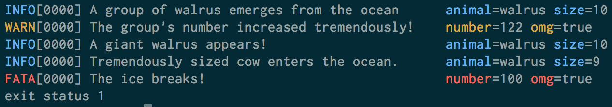

+++
title = "logrus文档"
date = 2023-06-05T11:23:39+08:00
type = "docs"
description = ""
isCJKLanguage = true
draft = false

+++

# Logrus 

> 原文：[https://pkg.go.dev/github.com/sirupsen/logrus](https://pkg.go.dev/github.com/sirupsen/logrus)
>
> 版本：v1.9.3 
>
> 发布时间：2023.5.21

# 

Logrus is a structured logger for Go (golang), completely API compatible with the standard library logger.

​	Logrus是Go语言的结构化日志记录器，与标准库的日志记录器完全兼容。

**Logrus is in maintenance-mode.** We will not be introducing new features. It's simply too hard to do in a way that won't break many people's projects, which is the last thing you want from your Logging library (again...).

​	**Logrus处于维护模式。**我们不会引入新功能。以一种不会破坏许多人项目的方式进行操作实在太困难了，这是您对日志记录库所不希望看到的最后一件事（再次强调）。

This does not mean Logrus is dead. Logrus will continue to be maintained for security, (backwards compatible) bug fixes, and performance (where we are limited by the interface).

​	这并不意味着Logrus已经停止开发。Logrus将继续维护安全性、（向后兼容的）错误修复和性能（在接口受限的情况下）。

I believe Logrus' biggest contribution is to have played a part in today's widespread use of structured logging in Golang. There doesn't seem to be a reason to do a major, breaking iteration into Logrus V2, since the fantastic Go community has built those independently. Many fantastic alternatives have sprung up. Logrus would look like those, had it been re-designed with what we know about structured logging in Go today. Check out, for example, [Zerolog](https://github.com/rs/zerolog), [Zap](https://github.com/uber-go/zap), and [Apex](https://github.com/apex/log).

​	我认为Logrus最大的贡献是在当今的Golang中广泛使用结构化日志记录中发挥了一定的作用。没有理由对Logrus进行重大的、破坏性的迭代进入Logrus V2，因为伟大的Go社区已经独立构建了这些功能。涌现出了许多出色的替代品。如果Logrus在今天重新设计，结构化日志记录的知识已被应用，那么它将看起来像这些替代品。例如，[Zerolog](https://github.com/rs/zerolog)，[Zap](https://github.com/uber-go/zap)和[Apex](https://github.com/apex/log)。

**Seeing weird case-sensitive problems?** It's in the past been possible to import Logrus as both upper- and lower-case. Due to the Go package environment, this caused issues in the community and we needed a standard. Some environments experienced problems with the upper-case variant, so the lower-case was decided. Everything using `logrus` will need to use the lower-case: `github.com/sirupsen/logrus`. Any package that isn't, should be changed.

​	**遇到奇怪的大小写问题？**在过去，可以将Logrus作为大写或小写方式导入。由于Go包环境的原因，这在社区中引起了问题，我们需要一个标准。某些环境对大写变体出现了问题，因此决定使用小写。所有使用`logrus`的内容都需要使用小写：`github.com/sirupsen/logrus`。如果有任何未更改的包，应该进行更改。

To fix Glide, see [these comments](https://github.com/sirupsen/logrus/issues/553#issuecomment-306591437). For an in-depth explanation of the casing issue, see [this comment](https://github.com/sirupsen/logrus/issues/570#issuecomment-313933276).

​	要修复Glide，请参见[这些评论](https://github.com/sirupsen/logrus/issues/553#issuecomment-306591437)。有关大小写问题的深入解释，请参见[此评论](https://github.com/sirupsen/logrus/issues/570#issuecomment-313933276)。

Nicely color-coded in development (when a TTY is attached, otherwise just plain text):

​	在开发中以美观的颜色编码（当连接到TTY时，否则仅为普通文本）：



With `log.SetFormatter(&log.JSONFormatter{})`, for easy parsing by logstash or Splunk:

​	使用`log.SetFormatter(&log.JSONFormatter{})`，方便由logstash或Splunk解析：

```
{"animal":"walrus","level":"info","msg":"A group of walrus emerges from the
ocean","size":10,"time":"2014-03-10 19:57:38.562264131 -0400 EDT"}

{"level":"warning","msg":"The group's number increased tremendously!",
"number":122,"omg":true,"time":"2014-03-10 19:57:38.562471297 -0400 EDT"}

{"animal":"walrus","level":"info","msg":"A giant walrus appears!",
"size":10,"time":"2014-03-10 19:57:38.562500591 -0400 EDT"}

{"animal":"walrus","level":"info","msg":"Tremendously sized cow enters the ocean.",
"size":9,"time":"2014-03-10 19:57:38.562527896 -0400 EDT"}

{"level":"fatal","msg":"The ice breaks!","number":100,"omg":true,
"time":"2014-03-10 19:57:38.562543128 -0400 EDT"}
```

With the default `log.SetFormatter(&log.TextFormatter{})` when a TTY is not attached, the output is compatible with the [logfmt](http://godoc.org/github.com/kr/logfmt) format:

​	当未连接到TTY时，使用默认的`log.SetFormatter(&log.TextFormatter{})`，输出与[logfmt](http://godoc.org/github.com/kr/logfmt)格式兼容：

```
time="2015-03-26T01:27:38-04:00" level=debug msg="Started observing beach" animal=walrus number=8
time="2015-03-26T01:27:38-04:00" level=info msg="A group of walrus emerges from the ocean" animal=walrus size=10
time="2015-03-26T01:27:38-04:00" level=warning msg="The group's number increased tremendously!" number=122 omg=true
time="2015-03-26T01:27:38-04:00" level=debug msg="Temperature changes" temperature=-4
time="2015-03-26T01:27:38-04:00" level=panic msg="It's over 9000!" animal=orca size=9009
time="2015-03-26T01:27:38-04:00" level=fatal msg="The ice breaks!" err=&{0x2082280c0 map[animal:orca size:9009] 2015-03-26 01:27:38.441574009 -0400 EDT panic It's over 9000!} number=100 omg=true
```

To ensure this behaviour even if a TTY is attached, set your formatter as follows:

​	即使连接了TTY，要确保这种行为，可以设置以下格式化器：

```go
	log.SetFormatter(&log.TextFormatter{
		DisableColors: true,
		FullTimestamp: true,
	})
```

## 记录方法名称 Logging Method Name 

If you wish to add the calling method as a field, instruct the logger via:

​	如果希望将调用的方法添加为字段，请通过以下方式通知记录器：

```
log.SetReportCaller(true)
```

This adds the caller as 'method' like so:

​	这将添加调用者作为'method'，如下所示：

```
{"animal":"penguin","level":"fatal","method":"github.com/sirupsen/arcticcreatures.migrate","msg":"a penguin swims by",
"time":"2014-03-10 19:57:38.562543129 -0400 EDT"}
time="2015-03-26T01:27:38-04:00" level=fatal method=github.com/sirupsen/arcticcreatures.migrate msg="a penguin swims by" animal=penguin
```

Note that this does add measurable overhead - the cost will depend on the version of Go, but is between 20 and 40% in recent tests with 1.6 and 1.7. You can validate this in your environment via benchmarks:

请注意，这会增加可测量的开销-成本将取决于Go的版本，在最近的测试中，1.6和1.7的开销在20%到40%之间。您可以通过基准测试在您的环境中验证这一点：

```sh
go test -bench=.*CallerTracing
```

## 大小写敏感性 Case-sensitivity

The organization's name was changed to lower-case--and this will not be changed back. If you are getting import conflicts due to case sensitivity, please use the lower-case import: `github.com/sirupsen/logrus`.

​	该组织的名称已更改为小写，并且不会更改回来。如果由于大小写敏感性而出现导入冲突，请使用小写导入：`github.com/sirupsen/logrus`。

## 示例

The simplest way to use Logrus is simply the package-level exported logger:

​	使用Logrus的最简单方法只是使用包级别导出的记录器：

``` go
package main

import (
  log "github.com/sirupsen/logrus"
)

func main() {
  log.WithFields(log.Fields{
    "animal": "walrus",
  }).Info("A walrus appears")
}
```

Note that it's completely api-compatible with the stdlib logger, so you can replace your `log` imports everywhere with `log "github.com/sirupsen/logrus"` and you'll now have the flexibility of Logrus. You can customize it all you want:

请注意，它与stdlib记录器完全兼容，因此您可以将所有的`log`导入替换为`log "github.com/sirupsen/logrus"`，这样您就可以灵活地使用Logrus。您可以根据需要进行自定义：

``` go
package main

import (
  "os"
  log "github.com/sirupsen/logrus"
)

func init() {
  // Log as JSON instead of the default ASCII formatter.
  // 将日志格式化为 JSON 而不是默认的 ASCII 格式
  log.SetFormatter(&log.JSONFormatter{})

  // Output to stdout instead of the default stderr
  // Can be any io.Writer, see below for File example
  // 将日志输出到标准输出而不是默认的标准错误
  // 可以是任何实现了 io.Writer 接口的类型，下面是写入文件的示例
  log.SetOutput(os.Stdout)

  // Only log the warning severity or above.    
  // 仅记录警告级别及以上的日志
  log.SetLevel(log.WarnLevel)
}

func main() {
  log.WithFields(log.Fields{
    "animal": "walrus",
    "size":   10,
  }).Info("A group of walrus emerges from the ocean")

  log.WithFields(log.Fields{
    "omg":    true,
    "number": 122,
  }).Warn("The group's number increased tremendously!")

  log.WithFields(log.Fields{
    "omg":    true,
    "number": 100,
  }).Fatal("The ice breaks!")

  // A common pattern is to re-use fields between logging statements by re-using
  // the logrus.Entry returned from WithFields()
  // 通常情况下，通过重用 logrus.Entry 语句之间的字段，
  // 可以在日志记录语句之间重用字段。
  contextLogger := log.WithFields(log.Fields{
    "common": "this is a common field",
    "other": "I also should be logged always",
  })

  contextLogger.Info("I'll be logged with common and other field")
  contextLogger.Info("Me too")
}
```

For more advanced usage such as logging to multiple locations from the same application, you can also create an instance of the `logrus` Logger:

​	对于更高级的用法，例如从同一应用程序向多个位置记录日志，还可以创建`logrus`记录器的实例：

``` go
package main

import (
  "os"
  "github.com/sirupsen/logrus"
)

// Create a new instance of the logger. You can have any number of instances.
// 创建记录器的新实例。您可以有任意数量的实例。
var log = logrus.New()

func main() {
  // The API for setting attributes is a little different than the package level
  // exported logger. See Godoc.
  // 设置属性的 API 与包级别的导出记录器有所不同。请参阅 Godoc。
  log.Out = os.Stdout

  // You could set this to any `io.Writer` such as a file
  // 您可以将其设置为任何 io.Writer，例如文件
  // file, err := os.OpenFile("logrus.log", os.O_CREATE|os.O_WRONLY|os.O_APPEND, 0666)
  // if err == nil {
  //  log.Out = file
  // } else {
  //  log.Info("Failed to log to file, using default stderr")
  // }

  log.WithFields(logrus.Fields{
    "animal": "walrus",
    "size":   10,
  }).Info("A group of walrus emerges from the ocean")
}
```

## 字段 Fields

Logrus encourages careful, structured logging through logging fields instead of long, unparseable error messages. For example, instead of: `log.Fatalf("Failed to send event %s to topic %s with key %d")`, you should log the much more discoverable:

​	Logrus鼓励通过记录字段而不是长而难以解析的错误消息来进行仔细的结构化日志记录。例如，不要使用 `log.Fatalf("Failed to send event %s to topic %s with key %d")`，而应该记录更容易发现的消息：

```go
log.WithFields(log.Fields{
  "event": event,
  "topic": topic,
  "key": key,
}).Fatal("Failed to send event")
```

We've found this API forces you to think about logging in a way that produces much more useful logging messages. We've been in countless situations where just a single added field to a log statement that was already there would've saved us hours. The `WithFields` call is optional.

​	我们发现这种 API 强制您以产生更有用的日志消息的方式思考日志记录。我们在无数情况下都遇到过这样的情况，只需向已有的日志语句添加一个字段就可以节省数小时的时间。`WithFields` 调用是可选的。

In general, with Logrus using any of the `printf`-family functions should be seen as a hint you should add a field, however, you can still use the `printf`-family functions with Logrus.

​	通常情况下，使用 Logrus 的 `printf` 系列函数之一应被视为一种提示，您应该添加一个字段，但是您仍然可以在 Logrus 中使用 `printf` 系列函数。

## 默认字段 Default Fields

Often it's helpful to have fields *always* attached to log statements in an application or parts of one. For example, you may want to always log the `request_id` and `user_ip` in the context of a request. Instead of writing `log.WithFields(log.Fields{"request_id": request_id, "user_ip": user_ip})` on every line, you can create a `logrus.Entry` to pass around instead:

​	通常情况下，在应用程序或其部分中始终附加字段到日志语句中是有帮助的。例如，您可能希望始终在请求的上下文中记录 `request_id` 和 `user_ip`。而不是在每一行中写入 `log.WithFields(log.Fields{"request_id": request_id, "user_ip": user_ip})`，您可以创建一个 `logrus.Entry` 对象并传递它：

```go
requestLogger := log.WithFields(log.Fields{"request_id": request_id, "user_ip": user_ip})
requestLogger.Info("something happened on that request") # will log request_id and user_ip
requestLogger.Warn("something not great happened")
```

## 钩子 Hooks

You can add hooks for logging levels. For example to send errors to an exception tracking service on `Error`, `Fatal` and `Panic`, info to StatsD or log to multiple places simultaneously, e.g. syslog.

​	您可以为日志级别添加钩子。例如，在 `Error`、`Fatal` 和 `Panic` 时将错误发送到异常跟踪服务，将信息发送到 StatsD，或同时记录到多个位置（如 syslog）。

Logrus comes with [built-in hooks](https://github.com/sirupsen/logrus/blob/v1.9.3/hooks). Add those, or your custom hook, in `init`:

​	Logrus 自带了[内置钩子](https://github.com/sirupsen/logrus/blob/v1.9.3/hooks)。在 `init` 中添加这些内置钩子或自定义的钩子：

```go
import (
  log "github.com/sirupsen/logrus"
  "gopkg.in/gemnasium/logrus-airbrake-hook.v2" // the package is named "airbrake"
  logrus_syslog "github.com/sirupsen/logrus/hooks/syslog"
  "log/syslog"
)

func init() {

  // Use the Airbrake hook to report errors that have Error severity or above to
  // an exception tracker. You can create custom hooks, see the Hooks section.
  // 使用Airbrake钩子将具有错误严重性或更高的错误报告到异常跟踪器。
  // 您可以创建自定义钩子，请参阅钩子部分。
  log.AddHook(airbrake.NewHook(123, "xyz", "production"))

  hook, err := logrus_syslog.NewSyslogHook("udp", "localhost:514", syslog.LOG_INFO, "")
  if err != nil {
    log.Error("Unable to connect to local syslog daemon")
  } else {
    log.AddHook(hook)
  }
}
```

Note: Syslog hook also support connecting to local syslog (Ex. "/dev/log" or "/var/run/syslog" or "/var/run/log"). For the detail, please check the [syslog hook README](https://github.com/sirupsen/logrus/blob/v1.9.3/hooks/syslog/README.md).

注意：Syslog钩子还支持连接到本地syslog（例如"/dev/log"或"/var/run/syslog"或"/var/run/log"）。详情请查看[syslog钩子自述文件](https://github.com/sirupsen/logrus/blob/v1.9.3/hooks/syslog/README.md)。

A list of currently known service hooks can be found in this wiki [page](https://github.com/sirupsen/logrus/wiki/Hooks)

​	当前已知的服务钩子列表可在此[Wiki页面](https://github.com/sirupsen/logrus/wiki/Hooks)中找到。

## 日志级别 Level logging

Logrus has seven logging levels: Trace, Debug, Info, Warning, Error, Fatal and Panic.

​	Logrus有七个日志级别：Trace、Debug、Info、Warning、Error、Fatal和Panic。

```go
log.Trace("Something very low level.")
log.Debug("Useful debugging information.")
log.Info("Something noteworthy happened!")
log.Warn("You should probably take a look at this.")
log.Error("Something failed but I'm not quitting.")
// Calls os.Exit(1) after logging
// 在记录日志后调用os.Exit(1)
log.Fatal("Bye.")
// Calls panic() after logging
// 在记录日志后调用panic()
log.Panic("I'm bailing.")
```

You can set the logging level on a `Logger`, then it will only log entries with that severity or anything above it:

​	您可以在`Logger`上设置日志级别，然后它只会记录具有该严重性或更高严重性的条目：

```go
// Will log anything that is info or above (warn, error, fatal, panic). Default.
// 仅记录 info 级别或以上的日志（warn、error、fatal、panic）。默认级别。
log.SetLevel(log.InfoLevel)
```

It may be useful to set `log.Level = logrus.DebugLevel` in a debug or verbose environment if your application has that.

​	如果您的应用程序具有调试或详细环境，将`log.Level = logrus.DebugLevel`设置为日志级别可能很有用。

Note: If you want different log levels for global (`log.SetLevel(...)`) and syslog logging, please check the [syslog hook README](https://github.com/sirupsen/logrus/blob/v1.9.3/hooks/syslog/README.md).

注意：如果您希望全局（`log.SetLevel（...）`）和syslog日志记录具有不同的日志级别，请查看[syslog钩子自述文件](https://github.com/sirupsen/logrus/blob/v1.9.3/hooks/syslog/README.md)。

## 条目 Entries

Besides the fields added with `WithField` or `WithFields` some fields are automatically added to all logging events:

​	除了使用`WithField`或`WithFields`添加的字段之外，一些字段会自动添加到所有日志事件中： 

1. `time`. The timestamp when the entry was created.
2. `msg`. The logging message passed to `{Info,Warn,Error,Fatal,Panic}` after the `AddFields` call. E.g. `Failed to send event.`
3. `level`. The logging level. E.g. `info`.
4. `time`。创建条目的时间戳。
5. `msg`。在`AddFields`调用后传递给`{Info、Warn、Error、Fatal、Panic}`的日志消息。例如，`Failed to send event.`
6. `level`。日志级别。例如，`info`。

## 环境 Environments

Logrus has no notion of environment.

​	Logrus没有环境的概念。

If you wish for hooks and formatters to only be used in specific environments, you should handle that yourself. For example, if your application has a global variable `Environment`, which is a string representation of the environment you could do:

​	如果您希望钩子和格式化程序仅在特定环境中使用，您应该自行处理。例如，如果您的应用程序有一个全局变量`Environment`，它是环境的字符串表示，您可以执行以下操作：

```go
import (
  log "github.com/sirupsen/logrus"
)

func init() {
  // do something here to set environment depending on an environment variable
  // or command-line flag
  // 在此处执行一些操作，根据环境变量或命令行标志设置环境
  if Environment == "production" {
    log.SetFormatter(&log.JSONFormatter{})
  } else {
    // The TextFormatter is default, you don't actually have to do this.
    // TextFormatter是默认值，您实际上不必执行此操作。
    log.SetFormatter(&log.TextFormatter{})
  }
}
```

This configuration is how `logrus` was intended to be used, but JSON in production is mostly only useful if you do log aggregation with tools like Splunk or Logstash.

​	这种配置是`logrus`的预期使用方式，但是在生产环境中，使用JSON通常只有在使用Splunk或Logstash等工具进行日志聚合时才有用。

## 格式化 Formatters

The built-in logging formatters are:

​	内置的日志格式化程序包括：

- `logrus.TextFormatter`. Logs the event in colors if stdout is a tty, otherwise without colors.
  
- `logrus.TextFormatter`。如果标准输出是TTY，则以彩色方式记录事件，否则不使用颜色。
  - *Note:* to force colored output when there is no TTY, set the `ForceColors` field to `true`. To force no colored output even if there is a TTY set the `DisableColors` field to `true`. For Windows, see [github.com/mattn/go-colorable](https://github.com/mattn/go-colorable).
  - 注意：如果要在没有TTY的情况下强制使用彩色输出，请将`ForceColors`字段设置为`true`。如果要在有TTY的情况下强制不使用彩色输出，请将`DisableColors`字段设置为`true`。有关Windows，请参阅[github.com/mattn/go-colorable](https://github.com/mattn/go-colorable)。
  - When colors are enabled, levels are truncated to 4 characters by default. To disable truncation set the `DisableLevelTruncation` field to `true`.
  - 在启用颜色时，默认情况下将级别截断为4个字符。要禁用截断，请将`DisableLevelTruncation`字段设置为`true`。
  - When outputting to a TTY, it's often helpful to visually scan down a column where all the levels are the same width. Setting the `PadLevelText` field to `true` enables this behavior, by adding padding to the level text.
  - 在输出到TTY时，通常有助于在具有相同宽度的所有级别的列中进行视觉扫描。将`PadLevelText`字段设置为`true`将启用此行为，通过为级别文本添加填充来实现。
  - All options are listed in the [generated docs](https://godoc.org/github.com/sirupsen/logrus#TextFormatter).
  - 所有选项都列在[生成的文档](https://godoc.org/github.com/sirupsen/logrus#TextFormatter)中。
  
- `logrus.JSONFormatter`. Logs fields as JSON.
  
- `logrus.JSONFormatter`。将字段记录为JSON。
  - All options are listed in the [generated docs](https://godoc.org/github.com/sirupsen/logrus#JSONFormatter).
  - 所有选项都列在[生成的文档](https://godoc.org/github.com/sirupsen/logrus#JSONFormatter)中。


Third party logging formatters:

​	第三方日志格式化程序： 

- [`FluentdFormatter`](https://github.com/joonix/log). Formats entries that can be parsed by Kubernetes and Google Container Engine.
- [`GELF`](https://github.com/fabienm/go-logrus-formatters). Formats entries so they comply to Graylog's [GELF 1.1 specification](http://docs.graylog.org/en/2.4/pages/gelf.html).
- [`logstash`](https://github.com/bshuster-repo/logrus-logstash-hook). Logs fields as [Logstash](http://logstash.net/) Events.
- [`prefixed`](https://github.com/x-cray/logrus-prefixed-formatter). Displays log entry source along with alternative layout.
- [`zalgo`](https://github.com/aybabtme/logzalgo). Invoking the Power of Zalgo.
- [`nested-logrus-formatter`](https://github.com/antonfisher/nested-logrus-formatter). Converts logrus fields to a nested structure.
- [`powerful-logrus-formatter`](https://github.com/zput/zxcTool). get fileName, log's line number and the latest function's name when print log; Sava log to files.
- [`caption-json-formatter`](https://github.com/nolleh/caption_json_formatter). logrus's message json formatter with human-readable caption added.
- [`FluentdFormatter`](https://github.com/joonix/log)。格式化可由Kubernetes和Google Container Engine解析的条目。
- [`GELF`](https://github.com/fabienm/go-logrus-formatters)。将条目格式化为符合Graylog的[GELF 1.1规范](http://docs.graylog.org/en/2.4/pages/gelf.html)。
- [`logstash`](https://github.com/bshuster-repo/logrus-logstash-hook)。将字段记录为[Logstash](http://logstash.net/)事件。
- [`prefixed`](https://github.com/x-cray/logrus-prefixed-formatter)。显示日志条目来源以及替代布局。
- [`zalgo`](https://github.com/aybabtme/logzalgo)。调用Zalgo的力量。
- [`nested-logrus-formatter`](https://github.com/antonfisher/nested-logrus-formatter)。将logrus字段转换为嵌套结构。
- [`powerful-logrus-formatter`](https://github.com/zput/zxcTool)。在打印日志时获取文件名、日志行号和最新函数名；将日志保存到文件中。
- [`caption-json-formatter`](https://github.com/nolleh/caption_json_formatter)。logrus的消息JSON格式化程序，添加可读的标题。

You can define your formatter by implementing the `Formatter` interface, requiring a `Format` method. `Format` takes an `*Entry`. `entry.Data` is a `Fields` type (`map[string]interface{}`) with all your fields as well as the default ones (see Entries section above):

您可以通过实现`Formatter`接口来定义自己的格式化程序，该接口要求实现一个`Format`方法。`Format`方法接收一个`*Entry`参数，其中`entry.Data`是一个`Fields`类型（`map[string]interface{}`），包含所有字段以及默认字段（参见上面的"Entries"部分）：

``` go
type MyJSONFormatter struct {
}

log.SetFormatter(new(MyJSONFormatter))

func (f *MyJSONFormatter) Format(entry *Entry) ([]byte, error) {
  // Note this doesn't include Time, Level and Message which are available on
  // the Entry. Consult `godoc` on information about those fields or read the
  // source of the official loggers.
  // 注意，这里没有包括时间、级别和消息，这些可以从Entry上获取。
  // 有关这些字段的信息，请查阅`godoc`，或者阅读官方日志记录器的源代码。
  serialized, err := json.Marshal(entry.Data)
    if err != nil {
      return nil, fmt.Errorf("Failed to marshal fields to JSON, %w", err)
    }
  return append(serialized, '\n'), nil
}
```

## 将日志记录器作为`io.Writer` Logger as an `io.Writer`

Logrus can be transformed into an `io.Writer`. That writer is the end of an `io.Pipe` and it is your responsibility to close it.

​	Logrus可以转换为`io.Writer`。该写入器是`io.Pipe`的末端，您有责任关闭它。

```go
w := logger.Writer()
defer w.Close()

srv := http.Server{
    // create a stdlib log.Logger that writes to
    // logrus.Logger.
    // 创建一个写入logrus.Logger的stdlib log.Logger。
    ErrorLog: log.New(w, "", 0),
}
```

Each line written to that writer will be printed the usual way, using formatters and hooks. The level for those entries is `info`.

写入该写入器的每一行都将按照通常的方式打印，使用格式化程序和钩子。这些条目的级别为`info`。

This means that we can override the standard library logger easily:

​	这意味着我们可以轻松地覆盖标准库的记录器：

```go
logger := logrus.New()
logger.Formatter = &logrus.JSONFormatter{}

// Use logrus for standard log output
// Note that `log` here references stdlib's log
// Not logrus imported under the name `log`.
log.SetOutput(logger.Writer())
```

## 日志轮换 Rotation

Log rotation is not provided with Logrus. Log rotation should be done by an external program (like `logrotate(8)`) that can compress and delete old log entries. It should not be a feature of the application-level logger.

​	Logrus不提供日志轮换功能。日志轮换应由外部程序（例如`logrotate(8)`）执行，该程序可以压缩和删除旧的日志条目。这不应该是应用程序级日志记录器的功能。

## 工具 Tools

| 工具                                                         | 描述                                                         |
| ------------------------------------------------------------ | ------------------------------------------------------------ |
| [Logrus Mate](https://github.com/gogap/logrus_mate)          | Logrus Mate是用于管理Logrus的工具，您可以通过配置文件初始化记录器的级别、钩子和格式化程序，在不同的环境中使用不同的配置生成记录器。 |
| [Logrus Viper Helper](https://github.com/heirko/go-contrib/tree/master/logrusHelper) | Logrus Viper Helper是围绕Logrus的辅助工具，结合了spf13/Viper以加载配置文件，并简化Logrus的配置使用[Logrus Mate](https://github.com/gogap/logrus_mate)的一些行为。[示例](https://github.com/heirko/iris-contrib/raw/master/middleware/logrus-logger/example) |

## 测试 Testing

Logrus has a built in facility for asserting the presence of log messages. This is implemented through the `test` hook and provides:

​	Logrus具有用于断言日志消息存在的内置工具。通过`test`钩子实现，提供以下功能： 

- decorators for existing logger (`test.NewLocal` and `test.NewGlobal`) which basically just adds the `test` hook
- a test logger (`test.NewNullLogger`) that just records log messages (and does not output any):
- 对现有记录器的装饰器（`test.NewLocal`和`test.NewGlobal`），基本上只是添加了`test`钩子。
- 一个测试记录器（`test.NewNullLogger`），只记录日志消息（不输出任何内容）：

```
import(
  "github.com/sirupsen/logrus"
  "github.com/sirupsen/logrus/hooks/test"
  "github.com/stretchr/testify/assert"
  "testing"
)

func TestSomething(t*testing.T){
  logger, hook := test.NewNullLogger()
  logger.Error("Helloerror")

  assert.Equal(t, 1, len(hook.Entries))
  assert.Equal(t, logrus.ErrorLevel, hook.LastEntry().Level)
  assert.Equal(t, "Helloerror", hook.LastEntry().Message)

  hook.Reset()
  assert.Nil(t, hook.LastEntry())
}
```

## 致命错误处理程序 Fatal handlers

Logrus can register one or more functions that will be called when any `fatal` level message is logged. The registered handlers will be executed before logrus performs an `os.Exit(1)`. This behavior may be helpful if callers need to gracefully shutdown. Unlike a `panic("Something went wrong...")` call which can be intercepted with a deferred `recover` a call to `os.Exit(1)` can not be intercepted.

​	Logrus可以注册一个或多个函数，当记录任何`fatal`级别的消息时，这些函数将被调用。在logrus执行`os.Exit(1)`之前，注册的处理程序将被执行。如果调用者需要优雅地关闭程序，这种行为可能会很有帮助。与可以使用延迟的`recover`截取的`panic("Something went wrong...")`调用不同，无法截取调用`os.Exit(1)`。

```
...
handler := func() {
  // gracefully shutdown something...
  // 优雅地关闭某些内容...
}
logrus.RegisterExitHandler(handler)
...
```

## 线程安全 Thread safety

By default, Logger is protected by a mutex for concurrent writes. The mutex is held when calling hooks and writing logs. If you are sure such locking is not needed, you can call logger.SetNoLock() to disable the locking.

​	默认情况下，Logger通过互斥锁保护以支持并发写入。在调用钩子和写入日志时，将保持该互斥锁。如果您确信不需要此锁定，请调用`logger.SetNoLock()`以禁用锁定。

Situation when locking is not needed includes:

​	不需要锁定的情况包括：

- You have no hooks registered, or hooks calling is already thread-safe.

- 您没有注册任何钩子，或者已经对调用钩子进行了线程安全处理。

- Writing to logger.Out is already thread-safe, for example:

- 向logger.Out写入已经是线程安全的，例如：

  1. logger.Out is protected by locks.

  2. logger.Out受锁保护。

  3. logger.Out is an os.File handler opened with `O_APPEND` flag, and every write is smaller than 4k. (This allows multi-thread/multi-process writing)
  
  4. logger.Out是使用`O_APPEND`标志打开的os.File处理程序，并且每次写入都小于4k。（这样可以进行多线程/多进程写入）
  
     (请参考 [http://www.notthewizard.com/2014/06/17/are-files-appends-really-atomic/](http://www.notthewizard.com/2014/06/17/are-files-appends-really-atomic/))


## 文档

[Rendered for](https://go.dev/about#build-context) linux/amd64                                 

### 概述 

Package logrus is a structured logger for Go, completely API compatible with the standard library logger.

​	logrus 包是用于 Go 的结构化日志记录器，与标准库的日志记录器完全兼容。

The simplest way to use Logrus is simply the package-level exported logger:

​	使用 Logrus 最简单的方法就是直接使用包级别的导出日志记录器：

``` go
package main

import (
  log "github.com/sirupsen/logrus"
)

func main() {
  log.WithFields(log.Fields{
    "animal": "walrus",
    "number": 1,
    "size":   10,
  }).Info("A walrus appears")
}
```

Output:

输出结果：

```
time="2015-09-07T08:48:33Z" level=info msg="A walrus appears" animal=walrus number=1 size=10
```

For a full guide visit https://github.com/sirupsen/logrus

​	要获取完整的指南，请访问 https://github.com/sirupsen/logrus。

##### Example (Basic)

``` go
package main

import (
	"os"

	"github.com/sirupsen/logrus"
)

func main() {
	var log = logrus.New()
	log.Formatter = new(logrus.JSONFormatter)
	log.Formatter = new(logrus.TextFormatter)                     //default
	log.Formatter.(*logrus.TextFormatter).DisableColors = true    // remove colors
	log.Formatter.(*logrus.TextFormatter).DisableTimestamp = true // remove timestamp from test output
	log.Level = logrus.TraceLevel
	log.Out = os.Stdout

	// file, err := os.OpenFile("logrus.log", os.O_CREATE|os.O_WRONLY, 0666)
	// if err == nil {
	// 	log.Out = file
	// } else {
	// 	log.Info("Failed to log to file, using default stderr")
	// }

	defer func() {
		err := recover()
		if err != nil {
			entry := err.(*logrus.Entry)
			log.WithFields(logrus.Fields{
				"omg":         true,
				"err_animal":  entry.Data["animal"],
				"err_size":    entry.Data["size"],
				"err_level":   entry.Level,
				"err_message": entry.Message,
				"number":      100,
			}).Error("The ice breaks!") // or use Fatal() to force the process to exit with a nonzero code
		}
	}()

	log.WithFields(logrus.Fields{
		"animal": "walrus",
		"number": 0,
	}).Trace("Went to the beach")

	log.WithFields(logrus.Fields{
		"animal": "walrus",
		"number": 8,
	}).Debug("Started observing beach")

	log.WithFields(logrus.Fields{
		"animal": "walrus",
		"size":   10,
	}).Info("A group of walrus emerges from the ocean")

	log.WithFields(logrus.Fields{
		"omg":    true,
		"number": 122,
	}).Warn("The group's number increased tremendously!")

	log.WithFields(logrus.Fields{
		"temperature": -4,
	}).Debug("Temperature changes")

	log.WithFields(logrus.Fields{
		"animal": "orca",
		"size":   9009,
	}).Panic("It's over 9000!")

}
Output:

level=trace msg="Went to the beach" animal=walrus number=0
level=debug msg="Started observing beach" animal=walrus number=8
level=info msg="A group of walrus emerges from the ocean" animal=walrus size=10
level=warning msg="The group's number increased tremendously!" number=122 omg=true
level=debug msg="Temperature changes" temperature=-4
level=panic msg="It's over 9000!" animal=orca size=9009
level=error msg="The ice breaks!" err_animal=orca err_level=panic err_message="It's over 9000!" err_size=9009 number=100 omg=true
```
##### Example (Hook)

``` go
package main

import (
	"log/syslog"
	"os"

	"github.com/sirupsen/logrus"
	slhooks "github.com/sirupsen/logrus/hooks/syslog"
)

func main() {
	var log = logrus.New()
	log.Formatter = new(logrus.TextFormatter)                     // default
	log.Formatter.(*logrus.TextFormatter).DisableColors = true    // remove colors
	log.Formatter.(*logrus.TextFormatter).DisableTimestamp = true // remove timestamp from test output
	if sl, err := slhooks.NewSyslogHook("udp", "localhost:514", syslog.LOG_INFO, ""); err == nil {
		log.Hooks.Add(sl)
	}
	log.Out = os.Stdout

	log.WithFields(logrus.Fields{
		"animal": "walrus",
		"size":   10,
	}).Info("A group of walrus emerges from the ocean")

	log.WithFields(logrus.Fields{
		"omg":    true,
		"number": 122,
	}).Warn("The group's number increased tremendously!")

	log.WithFields(logrus.Fields{
		"omg":    true,
		"number": 100,
	}).Error("The ice breaks!")

}
Output:

level=info msg="A group of walrus emerges from the ocean" animal=walrus size=10
level=warning msg="The group's number increased tremendously!" number=122 omg=true
level=error msg="The ice breaks!" number=100 omg=true
```
### 常量

[View Source](https://github.com/sirupsen/logrus/blob/v1.9.3/formatter.go#L6)

``` go
const (
	FieldKeyMsg         = "msg"
	FieldKeyLevel       = "level"
	FieldKeyTime        = "time"
	FieldKeyLogrusError = "logrus_error"
	FieldKeyFunc        = "func"
	FieldKeyFile        = "file"
)
```

Default key names for the default fields

​	默认字段的默认键名

### 变量

[View Source](https://github.com/sirupsen/logrus/blob/v1.9.3/logrus.go#L81)

```
var AllLevels = []Level{
	PanicLevel,
	FatalLevel,
	ErrorLevel,
	WarnLevel,
	InfoLevel,
	DebugLevel,
	TraceLevel,
}
```

A constant exposing all logging levels

​	一个常量，暴露所有的日志级别

[View Source](https://github.com/sirupsen/logrus/blob/v1.9.3/entry.go#L38)

```
var ErrorKey = "error"
```

Defines the key when adding errors using WithError.

​	使用 WithError 添加错误时定义的键名

### 函数

#### func AddHook <-0.4.0

``` go
func AddHook(hook Hook)
```

AddHook adds a hook to the standard logger hooks.

​	AddHook 函数向标准日志记录器的钩子列表中添加一个钩子。

#### func Debug 

``` go
func Debug(args ...interface{})
```

Debug logs a message at level Debug on the standard logger.

​	Debug 函数在标准日志记录器上以 Debug 级别记录一条消息。

#### func DebugFn <-1.7.0

``` go
func DebugFn(fn LogFunction)
```

DebugFn logs a message from a func at level Debug on the standard logger.

​	DebugFn 函数在标准日志记录器上以 Debug 级别从函数中记录一条消息。

#### func Debugf <-0.4.1

``` go
func Debugf(format string, args ...interface{})
```

Debugf logs a message at level Debug on the standard logger.

​	Debugf 函数在标准日志记录器上以 Debug 级别记录一条格式化消息。

#### func Debugln <-0.4.1

``` go
func Debugln(args ...interface{})
```

Debugln logs a message at level Debug on the standard logger.

​	Debugln 函数在标准日志记录器上以 Debug 级别记录一条消息。

#### func DeferExitHandler <-1.4.0

``` go
func DeferExitHandler(handler func())
```

DeferExitHandler prepends a Logrus Exit handler to the list of handlers, call logrus.Exit to invoke all handlers. The handlers will also be invoked when any Fatal log entry is made.

​	DeferExitHandler 函数在处理程序列表的前面添加一个 Logrus 退出处理程序，调用 logrus.Exit 来调用所有处理程序。当发生任何致命日志条目时，也将调用这些处理程序。

This method is useful when a caller wishes to use logrus to log a fatal message but also needs to gracefully shutdown. An example usecase could be closing database connections, or sending a alert that the application is closing.

​	当调用者希望使用 logrus 记录致命消息，但同时需要优雅地关闭时，此方法非常有用。例如，关闭数据库连接或发送应用程序关闭的警报。

#### func Error 

``` go
func Error(args ...interface{})
```

Error logs a message at level Error on the standard logger.

​	Error 函数在标准日志记录器上以 Error 级别记录一条消息。

#### func ErrorFn <-1.7.0

``` go
func ErrorFn(fn LogFunction)
```

ErrorFn logs a message from a func at level Error on the standard logger.

​	ErrorFn 函数在标准日志记录器上以 Error 级别从函数中记录一条消息。

#### func Errorf <-0.4.1

``` go
func Errorf(format string, args ...interface{})
```

Errorf logs a message at level Error on the standard logger.

​	Errorf 函数在标准日志记录器上以 Error 级别记录一条格式化消息。

#### func Errorln <-0.4.1

``` go
func Errorln(args ...interface{})
```

Errorln logs a message at level Error on the standard logger.

​	Errorln 函数在标准日志记录器上以 Error 级别记录一条消息。

#### func Exit <-0.11.0

``` go
func Exit(code int)
```

Exit runs all the Logrus atexit handlers and then terminates the program using os.Exit(code)

​	Exit 函数运行所有 Logrus 的退出处理程序，然后使用 os.Exit(code) 终止程序。

#### func Fatal 

``` go
func Fatal(args ...interface{})
```

Fatal logs a message at level Fatal on the standard logger then the process will exit with status set to 1.

​	Fatal 函数在标准日志记录器上以 Fatal 级别记录一条消息，然后进程将以状态 1 退出。

#### func FatalFn <-1.7.0

``` go
func FatalFn(fn LogFunction)
```

FatalFn logs a message from a func at level Fatal on the standard logger then the process will exit with status set to 1.

​	FatalFn 函数在标准日志记录器上以 Fatal 级别从函数中记录一条消息，然后进程将以状态 1 退出。

#### func Fatalf <-0.4.1

``` go
func Fatalf(format string, args ...interface{})
```

Fatalf logs a message at level Fatal on the standard logger then the process will exit with status set to 1.

​	Fatalf 函数在标准日志记录器上以 Fatal 级别记录一条格式化消息，然后进程将以状态 1 退出。

#### func Fatalln <-0.4.1

``` go
func Fatalln(args ...interface{})
```

Fatalln logs a message at level Fatal on the standard logger then the process will exit with status set to 1.

​	Fatalln 函数在标准日志记录器上以 Fatal 级别记录一条消息，然后进程将以状态 1 退出。

#### func Info 

``` go
func Info(args ...interface{})
```

Info logs a message at level Info on the standard logger.

​	Info 函数在标准日志记录器上以 Info 级别记录一条消息。

#### func InfoFn <-1.7.0

``` go
func InfoFn(fn LogFunction)
```

InfoFn logs a message from a func at level Info on the standard logger.

​	InfoFn 函数在标准日志记录器上以 Info 级别从函数中记录一条消息。

#### func Infof <-0.4.1

``` go
func Infof(format string, args ...interface{})
```

Infof logs a message at level Info on the standard logger.

​	Infof 函数在标准日志记录器上以 Info 级别记录一条格式化消息。

#### func Infoln <-0.4.1

``` go
func Infoln(args ...interface{})
```

Infoln logs a message at level Info on the standard logger.

​	Infoln 函数在标准日志记录器上以 Info 级别记录一条消息。

#### func IsLevelEnabled <-1.1.0

``` go
func IsLevelEnabled(level Level) bool
```

IsLevelEnabled checks if the log level of the standard logger is greater than the level param

​	IsLevelEnabled 函数检查标准日志记录器的日志级别是否大于 level 参数。

#### func Panic 

``` go
func Panic(args ...interface{})
```

Panic logs a message at level Panic on the standard logger.

​	Panic 函数在标准日志记录器上以 Panic 级别记录一条消息。

#### func PanicFn <-1.7.0

``` go
func PanicFn(fn LogFunction)
```

PanicFn logs a message from a func at level Panic on the standard logger.

​	PanicFn函数在标准日志记录器上以 Panic 级别从函数中记录一条消息。

#### func Panicf <-0.4.1

``` go
func Panicf(format string, args ...interface{})
```

Panicf logs a message at level Panic on the standard logger.

​	Panicf 函数在标准日志记录器上以 Panic 级别记录一条格式化消息。

#### func Panicln <-0.4.1

``` go
func Panicln(args ...interface{})
```

Panicln logs a message at level Panic on the standard logger.

​	Panicln 函数在标准日志记录器上以 Panic 级别记录一条消息。

#### func Print <-0.4.1

``` go
func Print(args ...interface{})
```

Print logs a message at level Info on the standard logger.

​	Print 函数在标准日志记录器上以 Info 级别记录一条消息。

#### func PrintFn <-1.7.0

``` go
func PrintFn(fn LogFunction)
```

PrintFn logs a message from a func at level Info on the standard logger.

​	PrintFn 函数在标准日志记录器上以 Info 级别从函数中记录一条消息。

#### func Printf <-0.4.1

``` go
func Printf(format string, args ...interface{})
```

Printf logs a message at level Info on the standard logger.

​	Printf 函数在标准日志记录器上以 Info 级别记录一条格式化消息。

#### func Println <-0.4.1

``` go
func Println(args ...interface{})
```

Println logs a message at level Info on the standard logger.

​	Println 函数在标准日志记录器上以 Info 级别记录一条消息。

#### func RegisterExitHandler <-0.11.0

``` go
func RegisterExitHandler(handler func())
```

RegisterExitHandler appends a Logrus Exit handler to the list of handlers, call logrus.Exit to invoke all handlers. The handlers will also be invoked when any Fatal log entry is made.

​	RegisterExitHandler 函数将一个 Logrus 退出处理程序附加到处理程序列表中，调用 logrus.Exit 来调用所有处理程序。当发生任何致命日志条目时，也将调用这些处理程序。

This method is useful when a caller wishes to use logrus to log a fatal message but also needs to gracefully shutdown. An example usecase could be closing database connections, or sending a alert that the application is closing.

​	当调用者希望使用 logrus 记录致命消息，但同时需要优雅地关闭时，此方法非常有用。例如，关闭数据库连接或发送应用程序关闭的警报。

#### func SetBufferPool <-1.7.0

``` go
func SetBufferPool(bp BufferPool)
```

SetBufferPool allows to replace the default logrus buffer pool to better meets the specific needs of an application.

​	SetBufferPool 函数允许替换默认的 logrus 缓冲池，以更好地满足应用程序的特定需求。

#### func SetFormatter <-0.4.0

``` go
func SetFormatter(formatter Formatter)
```

SetFormatter sets the standard logger formatter.

​	SetFormatter 函数设置标准日志记录器的格式化程序。

#### func SetLevel <-0.4.0

``` go
func SetLevel(level Level)
```

SetLevel sets the standard logger level.

​	SetLevel 函数设置标准日志记录器的日志级别。

#### func SetOutput <-0.4.0

``` go
func SetOutput(out io.Writer)
```

SetOutput sets the standard logger output.

​	SetOutput 函数设置标准日志记录器的输出。

#### func SetReportCaller <-1.2.0

``` go
func SetReportCaller(include bool)
```

SetReportCaller sets whether the standard logger will include the calling method as a field.

​	SetReportCaller 函数设置标准日志记录器是否将调用方法作为字段包含在内。

#### func Trace <-1.2.0

``` go
func Trace(args ...interface{})
```

Trace logs a message at level Trace on the standard logger.

​	Trace 函数在标准日志记录器上以 Trace 级别记录一条消息。

#### func TraceFn <-1.7.0

``` go
func TraceFn(fn LogFunction)
```

TraceFn logs a message from a func at level Trace on the standard logger.

​	TraceFn函数在标准记录器上以Trace级别记录来自函数的消息。

#### func Tracef <-1.2.0

``` go
func Tracef(format string, args ...interface{})
```

Tracef logs a message at level Trace on the standard logger.

​	Tracef函数在标准记录器上以Trace级别记录消息。

#### func Traceln <-1.2.0

``` go
func Traceln(args ...interface{})
```

Traceln logs a message at level Trace on the standard logger.

​	Traceln函数在标准记录器上以Trace级别记录消息。

#### func Warn 

``` go
func Warn(args ...interface{})
```

Warn logs a message at level Warn on the standard logger.

​	Warn函数在标准记录器上以Warn级别记录消息。

#### func WarnFn <-1.7.0

``` go
func WarnFn(fn LogFunction)
```

WarnFn logs a message from a func at level Warn on the standard logger.

​	WarnFn函数在标准记录器上以Warn级别记录来自函数的消息。

#### func Warnf <-0.4.1

``` go
func Warnf(format string, args ...interface{})
```

Warnf logs a message at level Warn on the standard logger.

​	Warnf函数在标准记录器上以Warn级别记录消息。

#### func Warning <-0.4.1

``` go
func Warning(args ...interface{})
```

Warning logs a message at level Warn on the standard logger.

​	Warning函数在标准记录器上以Warn级别记录消息。

#### func WarningFn <-1.7.0

``` go
func WarningFn(fn LogFunction)
```

WarningFn logs a message from a func at level Warn on the standard logger.

​	WarningFn函数在标准记录器上以Warn级别记录来自函数的消息。

#### func Warningf <-0.4.1

``` go
func Warningf(format string, args ...interface{})
```

Warningf logs a message at level Warn on the standard logger.

​	Warningf函数在标准记录器上以Warn级别记录消息。

#### func Warningln <-0.4.1

``` go
func Warningln(args ...interface{})
```

Warningln logs a message at level Warn on the standard logger.

​	Warningln函数在标准记录器上以Warn级别记录消息。

#### func Warnln <-0.4.1

``` go
func Warnln(args ...interface{})
```

Warnln logs a message at level Warn on the standard logger.

​	Warnln函数在标准记录器上以Warn级别记录消息。

### Types 

#### type BufferPool <-1.7.0

``` go
type BufferPool interface {
	Put(*bytes.Buffer)
	Get() *bytes.Buffer
}
```

#### type Entry 

``` go
type Entry struct {
	Logger *Logger

	// Contains all the fields set by the user.    
    // 包含用户设置的所有字段。
	Data Fields

	// Time at which the log entry was created    
    // 日志条目创建的时间
	Time time.Time

	// Level the log entry was logged at: Trace, Debug, Info, Warn, Error, Fatal or Panic
	// This field will be set on entry firing and the value will be equal to the one in Logger struct field.    
    // 日志条目记录的级别：Trace、Debug、Info、Warn、Error、Fatal或Panic
	// 此字段将在触发条目时设置，并且其值将等于Logger结构字段中的值。
	Level Level

	// Calling method, with package name    
    // 调用方法，包括包名
	Caller *runtime.Frame

	// Message passed to Trace, Debug, Info, Warn, Error, Fatal or Panic
    // 传递给Trace、Debug、Info、Warn、Error、Fatal或Panic的消息
	Message string

	// When formatter is called in entry.log(), a Buffer may be set to entry
    // 当调用entry.log()时，可以将Buffer设置为entry
	Buffer *bytes.Buffer

	// Contains the context set by the user. Useful for hook processing etc.
    // 包含用户设置的上下文。对于钩子处理等非常有用。
	Context context.Context
	// contains filtered or unexported fields
}
```

An entry is the final or intermediate Logrus logging entry. It contains all the fields passed with WithField{,s}. It's finally logged when Trace, Debug, Info, Warn, Error, Fatal or Panic is called on it. These objects can be reused and passed around as much as you wish to avoid field duplication.

​	Entry结构体是最终或中间的Logrus日志条目。它包含通过WithField{,s}传递的所有字段。当在其上调用Trace、Debug、Info、Warn、Error、Fatal或Panic时，它最终被记录。这些对象可以重复使用并传递，以避免字段重复。

#### func NewEntry 

``` go
func NewEntry(logger *Logger) *Entry
```

#### func WithContext <-1.4.0

``` go
func WithContext(ctx context.Context) *Entry
```

WithContext creates an entry from the standard logger and adds a context to it.

​	WithContext函数从标准记录器创建一个条目，并向其添加上下文。

#### func WithError <-0.8.7

``` go
func WithError(err error) *Entry
```

WithError creates an entry from the standard logger and adds an error to it, using the value defined in ErrorKey as key.

​	WithError函数从标准记录器创建一个条目，并向其添加错误，使用ErrorKey中定义的键名。

#### func WithField <-0.4.0

``` go
func WithField(key string, value interface{}) *Entry
```

WithField creates an entry from the standard logger and adds a field to it. If you want multiple fields, use `WithFields`.

​	WithField函数从标准记录器创建一个条目，并向其添加一个字段。如果要添加多个字段，请使用`WithFields`。

Note that it doesn't log until you call Debug, Print, Info, Warn, Fatal or Panic on the Entry it returns.

请注意，直到调用返回的条目上的Debug、Print、Info、Warn、Fatal或Panic时，它才会记录日志。

#### func WithFields <-0.4.0

``` go
func WithFields(fields Fields) *Entry
```

WithFields creates an entry from the standard logger and adds multiple fields to it. This is simply a helper for `WithField`, invoking it once for each field.

​	WithFields函数从标准记录器创建一个条目，并向其添加多个字段。这只是`WithField`的辅助函数，为每个字段调用它一次。

Note that it doesn't log until you call Debug, Print, Info, Warn, Fatal or Panic on the Entry it returns.

请注意，直到调用返回的条目上的Debug、Print、Info、Warn、Fatal或Panic时，它才会记录日志。

#### func WithTime <-1.0.6

``` go
func WithTime(t time.Time) *Entry
```

WithTime creates an entry from the standard logger and overrides the time of logs generated with it.

​	WithTime函数从标准记录器创建一个条目，并覆盖使用它生成的日志的时间。

Note that it doesn't log until you call Debug, Print, Info, Warn, Fatal or Panic on the Entry it returns.

请注意，直到调用返回的条目上的Debug、Print、Info、Warn、Fatal或Panic时，它才会记录日志。

#### (*Entry) Bytes <-1.5.0

``` go
func (entry *Entry) Bytes() ([]byte, error)
```

Returns the bytes representation of this entry from the formatter.

​	返回该条目的字节表示形式，来自格式化程序。

#### (*Entry) Debug 

``` go
func (entry *Entry) Debug(args ...interface{})
```

#### (*Entry) Debugf 

``` go
func (entry *Entry) Debugf(format string, args ...interface{})
```

#### (*Entry) Debugln 

``` go
func (entry *Entry) Debugln(args ...interface{})
```

#### (*Entry) Dup <-1.7.1

``` go
func (entry *Entry) Dup() *Entry
```

#### (*Entry) Error 

``` go
func (entry *Entry) Error(args ...interface{})
```

#### (*Entry) Errorf 

``` go
func (entry *Entry) Errorf(format string, args ...interface{})
```

#### (*Entry) Errorln 

``` go
func (entry *Entry) Errorln(args ...interface{})
```

#### (*Entry) Fatal 

``` go
func (entry *Entry) Fatal(args ...interface{})
```

#### (*Entry) Fatalf 

``` go
func (entry *Entry) Fatalf(format string, args ...interface{})
```

#### (*Entry) Fatalln 

``` go
func (entry *Entry) Fatalln(args ...interface{})
```

#### func (Entry) HasCaller <-1.2.0

``` go
func (entry Entry) HasCaller() (has bool)
```

#### (*Entry) Info 

``` go
func (entry *Entry) Info(args ...interface{})
```

#### (*Entry) Infof 

``` go
func (entry *Entry) Infof(format string, args ...interface{})
```

#### (*Entry) Infoln 

``` go
func (entry *Entry) Infoln(args ...interface{})
```

#### (*Entry) Log <-1.3.0

``` go
func (entry *Entry) Log(level Level, args ...interface{})
```

Log will log a message at the level given as parameter. Warning: using Log at Panic or Fatal level will not respectively Panic nor Exit. For this behaviour Entry.Panic or Entry.Fatal should be used instead.

​	Log方法会以给定的级别记录一条消息。警告：在Panic或Fatal级别使用Log不会触发Panic或退出。应使用Entry.Panic或Entry.Fatal代替。

#### (*Entry) Logf <-1.3.0

``` go
func (entry *Entry) Logf(level Level, format string, args ...interface{})
```

#### (*Entry) Logln <-1.3.0

``` go
func (entry *Entry) Logln(level Level, args ...interface{})
```

#### (*Entry) Panic 

``` go
func (entry *Entry) Panic(args ...interface{})
```

#### (*Entry) Panicf 

``` go
func (entry *Entry) Panicf(format string, args ...interface{})
```

#### (*Entry) Panicln 

``` go
func (entry *Entry) Panicln(args ...interface{})
```

#### (*Entry) Print 

``` go
func (entry *Entry) Print(args ...interface{})
```

#### (*Entry) Printf 

``` go
func (entry *Entry) Printf(format string, args ...interface{})
```

#### (*Entry) Println 

``` go
func (entry *Entry) Println(args ...interface{})
```

#### (*Entry) String 

``` go
func (entry *Entry) String() (string, error)
```

Returns the string representation from the reader and ultimately the formatter.

​	返回从读取器（reader）和最终格式化器（formatter）获取的字符串表示形式。

#### (*Entry) Trace <-1.2.0

``` go
func (entry *Entry) Trace(args ...interface{})
```

#### (*Entry) Tracef <-1.2.0

``` go
func (entry *Entry) Tracef(format string, args ...interface{})
```

#### (*Entry) Traceln <-1.2.0

``` go
func (entry *Entry) Traceln(args ...interface{})
```

#### (*Entry) Warn 

``` go
func (entry *Entry) Warn(args ...interface{})
```

#### (*Entry) Warnf 

``` go
func (entry *Entry) Warnf(format string, args ...interface{})
```

#### (*Entry) Warning <-0.6.3

``` go
func (entry *Entry) Warning(args ...interface{})
```

#### (*Entry) Warningf 

``` go
func (entry *Entry) Warningf(format string, args ...interface{})
```

#### (*Entry) Warningln 

``` go
func (entry *Entry) Warningln(args ...interface{})
```

#### (*Entry) Warnln 

``` go
func (entry *Entry) Warnln(args ...interface{})
```

#### (*Entry) WithContext <-1.4.0

``` go
func (entry *Entry) WithContext(ctx context.Context) *Entry
```

Add a context to the Entry.

​	向Entry添加一个上下文（context）。

#### (*Entry) WithError <-0.8.7

``` go
func (entry *Entry) WithError(err error) *Entry
```

Add an error as single field (using the key defined in ErrorKey) to the Entry.

​	将错误作为单个字段（使用ErrorKey中定义的键）添加到Entry。

#### (*Entry) WithField 

``` go
func (entry *Entry) WithField(key string, value interface{}) *Entry
```

Add a single field to the Entry.

​	向Entry添加一个字段。

#### (*Entry) WithFields 

``` go
func (entry *Entry) WithFields(fields Fields) *Entry
```

Add a map of fields to the Entry.

​	向Entry添加一组字段。

#### (*Entry) WithTime <-1.0.6

``` go
func (entry *Entry) WithTime(t time.Time) *Entry
```

Overrides the time of the Entry.

​		覆盖Entry的时间。

#### (*Entry) Writer <-0.11.5

``` go
func (entry *Entry) Writer() *io.PipeWriter
```

Writer returns an io.Writer that writes to the logger at the info log level

​	Writer方法返回一个io.Writer，将日志写入info级别的记录器。

#### (*Entry) WriterLevel <-0.11.5

``` go
func (entry *Entry) WriterLevel(level Level) *io.PipeWriter
```

WriterLevel returns an io.Writer that writes to the logger at the given log level

​	WriterLevel方法返回一个io.Writer，将日志写入指定的日志级别的记录器。

#### type Ext1FieldLogger <-1.2.0

``` go
type Ext1FieldLogger interface {
	FieldLogger
	Tracef(format string, args ...interface{})
	Trace(args ...interface{})
	Traceln(args ...interface{})
}
```

Ext1FieldLogger (the first extension to FieldLogger) is superfluous, it is here for consistancy. Do not use. Use Logger or Entry instead.

​	Ext1FieldLogger接口（FieldLogger的第一个扩展）是多余的，它存在只是为了一致性。不要使用它，请改用Logger或Entry。

#### type FieldLogger <-0.10.0

``` go
type FieldLogger interface {
	WithField(key string, value interface{}) *Entry
	WithFields(fields Fields) *Entry
	WithError(err error) *Entry

	Debugf(format string, args ...interface{})
	Infof(format string, args ...interface{})
	Printf(format string, args ...interface{})
	Warnf(format string, args ...interface{})
	Warningf(format string, args ...interface{})
	Errorf(format string, args ...interface{})
	Fatalf(format string, args ...interface{})
	Panicf(format string, args ...interface{})

	Debug(args ...interface{})
	Info(args ...interface{})
	Print(args ...interface{})
	Warn(args ...interface{})
	Warning(args ...interface{})
	Error(args ...interface{})
	Fatal(args ...interface{})
	Panic(args ...interface{})

	Debugln(args ...interface{})
	Infoln(args ...interface{})
	Println(args ...interface{})
	Warnln(args ...interface{})
	Warningln(args ...interface{})
	Errorln(args ...interface{})
	Fatalln(args ...interface{})
	Panicln(args ...interface{})
}
```

The FieldLogger interface generalizes the Entry and Logger types

​	FieldLogger接口泛化了Entry和Logger类型。

#### type FieldMap <-0.11.1

``` go
type FieldMap map[fieldKey]string
```

FieldMap allows customization of the key names for default fields.

​	FieldMap类型允许自定义默认字段的键名称。

#### type Fields 

``` go
type Fields map[string]interface{}
```

Fields type, used to pass to `WithFields`.

​	Fields类型，用于传递给`WithFields`。

#### type Formatter 

``` go
type Formatter interface {
	Format(*Entry) ([]byte, error)
}
```

The Formatter interface is used to implement a custom Formatter. It takes an `Entry`. It exposes all the fields, including the default ones:

​	Formatter接口用于实现自定义格式化器。它接受一个`Entry`，暴露所有字段，包括默认字段： 

* `entry.Data["msg"]`. The message passed from Info, Warn, Error .. 

* `entry.Data["time"]`. The timestamp. 
* `entry.Data["level"]. The level the entry was logged at.
* `entry.Data["msg"]`：从Info、Warn、Error等传递的消息。
* `entry.Data["time"]`：时间戳。
* `entry.Data["level"]`：记录的级别。

Any additional fields added with `WithField` or `WithFields` are also in `entry.Data`. Format is expected to return an array of bytes which are then logged to `logger.Out`.

​	使用`WithField`或`WithFields`添加的任何附加字段也在`entry.Data`中。Format函数应返回一个字节数组，然后将其记录到`logger.Out`。

#### type Hook 

``` go
type Hook interface {
	Levels() []Level
	Fire(*Entry) error
}
```

A hook to be fired when logging on the logging levels returned from `Levels()` on your implementation of the interface. Note that this is not fired in a goroutine or a channel with workers, you should handle such functionality yourself if your call is non-blocking and you don't wish for the logging calls for levels returned from `Levels()` to block.

​	在与接口的实现一起返回`Levels()`中的日志级别时，触发的钩子。注意，这不会在goroutine或带有工作者的通道中触发，如果您的调用是非阻塞的并且不希望阻止`Levels()`返回的日志级别的日志调用，则应自行处理此功能。

#### type JSONFormatter 

``` go
type JSONFormatter struct {
	// TimestampFormat sets the format used for marshaling timestamps.
	// The format to use is the same than for time.Format or time.Parse from the standard
	// library.
	// The standard Library already provides a set of predefined format.
    // TimestampFormat设置用于序列化时间戳的格式。
	// 使用的格式与标准库中的time.Format或time.Parse相同。
	// 标准库已提供一组预定义的格式。
	TimestampFormat string

	// DisableTimestamp allows disabling automatic timestamps in output    
    // DisableTimestamp允许在输出中禁用自动时间戳
	DisableTimestamp bool

	// DisableHTMLEscape allows disabling html escaping in output
    // DisableHTMLEscape允许在输出中禁用HTML转义
	DisableHTMLEscape bool

	// DataKey allows users to put all the log entry parameters into a nested dictionary at a given key.
    // DataKey允许用户将所有日志条目参数放入给定键的嵌套字典中。
	DataKey string

	// FieldMap allows users to customize the names of keys for default fields.
	// As an example:
    // FieldMap允许用户自定义默认字段的键名称。
	// 例如：
	// formatter := &JSONFormatter{
	//   	FieldMap: FieldMap{
	// 		 FieldKeyTime:  "@timestamp",
	// 		 FieldKeyLevel: "@level",
	// 		 FieldKeyMsg:   "@message",
	// 		 FieldKeyFunc:  "@caller",
	//    },
	// }
	FieldMap FieldMap

	// CallerPrettyfier can be set by the user to modify the content
	// of the function and file keys in the json data when ReportCaller is
	// activated. If any of the returned value is the empty string the
	// corresponding key will be removed from json fields.
    // CallerPrettyfier可以由用户设置，用于在激活ReportCaller时修改json数据中的函数和文件键的内容。
	// 如果返回值中的任何一个为空字符串，相应的键将从json字段中删除。
	CallerPrettyfier func(*runtime.Frame) (function string, file string)

	// PrettyPrint will indent all json logs
    // PrettyPrint将缩进所有json日志
	PrettyPrint bool
}
```

JSONFormatter formats logs into parsable json

​	JSONFormatter结构体将日志格式化为可解析的JSON格式。

#### (*JSONFormatter) Format 

``` go
func (f *JSONFormatter) Format(entry *Entry) ([]byte, error)
```

Format renders a single log entry

​	Format方法格式化单个日志条目。

#### type Level 

``` go
type Level uint32
```

Level type

``` go
const (
	// PanicLevel level, highest level of severity. Logs and then calls panic with the
	// message passed to Debug, Info, ...
    // PanicLevel级别，最高的严重级别。记录日志，然后使用传递给Debug、Info等的消息调用panic。
	PanicLevel Level = iota
	// FatalLevel level. Logs and then calls `logger.Exit(1)`. It will exit even if the
	// logging level is set to Panic.
    // FatalLevel级别。记录日志，然后调用`logger.Exit(1)`。即使日志级别设置为Panic，也将退出。
	FatalLevel
	// ErrorLevel level. Logs. Used for errors that should definitely be noted.
	// Commonly used for hooks to send errors to an error tracking service.
    // ErrorLevel级别。记录日志。用于一定要注意的错误。通常用于将错误发送到错误跟踪服务的钩子。
	ErrorLevel
	// WarnLevel level. Non-critical entries that deserve eyes.
    // WarnLevel级别。值得注意但不是关键的条目。
	WarnLevel
	// InfoLevel level. General operational entries about what's going on inside the
	// application.
    
    // InfoLevel级别。关于应用程序内部正在发生的一般操作条目。
	InfoLevel
	// DebugLevel level. Usually only enabled when debugging. Very verbose logging.
    // DebugLevel级别。通常仅在调试时启用。非常详细的日志记录。
	DebugLevel
	// TraceLevel level. Designates finer-grained informational events than the Debug.
    // TraceLevel级别。指定比Debug更细粒度的信息事件。
	TraceLevel
)
```

These are the different logging levels. You can set the logging level to log on your instance of logger, obtained with `logrus.New()`.

​	这些是不同的日志级别。您可以将日志级别设置为要记录的日志的实例中的`logrus.New()`。

#### func GetLevel <-0.6.1

``` go
func GetLevel() Level
```

GetLevel returns the standard logger level.

​	GetLevel函数返回标准记录器级别。

#### func ParseLevel <-0.6.0

``` go
func ParseLevel(lvl string) (Level, error)
```

ParseLevel takes a string level and returns the Logrus log level constant.

​	ParseLevel函数接受一个字符串级别并返回Logrus日志级别常量。

#### func (Level) MarshalText <-1.3.0

``` go
func (level Level) MarshalText() ([]byte, error)
```

#### func (Level) String <-0.4.0

``` go
func (level Level) String() string
```

Convert the Level to a string. E.g. PanicLevel becomes "panic".

​	将Level转换为字符串。例如，PanicLevel变为"panic"。

#### (*Level) UnmarshalText <-1.2.0

``` go
func (level *Level) UnmarshalText(text []byte) error
```

UnmarshalText implements encoding.TextUnmarshaler.

​	UnmarshalText方法实现encoding.TextUnmarshaler。

#### type LevelHooks <-0.8.3

``` go
type LevelHooks map[Level][]Hook
```

Internal type for storing the hooks on a logger instance.

​	用于在记录器实例上存储钩子的内部类型。

#### func (LevelHooks) Add <-0.8.3

``` go
func (hooks LevelHooks) Add(hook Hook)
```

Add a hook to an instance of logger. This is called with `log.Hooks.Add(new(MyHook))` where `MyHook` implements the `Hook` interface.

​	向记录器实例添加钩子。使用`log.Hooks.Add(new(MyHook))`调用此函数，其中`MyHook`实现了`Hook`接口。

#### func (LevelHooks) Fire <-0.8.3

``` go
func (hooks LevelHooks) Fire(level Level, entry *Entry) error
```

Fire all the hooks for the passed level. Used by `entry.log` to fire appropriate hooks for a log entry.

​	触发传递级别的所有钩子。`entry.log`使用此函数为日志条目触发适当的钩子。

#### type LogFunction <-1.7.0

``` go
type LogFunction func() []interface{}
```

LogFunction For big messages, it can be more efficient to pass a function and only call it if the log level is actually enables rather than generating the log message and then checking if the level is enabled

​	LogFunction类型用于处理大型消息，可以更高效地传递函数并仅在日志级别实际启用时调用它，而不是生成日志消息，然后检查级别是否已启用。

#### type Logger 

``` go
type Logger struct {
	// The logs are `io.Copy`'d to this in a mutex. It's common to set this to a
	// file, or leave it default which is `os.Stderr`. You can also set this to
	// something more adventurous, such as logging to Kafka.
    // 日志通过互斥锁传递到此处。
    // 通常将其设置为文件，
    // 或将其保留为默认值（即os.Stderr）。
    // 还可以将其设置为更复杂的值，例如记录到Kafka。
	Out io.Writer
	// Hooks for the logger instance. These allow firing events based on logging
	// levels and log entries. For example, to send errors to an error tracking
	// service, log to StatsD or dump the core on fatal errors.
    // 日志记录器实例的钩子。
    // 根据日志级别和日志条目触发事件。
    // 例如，将错误发送到错误跟踪服务，
    // 日志到StatsD或在致命错误时转储内核。
	Hooks LevelHooks
	// All log entries pass through the formatter before logged to Out. The
	// included formatters are `TextFormatter` and `JSONFormatter` for which
	// TextFormatter is the default. In development (when a TTY is attached) it
	// logs with colors, but to a file it wouldn't. You can easily implement your
	// own that implements the `Formatter` interface, see the `README` or included
	// formatters for examples.
    // 所有日志条目在记录到Out之前都要通过格式化器。
    // 包括的格式化器有TextFormatter和JSONFormatter，
    // 其中TextFormatter是默认值。在开发过程中（当有TTY附加时），它会记录带有颜色的日志，但在文件中则不会。
    // 您可以轻松实现自己的格式化器，
    // 它实现了`Formatter`接口，
    // 请参阅`README`或包含的格式化器示例。
	Formatter Formatter

	// Flag for whether to log caller info (off by default)
    // 是否记录调用者信息的标志（默认情况下关闭）
	ReportCaller bool

	// The logging level the logger should log at. This is typically (and defaults
	// to) `logrus.Info`, which allows Info(), Warn(), Error() and Fatal() to be
	// logged.
    // 日志记录器应记录的日志级别。
    // 通常（并且默认情况下）为`logrus.Info`，
    // 允许记录Info()、Warn()、Error()和Fatal()。
	Level Level

	// Function to exit the application, defaults to `os.Exit()`
    // 退出应用程序的函数，默认为`os.Exit()`
	ExitFunc exitFunc
	// The buffer pool used to format the log. If it is nil, the default global
	// buffer pool will be used.
    // 用于格式化日志的缓冲池。
    // 如果为nil，则使用默认的全局缓冲池。
	BufferPool BufferPool
	// contains filtered or unexported fields
}
```

#### func New 

``` go
func New() *Logger
```

Creates a new logger. Configuration should be set by changing `Formatter`, `Out` and `Hooks` directly on the default logger instance. You can also just instantiate your own:

​	创建新的记录器。可以通过直接在默认记录器实例上更改`Formatter`、`Out`和`Hooks`来设置配置。您也可以自己实例化：

```
var log = &logrus.Logger{
  Out: os.Stderr,
  Formatter: new(logrus.TextFormatter),
  Hooks: make(logrus.LevelHooks),
  Level: logrus.DebugLevel,
}
```

It's recommended to make this a global instance called `log`.

​	建议将其作为名为`log`的全局实例。

#### func StandardLogger <-0.6.5

``` go
func StandardLogger() *Logger
```

#### (*Logger) AddHook <-1.0.4

``` go
func (logger *Logger) AddHook(hook Hook)
```

AddHook adds a hook to the logger hooks.

​	AddHook方法向记录器钩子添加一个钩子。

#### (*Logger) Debug 

``` go
func (logger *Logger) Debug(args ...interface{})
```

#### (*Logger) DebugFn <-1.7.0

``` go
func (logger *Logger) DebugFn(fn LogFunction)
```

#### (*Logger) Debugf 

``` go
func (logger *Logger) Debugf(format string, args ...interface{})
```

#### (*Logger) Debugln 

``` go
func (logger *Logger) Debugln(args ...interface{})
```

#### (*Logger) Error 

``` go
func (logger *Logger) Error(args ...interface{})
```

#### (*Logger) ErrorFn <-1.7.0

``` go
func (logger *Logger) ErrorFn(fn LogFunction)
```

#### (*Logger) Errorf 

``` go
func (logger *Logger) Errorf(format string, args ...interface{})
```

#### (*Logger) Errorln 

``` go
func (logger *Logger) Errorln(args ...interface{})
```

#### (*Logger) Exit <-1.2.0

``` go
func (logger *Logger) Exit(code int)
```

#### (*Logger) Fatal 

``` go
func (logger *Logger) Fatal(args ...interface{})
```

#### (*Logger) FatalFn <-1.7.0

``` go
func (logger *Logger) FatalFn(fn LogFunction)
```

#### (*Logger) Fatalf 

``` go
func (logger *Logger) Fatalf(format string, args ...interface{})
```

#### (*Logger) Fatalln 

``` go
func (logger *Logger) Fatalln(args ...interface{})
```

#### (*Logger) GetLevel <-1.1.0

``` go
func (logger *Logger) GetLevel() Level
```

GetLevel returns the logger level.

​	GetLevel方法返回记录器的日志级别。

#### (*Logger) Info 

``` go
func (logger *Logger) Info(args ...interface{})
```

#### (*Logger) InfoFn <-1.7.0

``` go
func (logger *Logger) InfoFn(fn LogFunction)
```

#### (*Logger) Infof 

``` go
func (logger *Logger) Infof(format string, args ...interface{})
```

#### (*Logger) Infoln 

``` go
func (logger *Logger) Infoln(args ...interface{})
```

#### (*Logger) IsLevelEnabled <-1.1.0

``` go
func (logger *Logger) IsLevelEnabled(level Level) bool
```

IsLevelEnabled checks if the log level of the logger is greater than the level param

​	IsLevelEnabled方法检查记录器的日志级别是否大于参数level。

#### (*Logger) Log <-1.3.0

``` go
func (logger *Logger) Log(level Level, args ...interface{})
```

Log will log a message at the level given as parameter. Warning: using Log at Panic or Fatal level will not respectively Panic nor Exit. For this behaviour Logger.Panic or Logger.Fatal should be used instead.

​	Log方法将以参数指定的级别记录消息。警告：使用Panic或Fatal级别的Log不会分别触发Panic或Exit。应使用Logger.Panic或Logger.Fatal来实现这种行为。

#### (*Logger) LogFn <-1.7.0

``` go
func (logger *Logger) LogFn(level Level, fn LogFunction)
```

#### (*Logger) Logf <-1.3.0

``` go
func (logger *Logger) Logf(level Level, format string, args ...interface{})
```

#### (*Logger) Logln <-1.3.0

``` go
func (logger *Logger) Logln(level Level, args ...interface{})
```

#### (*Logger) Panic 

``` go
func (logger *Logger) Panic(args ...interface{})
```

#### (*Logger) PanicFn <-1.7.0

``` go
func (logger *Logger) PanicFn(fn LogFunction)
```

#### (*Logger) Panicf 

``` go
func (logger *Logger) Panicf(format string, args ...interface{})
```

#### (*Logger) Panicln 

``` go
func (logger *Logger) Panicln(args ...interface{})
```

#### (*Logger) Print 

``` go
func (logger *Logger) Print(args ...interface{})
```

#### (*Logger) PrintFn <-1.7.0

``` go
func (logger *Logger) PrintFn(fn LogFunction)
```

#### (*Logger) Printf 

``` go
func (logger *Logger) Printf(format string, args ...interface{})
```

#### (*Logger) Println 

``` go
func (logger *Logger) Println(args ...interface{})
```

#### (*Logger) ReplaceHooks <-1.1.0

``` go
func (logger *Logger) ReplaceHooks(hooks LevelHooks) LevelHooks
```

ReplaceHooks replaces the logger hooks and returns the old ones

​	ReplaceHooks方法替换记录器的钩子并返回旧的钩子。

#### (*Logger) SetBufferPool <-1.8.2

``` go
func (logger *Logger) SetBufferPool(pool BufferPool)
```

SetBufferPool sets the logger buffer pool.

​	SetBufferPool方法设置记录器的缓冲池。

#### (*Logger) SetFormatter <-1.1.0

``` go
func (logger *Logger) SetFormatter(formatter Formatter)
```

SetFormatter sets the logger formatter.

​	SetFormatter方法设置记录器的格式化器。

#### (*Logger) SetLevel <-1.0.3

``` go
func (logger *Logger) SetLevel(level Level)
```

SetLevel sets the logger level.

​	SetLevel方法设置记录器的日志级别。

#### (*Logger) SetNoLock <-0.11.0

``` go
func (logger *Logger) SetNoLock()
```

When file is opened with appending mode, it's safe to write concurrently to a file (within 4k message on Linux). In these cases user can choose to disable the lock.

​	当以追加模式打开文件时，可以安全地并发写入文件（在Linux上的4k消息内）。在这些情况下，用户可以选择禁用锁定。

#### (*Logger) SetOutput <-1.0.6

``` go
func (logger *Logger) SetOutput(output io.Writer)
```

SetOutput sets the logger output.

​	SetOutput方法设置记录器的输出。

#### (*Logger) SetReportCaller <-1.2.0

``` go
func (logger *Logger) SetReportCaller(reportCaller bool)
```

#### (*Logger) Trace <-1.2.0

``` go
func (logger *Logger) Trace(args ...interface{})
```

#### (*Logger) TraceFn <-1.7.0

``` go
func (logger *Logger) TraceFn(fn LogFunction)
```

#### (*Logger) Tracef <-1.2.0

``` go
func (logger *Logger) Tracef(format string, args ...interface{})
```

#### (*Logger) Traceln <-1.2.0

``` go
func (logger *Logger) Traceln(args ...interface{})
```

#### (*Logger) Warn 

``` go
func (logger *Logger) Warn(args ...interface{})
```

#### (*Logger) WarnFn <-1.7.0

``` go
func (logger *Logger) WarnFn(fn LogFunction)
```

#### (*Logger) Warnf 

``` go
func (logger *Logger) Warnf(format string, args ...interface{})
```

#### (*Logger) Warning 

``` go
func (logger *Logger) Warning(args ...interface{})
```

#### (*Logger) WarningFn <-1.7.0

``` go
func (logger *Logger) WarningFn(fn LogFunction)
```

#### (*Logger) Warningf 

``` go
func (logger *Logger) Warningf(format string, args ...interface{})
```

#### (*Logger) Warningln 

``` go
func (logger *Logger) Warningln(args ...interface{})
```

#### (*Logger) Warnln 

``` go
func (logger *Logger) Warnln(args ...interface{})
```

#### (*Logger) WithContext <-1.4.0

``` go
func (logger *Logger) WithContext(ctx context.Context) *Entry
```

Add a context to the log entry.

​	向日志条目添加上下文。

#### (*Logger) WithError <-0.9.0

``` go
func (logger *Logger) WithError(err error) *Entry
```

Add an error as single field to the log entry. All it does is call `WithError` for the given `error`.

​	将错误作为单个字段添加到日志条目。它只是调用给定错误的`WithError`。

#### (*Logger) WithField 

``` go
func (logger *Logger) WithField(key string, value interface{}) *Entry
```

WithField allocates a new entry and adds a field to it. Debug, Print, Info, Warn, Error, Fatal or Panic must be then applied to this new returned entry. If you want multiple fields, use `WithFields`.

​	WithField方法分配一个新的条目并向其中添加一个字段。然后可以对此新返回的条目应用Debug、Print、Info、Warn、Error、Fatal或Panic。如果要使用多个字段，请使用`WithFields`。

#### (*Logger) WithFields 

``` go
func (logger *Logger) WithFields(fields Fields) *Entry
```

Adds a struct of fields to the log entry. All it does is call `WithField` for each `Field`.

​	将字段结构添加到日志条目。它只是对每个字段调用`WithField`。

#### (*Logger) WithTime <-1.0.6

``` go
func (logger *Logger) WithTime(t time.Time) *Entry
```

Overrides the time of the log entry.

​	覆盖日志条目的时间。

#### (*Logger) Writer <-0.6.5

``` go
func (logger *Logger) Writer() *io.PipeWriter
```

Writer at INFO level. See WriterLevel for details.

​	INFO级别的Writer。有关详细信息，请参阅WriterLevel。

##### Example (HttpServer)

``` go
package main

import (
	"log"
	"net/http"

	"github.com/sirupsen/logrus"
)

func main() {
	logger := logrus.New()
	w := logger.Writer()
	defer w.Close()

	srv := http.Server{
		// create a stdlib log.Logger that writes to
		// logrus.Logger.
		ErrorLog: log.New(w, "", 0),
	}

	if err := srv.ListenAndServe(); err != nil {
		logger.Fatal(err)
	}
}

```
##### Example (Stdlib)

``` go
package main

import (
	"log"

	"github.com/sirupsen/logrus"
)

func main() {
	logger := logrus.New()
	logger.Formatter = &logrus.JSONFormatter{}

	// Use logrus for standard log output
	// Note that `log` here references stdlib's log
	// Not logrus imported under the name `log`.
	log.SetOutput(logger.Writer())
}

```
#### (*Logger) WriterLevel <-0.11.0

``` go
func (logger *Logger) WriterLevel(level Level) *io.PipeWriter
```

WriterLevel returns an io.Writer that can be used to write arbitrary text to the logger at the given log level. Each line written to the writer will be printed in the usual way using formatters and hooks. The writer is part of an io.Pipe and it is the callers responsibility to close the writer when done. This can be used to override the standard library logger easily.

​	WriterLevel方法返回一个`io.Writer`，可用于以给定的日志级别将任意文本写入记录器。写入到writer的每一行将按照惯例使用格式化器和钩子进行打印。该writer是`io.Pipe`的一部分，调用者有责任在完成时关闭该writer。这可以方便地覆盖标准库的日志记录器。

#### type MutexWrap <-0.11.0

``` go
type MutexWrap struct {
	// contains filtered or unexported fields
}
```

#### (*MutexWrap) Disable <-0.11.0

``` go
func (mw *MutexWrap) Disable()
```

#### (*MutexWrap) Lock <-0.11.0

``` go
func (mw *MutexWrap) Lock()
```

#### (*MutexWrap) Unlock <-0.11.0

``` go
func (mw *MutexWrap) Unlock()
```

#### type StdLogger 

``` go
type StdLogger interface {
	Print(...interface{})
	Printf(string, ...interface{})
	Println(...interface{})

	Fatal(...interface{})
	Fatalf(string, ...interface{})
	Fatalln(...interface{})

	Panic(...interface{})
	Panicf(string, ...interface{})
	Panicln(...interface{})
}
```

StdLogger is what your logrus-enabled library should take, that way it'll accept a stdlib logger and a logrus logger. There's no standard interface, this is the closest we get, unfortunately.

​	StdLogger接口是您的支持logrus的库应采用的方式，这样它将接受标准库记录器和logrus记录器。很遗憾，没有标准的接口，这是我们能够做到的最接近的方式。

#### type TextFormatter 

``` go
type TextFormatter struct {
	// Set to true to bypass checking for a TTY before outputting colors.    
    // 在输出颜色之前绕过检查终端
	ForceColors bool

	// Force disabling colors.
    // 在输出颜色之前绕过检查终端
	DisableColors bool

	// Force quoting of all values
    // 强制引用所有值
	ForceQuote bool

	// DisableQuote disables quoting for all values.
	// DisableQuote will have a lower priority than ForceQuote.
	// If both of them are set to true, quote will be forced on all values.
    // 禁用引用所有值
	// 禁用引用将优先级低于ForceQuote。
	// 如果两者都设置为true，则所有值都将强制引用。
	DisableQuote bool

	// Override coloring based on CLICOLOR and CLICOLOR_FORCE. - https://bixense.com/clicolors/
    // 根据CLICOLOR和CLICOLOR_FORCE覆盖颜色设置。- https://bixense.com/clicolors/
	EnvironmentOverrideColors bool

	// Disable timestamp logging. useful when output is redirected to logging
	// system that already adds timestamps.
    // 禁用时间戳记录。当输出被重定向到已经添加了时间戳的日志系统时很有用。
	DisableTimestamp bool

	// Enable logging the full timestamp when a TTY is attached instead of just
	// the time passed since beginning of execution.
    // 在终端上附加全时间戳，而不仅仅是自执行以来的时间。
	FullTimestamp bool

	// TimestampFormat to use for display when a full timestamp is printed.
	// The format to use is the same than for time.Format or time.Parse from the standard
	// library.
	// The standard Library already provides a set of predefined format.
    // 打印完整时间戳时使用的时间格式。
	// 要使用的格式与标准库的time.Format或time.Parse相同。
	// 标准库已经提供了一组预定义的格式。
	TimestampFormat string

	// The fields are sorted by default for a consistent output. For applications
	// that log extremely frequently and don't use the JSON formatter this may not
	// be desired.
    // 默认情况下，字段按照一致的输出进行排序。
    // 对于非常频繁记录并且不使用JSON格式化程序的应用程序，
    // 可能不需要排序。
	DisableSorting bool

	// The keys sorting function, when uninitialized it uses sort.Strings.
    // 键的排序函数，当未初始化时，使用sort.Strings。
	SortingFunc func([]string)

	// Disables the truncation of the level text to 4 characters.
    // 禁用将级别文本截断为4个字符。
	DisableLevelTruncation bool

	// PadLevelText Adds padding the level text so that all the levels output at the same length
	// PadLevelText is a superset of the DisableLevelTruncation option
    // PadLevelText在级别文本后面添加填充，以便所有级别的输出长度相同
	// PadLevelText是DisableLevelTruncation选项的超集
	PadLevelText bool

	// QuoteEmptyFields will wrap empty fields in quotes if true
    // 如果为true，则将空字段用引号括起来
	QuoteEmptyFields bool

	// FieldMap allows users to customize the names of keys for default fields.
	// As an example:
    // FieldMap允许用户自定义默认字段的键名称。
	// 例如：
	// formatter := &TextFormatter{
	//     FieldMap: FieldMap{
	//         FieldKeyTime:  "@timestamp",
	//         FieldKeyLevel: "@level",
	//         FieldKeyMsg:   "@message"}}
	FieldMap FieldMap

	// CallerPrettyfier can be set by the user to modify the content
	// of the function and file keys in the data when ReportCaller is
	// activated. If any of the returned value is the empty string the
	// corresponding key will be removed from fields.
    // CallerPrettyfier可以由用户设置以修改报告Caller时数据中函数和文件键的内容。
	// 如果返回值中的任何一个为空字符串，
    // 则相应的键将从字段中删除。
	CallerPrettyfier func(*runtime.Frame) (function string, file string)
	// contains filtered or unexported fields
}
```

TextFormatter formats logs into text

​	TextFormatter结构体将日志格式化为文本。

#### (*TextFormatter) Format 

``` go
func (f *TextFormatter) Format(entry *Entry) ([]byte, error)
```

Format renders a single log entry

​	Format方法将单个日志条目格式化为文本。