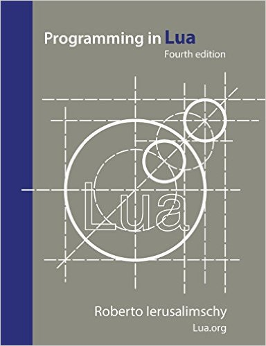

+++
title = "常见问题"
date = 2024-01-25T22:09:06+08:00
type = "docs"
description = ""
isCJKLanguage = true
draft = false

+++

# Frequently Asked Questions 常见问题

Here are answers to some frequently asked questions about Lua.

​	以下是有关 Lua 的一些常见问题的解答。
For an introduction to what Lua is, see this [summary](https://www.lua.org/about.html) or learn how to [get started](https://www.lua.org/start.html) with Lua.

​	有关 Lua 是什么的介绍，请参阅此摘要或了解如何开始使用 Lua。
For programming questions, see the community-maintained [LuaFaq](http://lua-users.org/wiki/LuaFaq) and also the much longer [uFAQ](http://www.luafaq.org/).

​	有关编程问题，请参阅社区维护的 LuaFaq，以及更长的 uFAQ。

## 1 – Distribution 发行版

See the [download](https://www.lua.org/download.html) and [get started](https://www.lua.org/start.html) pages for instructions on how to get source code and binaries for Lua.

​	请参阅下载和入门页面，了解有关如何获取 Lua 源代码和二进制文件的说明。

### 1.1 – What do I need to build Lua?  我需要什么来构建 Lua？

Lua is implemented in pure ANSI C and compiles unmodified in all known platforms. All you need to build Lua is an ANSI C compiler ([gcc](http://www.gnu.org/software/gcc/gcc.html) and [clang](http://clang.llvm.org/) are a popular ones). Lua also compiles cleanly as C++.

​	Lua 是用纯 ANSI C 实现的，并且可以在所有已知平台上进行未修改的编译。您只需要一个 ANSI C 编译器（gcc 和 clang 是流行的编译器）即可构建 Lua。Lua 还可以作为 C++ 进行干净编译。

If you are building Lua in a Unix system (like Linux or Mac OS X), then you probably already have everything you need and simply typing `make` should do it. (You'll only have to choose a suitable platform.) Otherwise, see the [next question](https://www.lua.org/faq.html#1.2). In any case, for full instructions see the [README](https://www.lua.org/manual/5.4/readme.html) that comes with the distribution. [Chapter 1](http://media.wiley.com/product_data/excerpt/71/04700691/0470069171.pdf) of the book [Beginning Lua Programming](https://www.amazon.com/exec/obidos/ASIN/0470069171/lua-faq-20) contains detailed instructions for downloading, building, and installing Lua. Here are simple instructions for common platforms:

​	如果您在 Unix 系统（如 Linux 或 Mac OS X）中构建 Lua，那么您可能已经拥有所需的一切，只需键入 `make` 即可。（您只需选择一个合适的平台。）否则，请参阅下一个问题。无论如何，有关完整说明，请参阅发行版附带的 README。Lua 编程入门一书的第 1 章包含有关下载、构建和安装 Lua 的详细说明。以下是常见平台的简单说明：

```
curl -L -R -O https://www.lua.org/ftp/lua-5.4.6.tar.gz
tar zxf lua-5.4.6.tar.gz
cd lua-5.4.6
make all test
```

If you don't have curl, try wget.
如果您没有 curl，请尝试 wget。

If you don't have the time or the inclination to compile Lua yourself, get a binary from [LuaBinaries](http://luabinaries.sourceforge.net/). If you only want to try Lua, try a [live demo](https://www.lua.org/demo.html).

​	如果您没有时间或倾向自己编译 Lua，请从 LuaBinaries 获取二进制文件。如果您只想尝试 Lua，请尝试现场演示。

### 1.2 – How do I build Lua in Windows and other systems?  如何在 Windows 和其他系统中构建 Lua？

This depends on your compiler. Most compilers in these platforms require that you create "project" files. You'll need to create projects (or whatever your compiler uses) for building the library, the interpreter, and the compiler. The sources are all in the `src` directory. The exact lists of which modules should go into which project are given in the [README](https://www.lua.org/manual/5.4/readme.html#other). See also [BuildingLua](http://lua-users.org/wiki/BuildingLua) in the [wiki](http://lua-users.org/wiki/). [Chapter 1](http://media.wiley.com/product_data/excerpt/71/04700691/0470069171.pdf) of the book [Beginning Lua Programming](https://www.amazon.com/exec/obidos/ASIN/0470069171/lua-faq-20) contains detailed instructions for downloading, building, and installing Lua.

​	这取决于您的编译器。这些平台中的大多数编译器要求您创建“项目”文件。您需要为构建库、解释器和编译器创建项目（或编译器使用的任何内容）。所有源代码都在 `src` 目录中。README 中给出了哪些模块应该进入哪个项目的准确列表。还请参阅 wiki 中的 BuildingLua。Lua 编程入门一书的第 1 章包含有关下载、构建和安装 Lua 的详细说明。

If you don't have the time or the inclination to compile Lua yourself, get a binary from [LuaBinaries](http://luabinaries.sourceforge.net/).

​	如果您没有时间或不想自己编译 Lua，请从 LuaBinaries 获取二进制文件。

### 1.3 – When is the next version due? 下一个版本何时到期？

Lua is in continuous development but new versions are [infrequent](https://www.lua.org/versions.html).

​	Lua 正在持续开发中，但新版本很少。

[Lua 5.4.6](https://www.lua.org/versions.html#5.4) was released on 14 May 2023.

​	Lua 5.4.6 于 2023 年 5 月 14 日发布。

### 1.4 – What changes will the next version bring? 下一个版本会带来哪些变化？

[Lua 5.4](https://www.lua.org/versions.html#5.4) was released recently. For a preview of what is coming in the next version, try a [work version](https://www.lua.org/work/) when available.

​	Lua 5.4 最近发布。要预览下一个版本中的内容，请在可用时尝试工作版本。

If you're concerned with incompatibilities, you shouldn't, because we make every effort to avoid introducing any incompatibilities. When incompatibilities are unavoidable, previous code is usually supported unmodified, possibly by building Lua with a suitable compilation flag. In any case, the [reference manual](https://www.lua.org/manual/5.4/) contains a [list of incompatibilities](https://www.lua.org/manual/5.4/manual.html#8).

​	如果您担心不兼容，您不必担心，因为我们尽一切努力避免引入任何不兼容。当不兼容不可避免时，通常会支持未修改的先前代码，可能通过使用合适的编译标志构建 Lua。无论如何，参考手册都包含不兼容列表。

### 1.5 – Is Lua free software? Lua 是自由软件吗？

Yes, Lua is freely available for any purpose, including commercial purposes, at absolutely no cost, and using it requires no paperwork. Read the details in the [license page](https://www.lua.org/license.html).

​	是的，Lua 可用于任何目的，包括商业目的，完全免费，并且使用它不需要任何文书工作。请阅读许可证页面中的详细信息。

### 1.6 – Is Lua compatible with GPL software? Lua 与 GPL 软件兼容吗？

Yes. Lua is distributed under the terms of the very liberal and well-known [MIT license](http://www.opensource.org/licenses/mit-license.html), which is [compatible with GPL](http://www.gnu.org/licenses/license-list.html#GPLCompatibleLicenses) and is approved by the [Open Source Initiative](http://www.opensource.org/). Read the details in the [license page](https://www.lua.org/license.html).

​	是的。Lua 根据非常宽松且知名的 MIT 许可证条款分发，该许可证与 GPL 兼容，并得到开源倡议组织的认可。请阅读许可证页面中的详细信息。

### 1.7 – What do I call software derived from Lua? 我应该如何称呼源自 Lua 的软件？

Lua is intended to be used in other people's software, including yours. In most cases, Lua is simply extended with new functions that adapt Lua to your specific domain. This is exactly what Lua was designed for. When the time comes to distribute your software two questions may arise: "May I still call the language inside my software Lua?" and "May I call it something else?".

​	Lua 旨在用于其他人的软件中，包括您的软件。在大多数情况下，Lua 只需扩展一些新函数，即可让 Lua 适应您的特定领域。这正是 Lua 的设计初衷。当需要分发您的软件时，可能会出现两个问题：“我是否仍可以将软件中的语言称为 Lua？”和“我是否可以将其称为其他名称？”。

The answer is the following: If the syntax and the semantics of the language (that is, the parser and the virtual machine) remain the same, then the language is still Lua. If you simply add new libraries, or even replace the standard Lua libraries with your own libraries, the language is still the same, and you don't need to (and probably shouldn't) give it a completely different name.

​	答案如下：如果语言的语法和语义（即解析器和虚拟机）保持不变，那么该语言仍然是 Lua。如果您只是添加了新的库，甚至用您自己的库替换了标准 Lua 库，那么该语言仍然是相同的，您不需要（而且可能不应该）给它一个完全不同的名称。

If you have changed the syntax or the semantics of the language, then it's probably a minor extension and you'll probably benefit from calling your language a Lua variant, so that you can refer users to existing Lua documentation and community, with the caveats relating to your extension of the language.

​	如果您更改了语言的语法或语义，那么它可能是一个次要扩展，您可能会受益于将您的语言称为 Lua 变体，以便您可以将用户转到现有的 Lua 文档和社区，并附带与您的语言扩展相关的注意事项。

Usually, people use some name that has Lua as part of it (CGILua, LuaMan, LuaOrb, etc.), so that it is clear that it *uses* Lua but it is not the official Lua distribution. In other words, it should be very clear that your software uses Lua (or, more specifically, that the language inside your software *is* Lua), but also it should be clear that your software *is not* Lua.

​	通常，人们使用一些包含 Lua 的名称（CGILua、LuaMan、LuaOrb 等），以便清楚地表明它使用 Lua，但它不是官方的 Lua 发行版。换句话说，应该非常清楚您的软件使用 Lua（或者更具体地说，软件中的语言是 Lua），但同样应该清楚您的软件不是 Lua。

In any case, please give us credit for Lua, according to the [license](https://www.lua.org/license.html).

​	无论如何，请根据许可证将 Lua 的功劳归于我们。

If this explanation is still unclear, please [contact us](https://www.lua.org/contact.html).

​	如果此说明仍不清楚，请联系我们。

### 1.8 – Is there a public revision control repository? 是否有公共修订控制存储库？

There is a [public mirror at GitHub](https://github.com/lua/lua) of Lua development code, as seen by the Lua team. It contains the full history of all commits, but is mirrored irregularly. Please do not send pull requests. Send [bug reports](https://www.lua.org/faq.html#2.3) and suggestions to the [mailing list](https://www.lua.org/lua-l.html). Lua is open-source software but it is not openly developed. Read [this explanation](http://lua-users.org/lists/lua-l/2008-06/msg00407.html).

​	Lua 开发代码在 GitHub 上有一个公共镜像，由 Lua 团队查看。它包含所有提交的完整历史记录，但镜像不定期更新。请不要发送拉取请求。将错误报告和建议发送至邮件列表。Lua 是开源软件，但它不是公开开发的。阅读此说明。

If you want to see a preview of what is coming in the next version, you'll have to wait until a [work version](https://www.lua.org/work/) becomes available.

​	如果您想预览下一版本中的内容，您必须等到工作版本可用。

### 1.9 – Do you accept patches? 您是否接受补丁？

We encourage discussions based on tested code solutions for problems and enhancements, but we never incorporate third-party code verbatim. We always try to understand the issue and the proposed solution and then, if we choose to address the issue, we provide our own code. All code in Lua is written by us. See also the [previous question](https://www.lua.org/faq.html#1.8).

​	我们鼓励针对问题和增强功能进行基于经过测试的代码解决方案的讨论，但我们绝不会原封不动地合并第三方代码。我们始终尝试了解问题和提议的解决方案，然后，如果我们选择解决该问题，我们会提供我们自己的代码。Lua 中的所有代码均由我们编写。另请参阅前一个问题。

## 2 – Information 信息

Complete information on Lua can be found in its [home page](https://www.lua.org/home.html). You may want to read a [summary](https://www.lua.org/about.html) first, choose an entry point from the [site map](https://www.lua.org/map.html), or learn how to [get started](https://www.lua.org/start.html) with Lua.

​	有关 Lua 的完整信息可以在其主页中找到。您可能首先想要阅读摘要，从站点地图中选择一个入口点，或了解如何开始使用 Lua。

### 2.1 – Is there a mailing list for Lua? Lua 是否有邮件列表？

Yes, a friendly and [active](https://www.lua.org/lua-l-stats.html) one called [lua-l](https://www.lua.org/lua-l.html). Everyone is welcome. Read all about it [here](https://www.lua.org/lua-l.html).

​	是的，有一个友好且活跃的邮件列表，名为 lua-l。欢迎所有人。在此处阅读所有相关信息。

For discussions in Portuguese, there is [Lua BR](https://www.lua.org/lua-br.html), the Brazilian version of lua-l.

​	对于葡萄牙语讨论，有 Lua BR，它是 lua-l 的巴西版本。

### 2.2 – Is there a newsgroup for Lua? Lua 有新闻组吗？

No, just use the [mailing list](https://www.lua.org/lua-l.html). If you want to read the postings using a web interface, visit [Google Groups](https://groups.google.com/g/lua-l) or see the archives at [MARC](http://marc.info/?l=lua-l). You may want also want to [search the archives](http://lua-users.org/lists/lua-l/).

​	没有，只需使用邮件列表即可。如果您想使用网络界面阅读帖子，请访问 Google Groups 或查看 MARC 上的存档。您可能还想搜索存档。

If you're looking for a Q&A forum for Lua, try [stackoverflow](http://stackoverflow.com/questions/tagged/lua) or [pt.stackoverflow](http://pt.stackoverflow.com/questions/tagged/lua).

​	如果您正在寻找 Lua 的问答论坛，请尝试 stackoverflow 或 pt.stackoverflow。

### 2.3 – How do I report a bug in Lua? 如何报告 Lua 中的错误？

First, try to make sure that you have indeed found a bug. [Check](https://www.lua.org/bugs.html) whether the problem has been already [reported](https://www.lua.org/bugs.html) (and probably fixed). [Search the archives](http://lua-users.org/lists/lua-l/) of the [mailing list](https://www.lua.org/lua-l.html) to see whether someone else has come across the same problem and have a fix or an explanation. After that research, if you still think you may have found a bug, post a report in the [mailing list](https://www.lua.org/lua-l.html).

​	首先，请尝试确保您确实找到了错误。检查该问题是否已报告（并且可能已修复）。搜索邮件列表的存档，以查看是否还有其他人遇到过相同的问题，并找到修复方法或解释。经过该研究后，如果您仍然认为自己可能找到了错误，请在邮件列表中发布报告。

Before reporting a bug, try to identify a minimal program that exhibits the bug, also known as [MWE](https://en.wikipedia.org/wiki/Minimal_Working_Example) and [SSCCE](http://sscce.org/). This makes it much easier to reproduce, document, and track down the bug. Also, read Simon Tatham's essay on [How to Report Bugs Effectively](http://www.chiark.greenend.org.uk/~sgtatham/bugs.html).

​	在报告错误之前，请尝试确定一个表现出该错误的最小程序，也称为 MWE 和 SSCCE。这使得重现、记录和追踪错误变得更加容易。此外，请阅读 Simon Tatham 关于如何有效报告错误的文章。

### 2.4 – Who uses Lua? 谁在使用 Lua？

Lua is used in many products and projects around the world, including several well-known games. The full list is too long for us to keep track. See a [list of lists](https://www.lua.org/uses.html).

​	Lua 用于世界各地的许多产品和项目，包括几款知名游戏。完整列表太长，我们无法跟踪。请参阅列表列表。

### 2.5 – Are there any books on Lua? 有关于 Lua 的书籍吗？

[](https://www.amazon.com/exec/obidos/ASIN/8590379868/lua-faq-20)

Yes, several. See the complete list [here](https://www.lua.org/docs.html#books). The book [Programming in Lua](https://www.lua.org/pil/) is a detailed and authoritative introduction to all aspects of Lua programming written by Lua's chief architect. The [fourth edition](https://www.amazon.com/exec/obidos/ASIN/8590379868/lua-faq-20) appeared in 2016 and is also available as an [e-book](https://store.feistyduck.com/products/programming-in-lua-fourth-edition-ebook). The first edition was published in 2003 and is freely available [online](https://www.lua.org/pil/contents.html). [Previous editions](https://www.lua.org/docs.html#pil) are available in several languages. There are several [books on Lua by other authors](https://www.lua.org/docs.html#otherbooks) as well.

​	有，有几本。请在此处查看完整列表。Lua 的首席架构师撰写的《Lua 编程》一书是对 Lua 编程各个方面的详细权威介绍。第四版于 2016 年问世，也可作为电子书获得。第一版于 2003 年出版，可在网上免费获得。以前的版本有几种语言版本。还有其他作者撰写的几本关于 Lua 的书籍。

### 2.6 – How can I help to support the Lua project? 我可以如何帮助支持 Lua 项目？

You can help to [support the Lua project](https://www.lua.org/donations.html) by [buying a book](https://www.lua.org/donations.html#books) published by Lua.org and by [making a donation](https://www.lua.org/donations.html#donation).

​	您可以通过购买 Lua.org 出版的书籍和捐款来帮助支持 Lua 项目。

You can also help to spread the word about Lua by buying Lua products at [Zazzle](http://www.zazzle.com/Lua_Store).

​	您还可以在 Zazzle 购买 Lua 产品来帮助宣传 Lua。