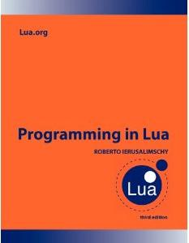

+++
title = "新闻"
date = 2024-01-25T19:01:27+08:00
type = "docs"
description = ""
isCJKLanguage = true
draft = false

+++

> 原文：[https://www.lua.org/news.html](https://www.lua.org/news.html)

Here is a summary of the main events around and about Lua. [![[RSS\]](https://www.lua.org/images/rss.png)](https://www.lua.org/news.rss)

​	以下是有关 Lua 的主要事件摘要。 ![[RSS]](./news_img/rss.png)
Check also the announcements in the [mailing list](https://www.lua.org/lua-l.html), the [recent changes](https://www.lua.org/recent.html) in the site, and our [RSS feeds](https://www.lua.org/rss.html).

​	还请查看邮件列表中的公告、网站上的最新更改以及我们的 RSS 源。

## 2024

- 01 Jan 2024 2024 年 1 月 1 日

  Happy New Year! 新年快乐！

## 2023

- 20 Dec 2023 2023 年 12 月 20 日

  [lua.org](https://lua.org/) moved to a new host in Switzerland, courtesy of Marc Balmer. 

  lua.org 已迁至瑞士的新主机，由 Marc Balmer 提供。

- 11 Dec 2023 2023 年 12 月 11 日

  Mailing list moved to [Google Groups](https://groups.google.com/g/lua-l/). 

  邮件列表已移至 Google Groups。

- 01 Dec 2023 2023 年 12 月 1 日

  [Building a Programming Language](https://classpert.com/classpertx/courses/building-a-programming-language/cohort) course with [Roberto](https://www.lua.org/authors.html). Read the [announcement](http://lua-users.org/lists/lua-l/2023-11/msg00095.html). 

  与 Roberto 一起构建一门编程语言课程。阅读公告。

- 17 Oct 2023 2023 年 10 月 17 日

  [Lua Workshop 2023](https://www.lua.org/wshop23.html) held in Rio de Janeiro to commemorate 30 years of Lua. 

  Lua 研讨会 2023 在里约热内卢举行，以纪念 Lua 诞生 30 周年。

- 18 Aug 2023 2023 年 8 月 18 日

  [Building a Programming Language](https://classpert.com/classpertx/courses/building-a-programming-language/cohort) course with [Roberto](https://www.lua.org/authors.html). Read the [announcement](http://lua-users.org/lists/lua-l/2023-07/msg00055.html). 

  与 Roberto 一起构建一门编程语言课程。阅读公告。

- 14 May 2023 2023 年 5 月 14 日

  [Lua 5.4.6](https://www.lua.org/ftp/lua-5.4.6.tar.gz) released. This is a [bug-fix](https://www.lua.org/bugs.html) release. See the [diffs](https://www.lua.org/work/diffs-lua-5.4.5-lua-5.4.6.html). 

  Lua 5.4.6 发布。这是一个错误修复版本。查看差异。

- 29 Apr 2023 2023 年 4 月 29 日

  [Lua 5.4.5](https://www.lua.org/ftp/lua-5.4.5.tar.gz) released. This is a [bug-fix](https://www.lua.org/bugs.html) release. See the [diffs](https://www.lua.org/work/diffs-lua-5.4.4-lua-5.4.5.html). 

  Lua 5.4.5 发布。这是一个错误修复版本。查看差异。

- 17 Mar 2023 2023 年 3 月 17 日

  [Building a Programming Language](https://clas.pt/bapl-lua-l) course with [Roberto](https://www.lua.org/authors.html). Read the [announcement](http://lua-users.org/lists/lua-l/2023-03/msg00065.html). 

  与 Roberto 一起构建一门编程语言课程。阅读公告。

- 01 Jan 2023 2023 年 1 月 1 日

  We commemorate [30 years of Lua](https://www.lua.org/images/lua30.gif) in 2023. 

  我们纪念 2023 年 Lua 的 30 周年。

## 2022

- 19 Oct 2022 2022 年 10 月 19 日

  [*Lua Programming Gems*](https://www.lua.org/gems/) is now freely available. 

  Lua 编程精粹现在可以免费获得。

- 10 Oct 2022 2022 年 10 月 10 日

  [Lua Workshop 2022](https://www.hs-furtwangen.de/en/faculties/digital-media/labs/games-lab/lua-workshop/) held at Freiburg. 

  Lua 研讨会 2022 在弗赖堡举行。

- 13 Sep 2022 2022 年 9 月 13 日

  Lua receives the [Pedro Ernesto Medal](https://en.wikipedia.org/wiki/Pedro_Ernesto_Baptista#Pedro_Ernesto_Medal), the highest decoration given by the city of Rio de Janeiro. 

  Lua 获得佩德罗·欧内斯特奖章，这是里约热内卢市颁发的最高奖章。

- 02 Jul 2022 2022 年 7 月 2 日

  [Building a Programming Language](https://clas.pt/bapl-lua-l) course with [Roberto](https://www.lua.org/authors.html). Read the [announcement](http://lua-users.org/lists/lua-l/2022-05/msg00030.html). 

  与 Roberto 一起构建一门编程语言课程。阅读公告。

- 26 Jan 2022 2022 年 1 月 26 日

  [Lua 5.4.4](https://www.lua.org/ftp/lua-5.4.4.tar.gz) released. This is a [bug-fix](https://www.lua.org/bugs.html) release. See the [diffs](https://www.lua.org/work/diffs-lua-5.4.3-lua-5.4.4.html). 

  Lua 5.4.4 发布。这是一个修复错误的版本。查看差异。

## 2021

- 09 Aug 2021 2021 年 8 月 9 日

  [Roberto](https://www.lua.org/authors.html) talks about Lua at the [SIGGRAPH 2021 Retrospective](https://s2021.siggraph.org/presentation/?id=miscpan_101&sess=sess234). 

  Roberto 在 SIGGRAPH 2021 回顾中谈到了 Lua。

- 16 Jul 2021 2021 年 7 月 16 日

  Video about [Lua and Roblox](https://www.youtube.com/watch?v=x5eZWJrDlGk) published by [TV PUC-Rio](http://tvpuc.vrc.puc-rio.br/cgi/cgilua.exe/sys/start.htm?infoid=4202&sid=29). 

  TV PUC-Rio 发布了有关 Lua 和 Roblox 的视频。

- 29 Mar 2021 2021 年 3 月 29 日

  [Lua 5.4.3](https://www.lua.org/ftp/lua-5.4.3.tar.gz) released. This is a [bug-fix](https://www.lua.org/bugs.html) release. See the [diffs](https://www.lua.org/work/diffs-lua-5.4.2-lua-5.4.3.html). 

  Lua 5.4.3 发布。这是一个修复错误的版本。查看差异。

- 15 Jan 2021 2021 年 1 月 15 日

  ["Lua, a misunderstood language"](https://andregarzia.com/2021/01/lua-a-misunderstood-language.html), a blog post by Andre Alves Garzia. 

  “Lua，一种被误解的语言”，Andre Alves Garzia 的一篇博客文章。

## 2020

- 03 Dec 2020 2020 年 12 月 03 日

  [Lua 5.4.2](https://www.lua.org/ftp/lua-5.4.2.tar.gz) released. This is a [bug-fix](https://www.lua.org/bugs.html) release. See the [diffs](https://www.lua.org/work/diffs-lua-5.4.1-lua-5.4.2.html). 

  Lua 5.4.2 发布。这是一个错误修复版本。查看差异。

- 29 Oct 2020 2020 年 10 月 29 日

  [Roberto](https://www.lua.org/authors.html) talks [live about Lua](https://www.youtube.com/watch?v=REwxKPitiZM). See the [announcement](http://www.inf.puc-rio.br/blog/noticia/noticia/roberto-ierusalimschy-faz-live-lua-na-puc-rio-na-quinta-feira-29). (in Portuguese) 

  Roberto 现场谈论 Lua。查看公告。（葡萄牙语）

- 09 Oct 2020 2020 年 10 月 09 日

  [Lua 5.4.1](https://www.lua.org/ftp/lua-5.4.1.tar.gz) released. This is a [bug-fix](https://www.lua.org/bugs.html) release. See the [diffs](https://www.lua.org/work/diffs-lua-5.4.0-lua-5.4.1.html). 

  Lua 5.4.1 发布。这是一个错误修复版本。查看差异。

- 25 Sep 2020 2020 年 9 月 25 日

  [Lua 5.3.6](https://www.lua.org/ftp/lua-5.3.6.tar.gz) released. This is a [bug-fix](https://www.lua.org/bugs.html) release. See the [diffs](https://www.lua.org/work/diffs-lua-5.3.5-lua-5.3.6.html). 

  Lua 5.3.6 发布。这是一个错误修复版本。查看差异。

- 29 Jun 2020 2020 年 6 月 29 日

  [Lua 5.4.0](https://www.lua.org/ftp/lua-5.4.0.tar.gz) released. Check out its [features](https://www.lua.org/versions.html#5.4). 

  Lua 5.4.0 发布。查看其功能。

- 10 Jun 2020 2020 年 6 月 10 日

  [Lua Workshop 2021](https://www.hs-furtwangen.de/en/faculties/digital-media/labs/games-lab/lua-workshop/) to be held in Freiburg, Germany. (postponed to 2022) 

  Lua Workshop 2021 将在德国弗赖堡举行。（推迟至 2022 年）

- 06 Feb 2020 2020 年 2 月 6 日

  [Lua Workshop 2020](https://www.hs-furtwangen.de/en/faculties/digital-media/labs/games-lab/lua-workshop/) to be held in Freiburg, Germany. Read the [announcement](http://lua-users.org/lists/lua-l/2020-02/msg00081.html). (postponed to 2021) 

  Lua Workshop 2020 将在德国弗赖堡举行。阅读公告。（推迟至 2021 年）

## 2019

- 16 Oct 2019 2019 年 10 月 16 日

  [Lua 5.4.0 (beta)](https://www.lua.org/work/) released. 

  Lua 5.4.0（测试版）发布。

- 13 Jun 2019 2019 年 6 月 13 日

  [Lua 5.4.0 (alpha)](https://www.lua.org/work/) released. 

  Lua 5.4.0（alpha 版）发布。

- 03 Mar 2019 2019 年 3 月 3 日

  [Lua in Moscow Conference 2019](http://lua.moscow/conf/2019/) held in Moscow. 

  2019 年莫斯科 Lua 大会在莫斯科举行。

## 2018

- 26 Oct 2018 2018 年 10 月 26 日

  ["A look at the design of Lua"](https://cacm.acm.org/magazines/2018/11/232214-a-look-at-the-design-of-lua/) published in [Communications of the ACM](https://cacm.acm.org/magazines/2018/11/232214-a-look-at-the-design-of-lua/). Watch the [video](https://vimeo.com/292779036). 

  《ACM 通讯》发表了“Lua 设计一瞥”。观看视频。

- 06–07 Sep 2018 2018 年 9 月 6 日至 7 日

  [Lua Workshop 2018](https://www.lua.org/wshop18.html) held in Kaunas, Lithuania. 

  2018 年 Lua 研讨会在立陶宛考纳斯举行。

- 20–22 Jul 2018 2018 年 7 月 20 日至 22 日

  [TUG 2018](http://tug.org/tug2018/) held in Rio de Janeiro. The Lua team are special guests. 

  2018 年 TUG 在里约热内卢举行。Lua 团队是特邀嘉宾。

- 10 Jul 2018 2018 年 7 月 10 日

  [Lua 5.3.5](https://www.lua.org/ftp/lua-5.3.5.tar.gz) released. This is a [bug-fix](https://www.lua.org/bugs.html) release. See the [diffs](https://www.lua.org/work/diffs-lua-5.3.4-lua-5.3.5.html).

   Lua 5.3.5 发布。这是一个修复错误的版本。查看差异。

- 07 Jul 2018 2018 年 7 月 7 日

  [Lua Workshop 2018](https://www.lua.org/wshop18.html) to be held in Kaunas, Lithuania, cortesy of CUJO. 

  2018 年卢阿工作坊将在立陶宛考纳斯举行，由 CUJO 赞助。

- 18 Jun 2018 2018 年 6 月 18 日

  [Lua 5.4.0 (work2)](https://www.lua.org/work/) released. 

  发布 Lua 5.4.0 (work2)。

- 13 Mar 2018 2018 年 3 月 13 日

  [Lua 5.4.0 (work1)](https://www.lua.org/work/) released. 

  发布 Lua 5.4.0 (work1)。

- 01 Jan 2018 2018 年 1 月 1 日

  We commemorate [25 years of Lua](https://www.lua.org/images/lua25.gif) in 2018. 

  我们在 2018 年纪念 Lua 诞生 25 周年。

## 2017

- 16–17 Oct 2017 2017 年 10 月 16 日至 17 日

  [Lua Workshop 2017](https://www.lua.org/wshop17.html) held in San Francisco. 

  2017 年卢阿工作坊在旧金山举行。

- 16 Aug 2017 2017 年 8 月 16 日

  [Roberto](https://www.lua.org/authors.html) participates in [Seminário Inovanças](https://museudoamanha.org.br/sites/default/files/15-08 - Cartaz A1 [Inovancas]07.pdf) at the [Museum of Tomorrow](http://museudoamanha.org.br/en/) in Rio. 

  罗伯托参加了在里约热内卢的明日博物馆举行的 Seminário Inovanças。

- 24 Jul 2017 2017 年 7 月 24 日

  [Lua Workshop 2017](https://www.lua.org/wshop17.html) to be held in San Francisco, CA, courtesy of Kong. 

  由 Kong 赞助的 2017 年 Lua 研讨会将在加利福尼亚州旧金山举行。

- 05 Jul 2017 2017 年 7 月 5 日

  Added [showcase page](https://www.lua.org/showcase.html). 添加了展示页面。

- 20 Jun 2017 2017 年 6 月 20 日

  [Roberto](https://www.lua.org/authors.html) gives a keynote at [Curry On 2017](http://www.curry-on.org/2017/). Watch the [video](https://www.youtube.com/watch?v=57jKNEKSNWA). 罗伯托在 2017 年 Curry On 大会上发表了主题演讲。观看视频。

- 03 Jun 2017 2017 年 6 月 3 日

  [LuaConf 2017](http://luaconf.com/) held in Rio de Janeiro. 

  LuaConf 2017 在里约热内卢举行。

- 25 Apr 2017 2017 年 4 月 25 日

  Fourth edition of *Programming in Lua* available as [e-book](https://store.feistyduck.com/products/programming-in-lua-fourth-edition-ebook). 

  Lua 编程第四版现已作为电子书提供。

- 25 Apr 2017 2017 年 4 月 25 日

  Lua features in the ["Inovanças – Creations Brazilian style"](http://museudoamanha.org.br/en/inovancas-creations-brazilian-style) exhibition at the [Museum of Tomorrow](http://museudoamanha.org.br/en/) in Rio. Lua 特色在里约热内卢明日博物馆的“Inovanças – 巴西风格创作”展览中展出。 Watch the [welcome video](https://www.youtube.com/watch?v=zNANLAPPNdU) and read the [catalog](https://www.lua.org/doc/Inovancas.pdf). Watch the [video about Lua](https://www.youtube.com/watch?v=0cgfcpTOZwo&t=243). 观看欢迎视频并阅读目录。观看有关 Lua 的视频。

- 23 Mar 2017 2017 年 3 月 23 日

  [Roberto](https://www.lua.org/authors.html) will give a keynote at [Curry On 2017](http://www.curry-on.org/2017/) in June. 

  Roberto 将在 6 月份的 Curry On 2017 大会上发表主旨演讲。

- 05 Mar 2017 2017 年 3 月 5 日

  [Lua in Moscow Conference 2017](http://lua.moscow/conf/2017/) held in Moscow. 

  2017 年莫斯科 Lua 大会在莫斯科举行。

- 20 Feb 2017 2017 年 2 月 20 日

  [Mailing list](https://www.lua.org/lua-l.html) turns 20. Read the [announcement](http://lua-users.org/lists/lua-l/2017-02/msg00184.html). 

  邮件列表成立 20 周年。阅读公告。

- 30 Jan 2017 2017 年 1 月 30 日

  [Lua 5.3.4](https://www.lua.org/ftp/lua-5.3.4.tar.gz) released. This is a [bug-fix](https://www.lua.org/bugs.html) release. See the [diffs](https://www.lua.org/work/diffs-lua-5.3.3-lua-5.3.4.html). 

  发布 Lua 5.3.4。这是一个修复错误的版本。查看差异。

- 08 Jan 2017 2017 年 1 月 8 日

  [LuaConf 2017](http://luaconf.com/) to be held in June. Read the [announcement](http://lua-users.org/lists/lua-l/2017-01/msg00047.html). 

  LuaConf 2017 将于 6 月举行。阅读公告。

## 2016

- 13–14 Oct 2016 2016 年 10 月 13 日至 14 日

  [Lua Workshop 2016](https://www.lua.org/wshop16.html) held in San Francisco. 

  Lua Workshop 2016 在旧金山举行。

- 01 Aug 2016 2016 年 8 月 1 日

  [Fourth edition](https://www.amazon.com/exec/obidos/ASIN/8590379868/lua-news-20) of *Programming in Lua* published. 

  出版了《用 Lua 进行编程》的第四版。

- 09 Jul 2016 2016 年 7 月 9 日

  [LuaConf 2016](http://luaconf.com/2016) held in Rio de Janeiro. See some [photos](https://www.flickr.com/photos/142579272@N02/).

   LuaConf 2016 在里约热内卢举行。查看一些照片。

- 06 Jun 2016 2016 年 6 月 6 日

  [Lua 5.3.3](https://www.lua.org/ftp/lua-5.3.3.tar.gz) released. This is a [bug-fix](https://www.lua.org/bugs.html) release. See the [diffs](https://www.lua.org/work/diffs-lua-5.3.2-lua-5.3.3.html). 

  发布 Lua 5.3.3。这是一个修复错误的版本。请参阅差异。

- 06 May 2016 2016 年 5 月 6 日

  Get 20% off when you buy [*Programando em Lua*](http://www.grupogen.com.br/programando-em-lua?code=luaorg&utm_source=luaorgutm_medium=beneficios&utm_campaign=parceria_luaorg_9788521626992) through lua.org 

  通过 lua.org 购买 Programando em Lua 可享受 20% 的折扣

- 15 Mar 2016 2016 年 3 月 15 日

  lua.org now accepts [https](https://www.lua.org/) connections, courtesy of Pepperfish. 

  lua.org 现在接受 https 连接，由 Pepperfish 提供。

- 09 Mar 2016 2016 年 3 月 9 日

  [LuaConf 2016](http://luaconf.com/2016) to be held in Rio de Janeiro, courtesy of Etiene Dalcol and Evandro Gonçalves. 

  LuaConf 2016 将在里约热内卢举行，由 Etiene Dalcol 和 Evandro Gonçalves 提供。

- 04 Feb 2016 2016 年 2 月 4 日

  [Lua Workshop 2016](https://www.lua.org/wshop16.html) to be held in San Francisco, CA, courtesy of Mashape. 

  Lua Workshop 2016 将在加利福尼亚州旧金山举行，由 Mashape 提供。

## 2015

- 30 Nov 2015 2015 年 11 月 30 日

  [Lua 5.3.2](https://www.lua.org/ftp/lua-5.3.2.tar.gz) released. This is a [bug-fix](https://www.lua.org/bugs.html) release. See the [diffs](https://www.lua.org/work/diffs-lua-5.3.1-lua-5.3.2.html). Lua 5.3.2 发布。这是一个错误修复版本。请参阅差异。

- 15–16 Oct 2015 2015 年 10 月 15 日至 16 日

  [Lua Workshop 2015](https://www.lua.org/wshop15.html) held in Stockholm. Lua Workshop 2015 在斯德哥尔摩举行。

- 26 Jun 2015 2015 年 6 月 26 日

  [*Programando em Lua*](http://www.grupogen.com.br/programando-em-lua?code=luaorg&utm_source=luaorgutm_medium=beneficios&utm_campaign=parceria_luaorg_9788521626992) published. It's a Portuguese translation of the third edition of [*Programming in Lua*](https://www.lua.org/pil/). 《用 Lua 编程》出版。这是《用 Lua 编程》第三版的葡萄牙语译本。

- 17 Jun 2015 2015 年 6 月 17 日

  [Lua 5.3.1](https://www.lua.org/ftp/lua-5.3.1.tar.gz) released. This is a [bug-fix](https://www.lua.org/bugs.html) release. See the [diffs](https://www.lua.org/work/diffs-lua-5.3.0-lua-5.3.1.html). Lua 5.3.1 发布。这是一个修复漏洞的版本。请参阅差异。

- 09 Apr 2015 2015 年 4 月 9 日

  [Lua Workshop 2015](https://www.lua.org/wshop15.html) to be held in Stockholm, Sweden, courtesy of King. 2015 年 Lua 研讨会将在瑞典斯德哥尔摩举行，由 King 提供赞助。

- 07 Mar 2015 2015年3月7日

  [Lua 5.2.4](https://www.lua.org/ftp/lua-5.2.4.tar.gz) released. This is a [bug-fix](https://www.lua.org/bugs.html) release. See the [diffs](https://www.lua.org/work/diffs-lua-5.2.3-lua-5.2.4.html). Lua 5.2.4 发布。这是一个修复错误的版本。查看差异。

- 12 Jan 2015 2015 年 1 月 12 日

  [Lua 5.3.0](https://www.lua.org/ftp/lua-5.3.0.tar.gz) released. Check out its [features](https://www.lua.org/versions.html#5.3). Lua 5.3.0 发布。查看其功能。

## 2014

- 11 Dec 2014 2014 年 12 月 11 日

  [Lua 5.3.0](https://www.lua.org/work/) entered final release-candidate cycle. Lua 5.3.0 进入最终候选版本周期。

- 23 Oct 2014 2014 年 10 月 23 日

  [Lua 5.3.0 (beta)](https://www.lua.org/work/) released. Lua 5.3.0（测试版）发布。

- 13–14 Sep 2014 2014 年 9 月 13 日至 14 日

  [Lua Workshop 2014](https://www.lua.org/wshop14.html) held in Moscow. Lua 研讨会 2014 在莫斯科举行。

- 31 Jul 2014 2014 年 7 月 31 日

  [Lua 5.3.0 (alpha)](https://www.lua.org/work/) released. Lua 5.3.0（alpha）发布。

- 19 Jun 2014 2014 年 6 月 19 日

  [Lua 5.3.0 (work3)](https://www.lua.org/work/) released. Lua 5.3.0（work3）发布。

- 15 Apr 2014 2014 年 4 月 15 日

  [Lua Workshop 2014](https://www.lua.org/wshop14.html) to be held in Moscow, Russia, courtesy of Alexander Gladysh. Lua 工作坊 2014 将在俄罗斯莫斯科举行，由 Alexander Gladysh 赞助。

- 21 Mar 2014 2014 年 3 月 21 日

  [Lua 5.3.0 (work2)](https://www.lua.org/work/) released. Lua 5.3.0（work2）发布。

- 28 Jan 2014 2014 年 1 月 28 日

  Reference manual available in [Portuguese](https://www.lua.org/manual/5.2/pt/). 参考手册提供葡萄牙语版本。

## 2013

- 07 Dec 2013 2013 年 12 月 7 日

  [Lua 5.2.3](https://www.lua.org/ftp/lua-5.2.3.tar.gz) released. This is a [bug-fix](https://www.lua.org/bugs.html) release. Lua 5.2.3 发布。这是一个错误修复版本。

- 23–24 Nov 2013 2013 年 11 月 23-24 日

  [Lua Workshop 2013](https://www.lua.org/wshop13.html) held in Toulouse. Lua 研讨会 2013 在图卢兹举行。

- 02 Oct 2013 2013 年 10 月 2 日

  [CBSoft 2013](http://cbsoft2013.unb.br/cbsoft/pesquisa-desenvolvimento-e-inovacao) celebrates 20 years of Lua. See the [slides](http://www.dcc.ufrj.br/~fabiom/lua_20years.pdf). CBSoft 2013 庆祝 Lua 诞生 20 周年。请参阅幻灯片。

- 28 Jul 2013 2013 年 7 月 28 日

  We commemorate 20 years of the first version of Lua today. Read the [announcement](http://lua-users.org/lists/lua-l/2013-07/msg00846.html). 今天，我们纪念 Lua 第一个版本诞生 20 周年。阅读公告。

- 23 Jul 2013 2013 年 7 月 23 日

  [Roberto](https://www.lua.org/authors.html) receives the [Scientific Merit Award](http://www.sbc.org.br/33-premios/148-merito-cientifico) of the Brazilian Computer Society for his work on Lua. Roberto 因其在 Lua 上的工作而获得巴西计算机协会颁发的科学功绩奖。

- 22 Jul 2003 2003 年 7 月 22 日

  Added page on [getting started](https://www.lua.org/start.html) with Lua. 添加了 Lua 入门页面。

- 12 Jul 2013 2013 年 7 月 12 日

  [Lua Workshop 2013](https://www.lua.org/wshop13.html) to be held in Toulouse, France, courtesy of Benjamin Cabé and Kévin Kin-foo. 由 Benjamin Cabé 和 Kévin Kin-foo 赞助的 2013 年 Lua 研讨会将在法国图卢兹举行。

- 06 Jul 2013 2013 年 7 月 6 日

  [Lua 5.3.0 (work1)](https://www.lua.org/work/) released. 发布 Lua 5.3.0 (work1)。

- 15 May 2013 2013 年 5 月 15 日

  [Roberto](https://www.lua.org/authors.html) gives an [invited talk](http://www2013.org/program/why-do-we-need-multiple-languages/) at [WWW 2013](http://www2013.org/). See the [slides](https://www.inf.puc-rio.br/~roberto/talks/www2013.pdf). Roberto 在 2013 年 WWW 大会上发表了特邀演讲。请参阅幻灯片。

- 14 May 2013 2013 年 5 月 14 日

  Third edition of *Programming in Lua* available as [e-book](https://store.feistyduck.com/products/programming-in-lua). 《用 Lua 进行编程》第三版现已作为电子书提供。

- 27 Mar 2013 2013 年 3 月 27 日

  [Lua 5.2.2](https://www.lua.org/ftp/lua-5.2.2.tar.gz) released. This is a [bug-fix](https://www.lua.org/bugs.html) release. Lua 5.2.2 发布。这是一个错误修复版本。

- 03 Jan 2013 2013 年 1 月 3 日 Lua 编程第三版发布。

  [Third edition](https://www.amazon.com/exec/obidos/ASIN/859037985X/lua-news-20) of *Programming in Lua* published. 2012 年 12 月 10 日 现在可以通过 PayPal 捐赠给 Lua 项目。

## 2012

- 10 Dec 2012 2012 年 11 月 29 日至 30 日 Lua 研讨会 2012 在 Verisign 举行。

  [Donations](https://www.lua.org/donations.html#donation) to the Lua project via PayPal are again available. 2012 年 9 月 2 日至 8 日 Roberto 在软件工程创新语言激光夏季学校讲授使用 Lua 进行真实脚本编写的课程。

- 29–30 Nov 2012 2012 年 6 月 14 日

  [Lua Workshop 2012](https://www.lua.org/wshop12.html) held at Verisign.

- 02–08 Sep 2012

  [Roberto](https://www.lua.org/authors.html) gives a course on *Real Scripting with Lua* at the [LASER Summer School on Innovative Languages for Software Engineering](http://laser.inf.ethz.ch/2012/lectures.php#Ierusalimschy).

- 14 Jun 2012

  [Lua 5.2.1](https://www.lua.org/ftp/lua-5.2.1.tar.gz) released. This is a [bug-fix](https://www.lua.org/bugs.html) release. Lua 5.2.1 发布。这是一个错误修复版本。

- 21 May 2012 2012 年 5 月 21 日

  [Lua Workshop 2012](https://www.lua.org/wshop12.html) to be held at Verisign, courtesy of John Rodriguez. Lua Workshop 2012 将在 Verisign 举行，由 John Rodriguez 提供赞助。

- 04 May 2012 2012 年 5 月 4 日

  [LuaJIT](http://luajit.org/) gets a dedicated [mailing list](http://luajit.org/list.html). Read the [announcement](http://lua-users.org/lists/lua-l/2012-05/msg00114.html). LuaJIT 获得了一个专门的邮件列表。阅读公告。

- 17 Apr 2012 2012 年 4 月 17 日

  [Lua store](http://www.fibers.com/shop/Lua) opens at Fibers. Use Lua, wear Lua! (no longer active) Lua 商店在 Fibers 开业。使用 Lua，穿着 Lua！（不再活跃）

- 02 Apr 2012 2012 年 4 月 2 日

  Started plans for the [Lua Workshop 2012](http://lua-users.org/wiki/LuaWorkshopTwoThousandTwelve). 开始计划 Lua Workshop 2012。

- 20 Feb 2012 2012 年 2 月 20 日

  [Mailing list](https://www.lua.org/lua-l.html) turns 15. Read the [announcement](http://lua-users.org/lists/lua-l/2012-02/msg00898.html). 邮件列表满 15 岁。阅读公告。

- 17 Feb 2012 2012 年 2 月 17 日

  [Lua 5.1.5](https://www.lua.org/ftp/lua-5.1.5.tar.gz) released. This is a [bug-fix](https://www.lua.org/bugs.html) release. Lua 5.1.5 发布。这是一个错误修复版本。

- 30 Jan 2012 2012 年 1 月 30 日

  Wikipedia chooses Lua as its new template language. Read the [announcement](http://en.wikipedia.org/wiki/Wikipedia:Wikipedia_Signpost/2012-01-30/Technology_report). 维基百科选择 Lua 作为其新的模板语言。阅读公告。

- 13 Jan 2012 2012 年 1 月 13 日

  Lua wins the [Front Line Award 2011](http://www.gamasutra.com/view/news/129084/Announcing_Game_Developer_magazines_2011_Front_Line_Award_winners.php) from [Game Developers Magazine](http://www.gdmag.com/) in the category *Programming Tools*. Lua 赢得游戏开发者杂志 2011 年前线奖，类别为编程工具。

- 09 Jan 2012 2012 年 1 月 9 日

  [Roberto](https://www.lua.org/authors.html) visits Stanford University for three months on a [Tinker Professorship](http://las.stanford.edu/people/tinker-professors). Roberto 作为 Tinker 教授访问斯坦福大学三个月。

## 2011

- 16 Dec 2011 2011 年 12 月 16 日

  [Lua 5.2.0](https://www.lua.org/ftp/lua-5.2.0.tar.gz) released. Check out its [features](https://www.lua.org/versions.html#5.2). Lua 5.2.0 发布。查看其功能。

- 23 Oct 2011 2011 年 10 月 23 日

  [Codea](http://twolivesleft.com/Codea/) launched, an app to create games and simulations using Lua on the iPad. (formerly known as [Codify](http://twolivesleft.com/Codea/PressRelease.html)) Codea 发布，一款使用 Lua 在 iPad 上创建游戏和模拟的应用程序。（以前称为 Codify）

- 08–09 Sep 2011 2011 年 9 月 8 日至 9 日

  [Lua Workshop 2011](https://www.lua.org/wshop11.html) held in Switzerland. Lua 研讨会 2011 年在瑞士举行。

- 13 Jul 2011 2011 年 7 月 13 日

  [Lua 5.2 (beta)](https://www.lua.org/work/) released. Lua 5.2（测试版）发布。

- 06 Jun 2011 2011 年 6 月 6 日

  Lua enters the top 10 languages of the [TIOBE Programming Community Index](http://www.tiobe.com/tiobe-index/). Lua 进入 TIOBE 编程社区指数前 10 名语言。

- 12 May 2011 2011 年 5 月 12 日

  ["Passing a language through the eye of a needle"](http://queue.acm.org/detail.cfm?id=1983083) published in [ACM Queue](http://queue.acm.org/). Later also published in [Communications of the ACM](http://cacm.acm.org/magazines/2011/7/109909-passing-a-language-through-the-eye-of-a-needle/). “用针眼过滤语言”一文发表于 ACM Queue。之后还发表在 ACM 通讯上。

- 26 Apr 2011 2011 年 4 月 26 日

  [Lua Workshop 2011](https://www.lua.org/wshop11.html) to be held in Switzerland, courtesy of Marc Balmer. Lua Workshop 2011 将在瑞士举行，由 Marc Balmer 赞助。

- 03 Apr 2011 2011 年 4 月 3 日

  Lua approaches the top 10 languages of the [TIOBE Programming Community Index](http://www.tiobe.com/tiobe-index/). Lua 接近 TIOBE 编程社区指数前 10 名语言。

- 15 Mar 2011 2011 年 3 月 15 日

  Reference manual available in [German](http://lua.coders-online.net/). 德语参考手册可用。

- 12 Feb 2011 2011 年 2 月 12 日

  Started plans for the [Lua Workshop 2011](http://lua-users.org/wiki/LuaWorkshopTwoThousandEleven). 开始计划 Lua 工作坊 2011。

## 2010

- 23 Nov 2010 2010 年 11 月 23 日

  [Lua 5.2 (alpha)](https://www.lua.org/work/) released. Lua 5.2（alpha）发布。

- 30 Oct 2010 2010 年 10 月 30 日

  [Lua 5.2 (work5)](https://www.lua.org/work/) released. Lua 5.2（work5）发布。

- 01 Oct 2010 2010 年 10 月 1 日

  [**Social****Media****Press**](http://www.online-artikel.de/) joins our corporate sponsorship program. (no longer active) SocialMediaPress 加入我们的企业赞助计划。（不再有效）

- 28 Aug 2010 2010 年 8 月 28 日

  [Mailing list](https://www.lua.org/lua-l.html) has a [new home](http://listmaster.pepperfish.net/cgi-bin/mailman/listinfo/lua-l-lists.lua.org) at [Pepperfish](http://www.pepperfish.net/). 邮件列表在 Pepperfish 有了新家。

- 19 Aug 2010 2010 年 8 月 19 日

  Short scheduled maintenance at lua.org. [Mirror site at PUC-Rio](http://www.tecgraf.puc-rio.br/lua/mirror/) activated during downtime. lua.org 计划进行短暂维护。停机期间，PUC-Rio 镜像站点已激活。

- 31 Jul 2010 2010 年 7 月 31 日

  [Lua 5.2 (work4)](https://www.lua.org/work/) released. Lua 5.2 (work4) 发布。

- 18 May 2010 2010 年 5 月 18 日

  [Lua 5.2 (work3)](https://www.lua.org/work/) released. Lua 5.2 (work3) 发布。

- 10 May 2010 2010 年 5 月 10 日

  The [Czechoslovak TeX Users Group](http://www.cstug.cz/index.eng.html) joins our corporate sponsorship program. (no longer active) 捷克斯洛伐克 TeX 用户组加入了我们的企业赞助计划。（不再有效）

- 23 Mar 2010 2010 年 3 月 23 日

  [*Lua Programming Gems*](https://www.lua.org/gems/) available as [e-book](https://store.feistyduck.com/products/lua-programming-gems-ebook). Lua 编程精华现已作为电子书提供。

- 10 Mar 2010 2010 年 3 月 10 日

  [Roberto](https://www.lua.org/authors.html) talks at the [Stanford EE Computer Systems Colloquium](http://www.stanford.edu/class/ee380/) on [the design of Lua](http://www.stanford.edu/class/ee380/Abstracts/100310.html). Watch the [video](http://ee380.stanford.edu/cgi-bin/videologger.php?target=100310-ee380-300.asx). See the [slides](http://www.stanford.edu/class/ee380/Abstracts/100310-slides.pdf). Roberto 在斯坦福大学电子工程计算机系统讨论会上谈到了 Lua 的设计。观看视频。查看幻灯片。

- 09 Mar 2010 2010 年 3 月 9 日

  Tutorial on [Lua scripting in game production](http://www.gdconf.com/conference/tutorials.html#103) given at [GDC 2010](http://www.gdconf.com/). See the [slides](http://www.kore.net/company/luagamedev.html). 在 GDC 2010 上提供的有关游戏制作中 Lua 脚本的教程。查看幻灯片。

- 01 Mar 2010 2010 年 3 月 1 日

  [Adobe](http://www.adobe.com/) joins our corporate sponsorship program. (no longer active) Adobe 加入我们的企业赞助计划。（不再有效）

- 20 Jan 2010 2010 年 1 月 20 日

  [Lua forums](http://forum.luahub.com/) relocated to LuaHUB, courtesy of Stefan Peters and Brett Kapilik. (no longer exists) 由 Stefan Peters 和 Brett Kapilik 提供支持，Lua 论坛已迁移至 LuaHUB。（不再存在）

- 18 Jan 2010 2010 年 1 月 18 日

  Second edition of *Programming in Lua* available as [e-book](https://store.feistyduck.com/products/programming-in-lua). (now the third edition) 第二版《Lua 编程》可作为电子书获得。（现在是第三版）

- 13 Jan 2010 2010 年 1 月 13 日

  [Lua 5.2 (work2)](https://www.lua.org/work/) released. 发布 Lua 5.2 (work2)。

- 08 Jan 2010 2010 年 1 月 8 日

  [Lua 5.2 (work1)](https://www.lua.org/work/) released. 发布 Lua 5.2 (work1)。

## 2009

- 17 Dec 2009 2009 年 12 月 17 日

  A full-day tutorial on [Lua scripting in game production](http://www.gdconf.com/conference/tutorials.html#103) will be given at [GDC 2010](http://www.gdconf.com/). GDC 2010 将提供一个关于游戏制作中 Lua 脚本的全天教程。

- 28 Oct 2009 2009 年 10 月 28 日

  [Lua store](http://www.zazzle.com/Lua_Store) opens at Zazzle. Use Lua, wear Lua! Lua 商店在 Zazzle 开业。使用 Lua，穿着 Lua！

- 06–07 Oct 2009 2009 年 10 月 6 日至 7 日

  [Lua Workshop 2009](https://www.lua.org/wshop09.html) held in Rio de Janeiro. Lua 工作坊 2009 在里约热内卢举行。

- 21 Aug 2009 2009 年 8 月 21 日

  [Roberto](https://www.lua.org/authors.html) gives an introductory Lua course at [SBLP 2009](http://sblp2009.ucpel.tche.br/). Roberto 在 SBLP 2009 上提供了一个 Lua 入门课程。

- 12 Aug 2009 2009 年 8 月 12 日

  Created [Lua BR](http://groups.google.com/group/lua-br), a versão brasileira da [lista de Lua](https://www.lua.org/lua-l.html). 创建了 Lua BR，Lua 列表的巴西版本。 [LatinoWare 2009](http://www.latinoware.org/) promotes an [Ecological Games Contest](http://www.latinoware.org/node/100) in which entries using Lua will get a bonus. LatinoWare 2009 举办生态游戏竞赛，使用 Lua 的参赛作品将获得奖励。

- 20–21 Jul 2009 20–21 日 7 月 2009 年

  [Roberto](https://www.lua.org/authors.html) gives an [introductory Lua course](https://www.lua.org/doc/jai2009.pdf) at [JAI 2009](http://csbc2009.inf.ufrgs.br/index.php?option=com_content&task=view&id=26&Itemid=71). Roberto 在 JAI 2009 上开设了 Lua 入门课程。

- 23 Jun 2009 23 日 6 月 2009 年

  [Ansca](http://www.anscamobile.com/) announces the [Corona SDK](http://www.anscamobile.com/corona/) for writing native iPhone applications in Lua. Read the [announcement](http://lua-users.org/lists/lua-l/2009-06/msg00589.html). Ansca 宣布推出 Corona SDK，用 Lua 编写原生 iPhone 应用程序。阅读公告。

- 08 Jun 2009 08 日 6 月 2009 年

  Google introduces the [Android Scripting Environment](http://google-opensource.blogspot.com/2009/06/introducing-android-scripting.html) with support for Lua. Google 推出 Android 脚本环境，支持 Lua。

- 28 May 2009 28 日 5 月 2009 年

  [Lua Workshop 2009](https://www.lua.org/wshop09.html) to be held in Rio de Janeiro. Lua 研讨会 2009 将在里约热内卢举行。

- 18 May 2009 18 日 5 月 2009 年

  The book [*Concepts of Programming Languages*](http://www.pearsonhighered.com/educator/academic/product/0,3110,0136073476,00.html) includes sections on Lua and a brief interview with [Roberto](https://www.lua.org/authors.html). 《编程语言的概念》一书包括有关 Lua 的章节和对 Roberto 的简短采访。

- 15 Apr 2009 2009 年 4 月 15 日

  Short scheduled maintenance at lua.org. [Mirror site at PUC-Rio](http://www.tecgraf.puc-rio.br/lua/) activated during downtime. lua.org 上的短暂计划维护。在停机期间激活 PUC-Rio 的镜像站点。

- 27 Mar 2009 2009 年 3 月 27 日

  Interview with the [Lua team](https://www.lua.org/authors.html) to appear in the book [*Masterminds of Programming*](https://www.amazon.com/exec/obidos/ASIN/0596515170/lua-news-20). Lua 团队接受采访，内容将出现在《编程大师》一书中。

- 12 Jan 2009 2009 年 1 月 12 日

  Reference manual available in [Hungarian](http://thor.4242.hu/scripting/manual_hu.html). (no longer exists) 参考手册提供匈牙利语版本。（不再存在）

## 2008

- 01 Dec 2008 2008 年 12 月 1 日

  [*Lua Programming Gems*](https://www.lua.org/gems/) published. Read the [announcement](http://lua-users.org/lists/lua-l/2008-12/msg00228.html). 《Lua 编程珍品》已出版。阅读公告。

- 19 Sep 2008 2008 年 9 月 19 日

  [Roberto](https://www.lua.org/authors.html) talks about Lua at [PyConBrasil 2008](http://pyconbrasil.com.br/saiba-mais/noticias/criador-da-linguagem-lua-e-palestrante-convidado-na-pyconbrasil-2008). See the [slides](https://www.inf.puc-rio.br/~roberto/talks/luapyconf.pdf). Roberto 在 PyConBrasil 2008 上谈论 Lua。查看幻灯片。

- 11 Sep 2008 2008 年 9 月 11 日

  Roberto [interviewed](https://www.computerworld.com.au/article/260022/a-z_programming_languages_lua/) for Computerworld's *The A-Z of Programming Languages*. Roberto 接受 Computerworld 的编程语言 A-Z 采访。

- 22 Aug 2008 2008 年 8 月 22 日

  [Lua 5.1.4](https://www.lua.org/ftp/lua-5.1.4.tar.gz) released. This is a [bug-fix](https://www.lua.org/bugs.html) release. Lua 5.1.4 发布。这是一个修复错误的版本。

- 14–15 Jul 2008 2008 年 7 月 14 日至 15 日

  [Lua Workshop 2008](https://www.lua.org/wshop08.html) held at George Washington University in Washington, D.C.. Lua Workshop 2008 在华盛顿特区的乔治华盛顿大学举行。

- 01 Jul 2008 2008 年 7 月 1 日

  [**TYPO3** (AOE media)](http://www.aoemedia.de/) joins our corporate sponsorship program. (no longer active) TYPO3 (AOE media) 加入我们的企业赞助计划。（不再有效）

- 06 Jun 2008 2008 年 6 月 6 日

  Announced corporate sponsorship program: [Océ](http://www.oce.com/) is our first corporate sponsor. (no longer active) 宣布企业赞助计划：Océ 是我们的第一个企业赞助商。（不再有效）

- 30 May 2008 2008 年 5 月 30 日

  [Roberto](https://www.lua.org/authors.html) talks about Lua at [JAOO 2008](http://jaoo.com.au/), in [Brisbane](http://jaoo.com.au/brisbane-2008/presentation/Learn+LUA+in+20+minutes) and [Sydney](http://jaoo.com.au/sydney-2008/presentation/Learn+LUA+in+20+minutes). Roberto 在布里斯班和悉尼的 JAOO 2008 上谈论 Lua。

- 13 May 2008 2008 年 5 月 13 日

  [Chinese translation](http://www.phei.com.cn/bookshop/bookinfo.asp?bookcode=TP061870 &booktype=new) of *Programming in Lua* published. 《用 Lua 进行编程》的中文译本出版。

- 07 May 2008 2008 年 5 月 7 日

  [Patch for Lua 5.1.3](https://www.lua.org/ftp/patch-lua-5.1.3) released. (superseded by Lua 5.1.4) 发布 Lua 5.1.3 补丁。（已被 Lua 5.1.4 取代）

- 13 Mar 2008 2008 年 3 月 13 日

  Reference manual available in [Russian](http://www.lua.ru/doc/). (no longer exists) 参考手册提供俄语版本。（不再存在）

- 21 Feb 2008 2008 年 2 月 21 日

  Live Lua [demo](https://www.lua.org/demo.html) available. 有可用的 Lua 实时演示。

- 25 Jan 2008 2008 年 1 月 25 日

  [Lua 5.1.3](https://www.lua.org/ftp/lua-5.1.3.tar.gz) released. This is a [bug-fix](https://www.lua.org/bugs.html) release. 发布 Lua 5.1.3。这是一个修复错误的版本。

- 24 Jan 2008 2008 年 1 月 24 日

  ["Introductory Lua programming"](https://www.amazon.co.jp/exec/obidos/ASIN/4797342722) by Yutaka Ueno published (in Japanese). 上野裕隆的“Lua 编程入门”（日文）出版。

## 2007

- 20 Dec 2007 2007 年 12 月 20 日

  Launched campaign to [Write "Lua" Right!](https://www.lua.org/about.html#name) 发起“正确编写 Lua”活动！

- 18 Dec 2007 2007 年 12 月 18 日

  Reference manual available in [Spanish](https://www.lua.org/manual/5.1/es/). 参考手册提供西班牙语版本。

- 09 Dec 2007 2007 年 12 月 09 日

  [Lua Workshop 2008](https://www.lua.org/wshop08.html) to be held at George Washington University in Washington, D.C., courtesy of Matthew Burke. Read the [preliminary announcement](http://lua-users.org/lists/lua-l/2007-12/msg00109.html). 2008 年 Lua 研讨会将在华盛顿特区的乔治华盛顿大学举行，由马修·伯克赞助。阅读初步公告。

- 10 Sep 2007 2007 年 9 月 10 日

  Reference manual available in [Portuguese](https://www.lua.org/manual/5.1/pt/). 参考手册提供葡萄牙语版本。

- 28 Aug 2007 2007 年 8 月 28 日

  [Article on LuaView](http://www.ilb2b.it//labview_world/pdf_riv/200705/20070521007_1.pdf) appears in [*LabVIEW World*](http://www.ilb2b.it/labview/lb_world.asp) (in Italian). LuaView 文章出现在 LabVIEW World（意大利语）。

- 23 Aug 2007 2007 年 8 月 23 日

  Article ["Traveling light, the Lua way"](http://doi.ieeecomputersociety.org/10.1109/MS.2007.150) by Ashwin Hirschi appears in [*IEEE Software*](http://www.computer.org/portal/site/software). Read a [review](http://www.computingreviews.com/Review/review_reviewprint.cfm?review_id=135601). Ashwin Hirschi 在 IEEE Software 中发表文章“轻装旅行，Lua 之道”。阅读评论。

- 05 Aug 2007 2007 年 8 月 5 日

  Lua climbs to position 15 in the [TIOBE Programming Community Index](http://www.tiobe.com/tiobe-index/). Lua 在 TIOBE 编程社区指数中升至第 15 位。

- 17 Jul 2007 2007 年 7 月 17 日

  [Workshop](http://tug.org/tug2007/workshops.html) on [LuaTeX](http://www.luatex.org/) held at [TUG 2007](http://tug.org/tug2007/). Watch the [videos](http://www.river-valley.tv/conferences/tug2007/) of the talks. 2007 年 TUG 上举行的 LuaTeX 研讨会。观看演讲视频。

- 08 Jul 2007 2007 年 7 月 8 日

  Lua climbs to position 18 in the [TIOBE Programming Community Index](http://www.tiobe.com/tiobe-index/). Lua 在 TIOBE 编程社区指数中升至第 18 位。

- 25 Jun 2007 2007 年 6 月 25 日

  [Korean translation](http://insightbook.springnote.com/pages/253177) of *Programming in Lua* published. Lua 编程的韩语译本出版。

- 09 Jun 2007 2007 年 6 月 9 日

  Paper on [the evolution of Lua](https://www.lua.org/doc/hopl.pdf) presented at the [Third ACM SIGPLAN History of Programming Languages Conference](http://research.ihost.com/hopl/HOPL-III.html) (HOPL III), a part of [FCRC 2007](http://fcrc.acm.org/past_fcrc.cfm#fcrc2007). See the [slides](https://www.inf.puc-rio.br/~roberto/talks/hopl-slides.pdf) and the [video](http://portal.acm.org/ft_gateway.cfm?id=1238846&type=mov). 在第三届 ACM SIGPLAN 编程语言历史会议 (HOPL III) 上提交的关于 Lua 演变的论文，这是 FCRC 2007 的一部分。请参阅幻灯片和视频。

- 09 May 2007 2007 年 5 月 9 日

  [Article on Lua](http://www.linuxjournal.com/article/9605) to appear in [Linux Journal](http://www.linuxjournal.com/issue/158). Lua 相关文章即将在 Linux Journal 中刊登。

- 28–29 Apr 2007 2007 年 4 月 28-29 日

  Scheduled maintenance at lua.org. [Mirror site at PUC-Rio](http://www.tecgraf.puc-rio.br/lua/) activated during downtime. lua.org 的计划维护。在停机期间，PUC-Rio 的镜像站点已激活。

- 02 Apr 2007 2007 年 4 月 2 日

  [Lua 5.1.2](https://www.lua.org/ftp/lua-5.1.2.tar.gz) released. This is a [bug-fix](https://www.lua.org/bugs.html) release. Lua 5.1.2 发布。这是一个修复错误的版本。

- 06 Mar 2007 2007 年 3 月 6 日

  Lua climbs to position 25 in the [TIOBE Programming Community Index](http://www.tiobe.com/tiobe-index/). Lua 在 TIOBE 编程社区指数中升至第 25 位。

- 20 Feb 2007 2007 年 2 月 20 日

  [Mailing list](https://www.lua.org/lua-l.html) turns 10. Read the [announcement](http://lua-users.org/lists/lua-l/2007-02/msg00356.html). 邮件列表满 10 岁了。阅读公告。

- 01 Feb 2007 2007 年 2 月 1 日

  [43 abstracts selected](https://www.lua.org/gems/selected.html) for [*Lua Programming Gems*](https://www.lua.org/gems/). 为 Lua 编程精粹选择了 43 篇摘要。

## 2006

- 24 Nov 2006 2006 年 11 月 24 日

  Released [call for contributions](https://www.lua.org/gems/) to *Lua Programming Gems*. 发布了对 Lua 编程精华的征稿通知。

- 06 Oct 2006 2006 年 10 月 06 日

  [German translation](https://www.opensourcepress.de/index.php?26&backPID=15&tt_products=87) of *Programming in Lua* published. Lua 编程的德语译本已出版。

- 05 Oct 2006 2006 年 10 月 05 日

  Lua entered the top 50 in the [TIOBE Programming Community Index](http://www.tiobe.com/tiobe-index/). Lua 进入 TIOBE 编程社区指数前 50 名。

- 04–05 Sep 2006 2006 年 9 月 04 日至 05 日

  [Lua Workshop 2006](https://www.lua.org/wshop06.html) held at Océ. See [photos](http://www.daanschar.com/lua/) and [videos](http://youtube.com/results?search_query=lua+workshop&search=Search). Lua 研讨会 2006 在 Océ 举行。请参阅照片和视频。

- 17 Aug 2006 2006 年 8 月 17 日

  [Reference manual](https://www.lua.org/manual/5.1/) available as a book. [Buy a copy](https://www.amazon.com/exec/obidos/ASIN/8590379833/lua-news-20) and [help to support](https://www.lua.org/donations.html) the Lua project. 参考手册可作为书籍提供。购买一本并帮助支持 Lua 项目。

- 06 Jul 2006 2006 年 7 月 06 日

  Created official page for the [Lua Workshop 2006](https://www.lua.org/wshop06.html). 创建了 Lua Workshop 2006 的官方页面。

- 30 Jun 2006 2006 年 6 月 30 日

  A [poll](http://archive.gamedev.net/gdpolls/viewpoll.asp?ID=788) at [GameDev.net](http://www.gamedev.net/) shows Lua as the favorite embeddable scripting language. GameDev.net 上的一项民意调查显示 Lua 是最受欢迎的可嵌入脚本语言。

- 26 Jun 2006 2006 年 6 月 26 日

  [Lua 5.0.3](https://www.lua.org/ftp/lua-5.0.3.tar.gz) released. This is a [bug-fix](https://www.lua.org/bugs.html) release. Lua 5.0.3 发布。这是一个修复错误的版本。

- 09 Jun 2006 2006 年 6 月 9 日

  [Lua 5.1.1](https://www.lua.org/ftp/lua-5.1.1.tar.gz) released. This is a [bug-fix](https://www.lua.org/bugs.html) release. Lua 5.1.1 发布。这是一个修复错误的版本。

- 03 Jun 2006 2006 年 6 月 3 日

  Lua elected for [DistroWatch May 2006 donation](http://distrowatch.com/weekly.php?issue=20060605#donation). Lua 被选为 DistroWatch 2006 年 5 月捐赠。

- 23 Mar 2006 2006 年 3 月 23 日

  [Second edition](https://www.lua.org/pil/#2ed) of *Programming in Lua* published. Lua 编程第二版发布。

- 21 Feb 2006 2006 年 2 月 21 日

  [Lua 5.1](https://www.lua.org/ftp/lua-5.1.tar.gz) released. Check out its [features](https://www.lua.org/versions.html#5.1). Lua 5.1 发布。查看其功能。

- 15 Feb 2006 2006 年 2 月 15 日

  [Lua Workshop 2006](http://lua-users.org/wiki/LuaWorkshopOhSix) to be held at the Océ R&D site in Venlo (NL), courtesy of Wim Couwenberg. Read the [announcement](http://lua-users.org/lists/lua-l/2006-02/msg00322.html). Lua Workshop 2006 将在位于芬洛 (NL) 的 Océ 研发中心举行，由 Wim Couwenberg 提供赞助。阅读公告。

- 23 Jan 2006 2006 年 1 月 23 日

  Some [audio recordings](http://lua.simmunity.com/) from the [Lua Workshop 2005](https://www.lua.org/wshop05.html) available, courtesy of Shannon Bailey. Read the original [announcement](http://lua-users.org/lists/lua-l/2006-01/msg00397.html) (but note that the URL has changed). 一些来自 Lua Workshop 2005 的音频记录可用，由 Shannon Bailey 提供赞助。阅读原始公告（但请注意 URL 已更改）。

## 2005

- 18 Nov 2005 2005 年 11 月 18 日

  [Lua 5.1 (beta)](https://www.lua.org/work/) released. Lua 5.1（测试版）发布。

- 16 Nov 2005 2005 年 11 月 16 日

  Started plans for the [Lua Workshop 2006](http://lua-users.org/wiki/LuaWorkshopOhSix). Read the [announcement](http://lua-users.org/lists/lua-l/2005-11/msg00175.html). 开始计划 2006 年 Lua 研讨会。阅读公告。

- 04 Nov 2005 2005 年 11 月 4 日

  [Lua In Games Roundtable](http://www.cmpevents.com/GD06/a.asp?option=G&V=3&id=384048) to be held in [GDC 2006](http://www.gdconf.com/). Lua 游戏圆桌会议将在 2006 年 GDC 上举行。

- 29 Sep 2005 2005 年 9 月 29 日

  [*Game Development with Lua*](http://www.charlesriver.com/Books/BookDetail.aspx?productID=109811) published. 《使用 Lua 进行游戏开发》出版。

- 09 Sep 2005 2005 年 9 月 9 日

  [Lua 5.1 (alpha)](https://www.lua.org/work/) released. Lua 5.1（alpha 版）发布。

- 01 Sep 2005 2005 年 9 月 1 日

  Paper on [the evolution of Lua](https://www.lua.org/doc/hopl.pdf) submitted to [ACM HOPL III](http://research.ihost.com/hopl/HOPL.html). 提交给 ACM HOPL III 的关于 Lua 演化的论文。

- 11 Aug 2005 2005 年 8 月 11 日

  [Roberto](https://www.lua.org/authors.html) presents a Lua case study at [Computação & Mercado 2005](http://www.computacaoemercado.com.br/). 罗伯托在 Computação & Mercado 2005 上展示了一个 Lua 案例研究。

- 03 Aug 2005 2005 年 8 月 3 日

  [Mailing list](https://www.lua.org/lua-l.html) reaches 1000 subscribers, another all-time record. 邮件列表达到 1000 名订阅者，再创历史新高。

- 27–28 Jul 2005 2005 年 7 月 27-28 日

  [Lua Workshop 2005](https://www.lua.org/wshop05.html) held at Adobe. Slides for most of the talks are available. Also some [photos](https://www.lua.org/wshop05/photos/). Lua 研讨会 2005 在 Adobe 举行。大多数演讲的幻灯片均已提供。还有一些照片。

- 20 Jun 2005 2005 年 6 月 20 日

  [Roberto](https://www.lua.org/authors.html) talks about Lua at the Politecnico di Milano. The audio is [available](http://lua-users.org/lists/lua-l/2005-06/msg00258.html) (also [here](http://lua-users.org/lists/lua-l/2005-06/msg00260.html)). Roberto 在米兰理工大学发表了关于 Lua 的演讲。音频已提供（此处亦提供）。

- 20 Jun 2005 2005 年 6 月 20 日

  First Lua certification exam [announced](http://lua-users.org/lists/lua-l/2005-06/msg00190.html). (no longer exists) 宣布首次 Lua 认证考试。（不再存在）

- 23 May 2005 2005 年 5 月 23 日

  Paper on [the implementation of Lua 5.0](https://www.lua.org/doc/sblp2005.pdf) presented at the [IX Brazilian Symposium on Programming Languages](http://homepages.dcc.ufmg.br/~mariza/CELP/sblp2005/program.htm). 

  在巴西第九届编程语言研讨会上提交了关于 Lua 5.0 实现的论文。

- 18 May 2005 2005 年 5 月 18 日

  [Lua 5.1 (work6)](https://www.lua.org/work/) released. Lua 5.1 (work6) 发布。

- 16 Mar 2005 2005 年 3 月 16 日

  [Roberto](https://www.lua.org/authors.html) talks about Lua at the [1a Semana de Software Livre da PUC-Rio](http://www.blacklist.com.br/gul/evento/). 

  罗伯托在 PUC-Rio 的第 1 a 届自由软件周上谈论 Lua。

- 04 Mar 2005 2005 年 3 月 4 日

  [Lua 5.1 (work5)](https://www.lua.org/work/) released. 

  Lua 5.1 (work5) 发布。

- 03 Mar 2005 2005 年 3 月 3 日

  [Lua Workshop 2005](https://www.lua.org/wshop05.html) to be held at Adobe, courtesy of Mark Hamburg. Read the [announcement](http://lua-users.org/lists/lua-l/2005-03/msg00037.html). 

  Lua Workshop 2005 将在 Adobe 举行，由 Mark Hamburg 提供赞助。阅读公告。

- 23 Feb 2005 2005 年 2 月 23 日

  Paper on [the implementation of Lua 5.0](https://www.lua.org/doc/sblp2005.pdf) submitted to [IX Brazilian Symposium on Programming Languages](http://www.upe.poli.br/dsc/sblp2005/). 

  关于 Lua 5.0 实现的论文已提交至巴西第九届编程语言研讨会。

- 22 Jan 2005 2005 年 1 月 22 日

  New [Lua forum in Portuguese](http://www.lua.gratison.com/). (no longer exists) 

  新的葡萄牙语 Lua 论坛。（已不存在）

- 11 Jan 2005 2005 年 1 月 11 日

  [Mailing list](https://www.lua.org/lua-l.html) reaches 800 subscribers, an all-time record. 

  邮件列表达到 800 名订阅者，创历史新高。

## 2004

- 30 Dec 2004 2004 年 12 月 30 日

  [Lua 5.1 (work4)](https://www.lua.org/work/) released. 

  Lua 5.1 (work4) 发布。

- 06 Dec 2004 2004 年 12 月 06 日

  [Lua 5.1 (work3)](https://www.lua.org/work/) released.

   Lua 5.1 (work3) 发布。

- 27 Nov 2004 2004 年 11 月 27 日

  [Why Lua is not BASIC](http://www.heyrick.co.uk/frobnicate/download.php?file=frob22.pdf) by Gavin Wraith appears in [*Frobnicate* **22**](http://www.heyrick.co.uk/frobnicate/) (autumn 2004 issue). 

  Gavin Wraith 的文章“为什么 Lua 不是 BASIC”出现在 Frobnicate 22（2004 年秋季刊）。

- 21 Oct 2004 2004 年 10 月 21 日

  Tutorial on Lua given at [WJogos 2004](http://wwwusers.rdc.puc-rio.br/sbgames/wjogos/). Read the [notes](https://www.lua.org/doc/wjogos04.pdf) and the [slides](https://www.lua.org/doc/wjogos04.ppt) (in Portuguese). 

  在 WJogos 2004 上提供了有关 Lua 的教程。阅读笔记和幻灯片（葡萄牙语）。

- 04 Oct 2004 2004 年 10 月 04 日

  [lua.org](http://www.lua.org/) hosted by [Pepperfish](http://www.pepperfish.net/), courtesy of Daniel Silverstone. 

  lua.org 由 Pepperfish 托管，由 Daniel Silverstone 提供。

- 20 Sep 2004 2004 年 9 月 20 日

  [Lua 5.1 (work2)](https://www.lua.org/work/) released. 

  Lua 5.1 (work2) 发布。

- 01 Sep 2004 2004 年 9 月 1 日

  [Lua 5.1 (work1)](https://www.lua.org/work/) released. 

  Lua 5.1 (work1) 发布。

- 23 Jul 2004 2004 年 7 月 23 日

  [Article on Lua](http://www.linux-magazine.com/issue/45/Lua_Programming.pdf) to appear in [Linux Magazine](http://www.linux-magazine.com/). 

  Lua 文章即将在 Linux Magazine 中刊登。

- 05 Jul 2004 2004 年 7 月 5 日

  The book *Programming in Lua* is [online](https://www.lua.org/pil/contents.html). 

  ​	《Lua 编程》一书已在线发布。 

  [Lua web forums](http://www.icynorth.com/forums/index.php?c=8) recreated at Icy North Technologies, courtesy of Brett Kapilik. (moved to [LuaHUB](http://forum.luahub.com/)) 

  ​	Lua 网络论坛在 Icy North Technologies 重新创建，由 Brett Kapilik 提供支持。（已移至 LuaHUB）

- 23 Jun 2004 2004 年 6 月 23 日

  [LuaForge](http://luaforge.net/) opens. Read the [announcement](http://lua-users.org/lists/lua-l/2004-06/msg00555.html). 

  LuaForge 开放。阅读公告。

- 01 May 2004 2004 年 5 月 1 日

  [LabLua](http://www.lua.inf.puc-rio.br/) founded. 

  LabLua 成立。

- 28 Apr 2004 2004 年 4 月 28 日

  Added page for receiving [donations](https://www.lua.org/donations.html) to help support Lua. 

  添加页面以接收捐赠以帮助支持 Lua。

- 24 Mar 2004 2004 年 3 月 24 日

  Roundtable about [Lua in the gaming industry](http://www.cmpevents.com/GDx/a.asp?option=C&V=11&SessID=2272) held at [Game Developers Conference 2004](http://www.gdconf.com/). Read the [report](http://lua-users.org/lists/lua-l/2004-04/msg00164.html). 

  在 2004 年游戏开发者大会上举行关于游戏行业中 Lua 的圆桌会议。阅读报告。

- 23 Mar 2004 2004 年 3 月 23 日

  [Lua 5.1 (work0)](https://www.lua.org/work/) released. Lua 5.1（work0）发布。

- 17 Mar 2004 2004 年 3 月 17 日

  [Lua 5.0.2](https://www.lua.org/ftp/lua-5.0.2.tar.gz) released. This is a [bug-fix](https://www.lua.org/bugs.html) release. 

  Lua 5.0.2 发布。这是一个修复错误的版本。

## 2003

- 15 Dec 2003 2003 年 12 月 15 日

  The book [*Programming in Lua*](https://www.lua.org/pil/) by Roberto Ierusalimschy is published. 

  Roberto Ierusalimschy 的书《用 Lua 进行编程》出版。

- 27 Nov 2003 2003 年 11 月 27 日

  Added page listing [individuals and institutions that have supported Lua](https://www.lua.org/thanks.html). 

  添加了列出支持 Lua 的个人和机构的页面。

- 25 Nov 2003 2003 年 11 月 25 日

  [Lua 5.0.1](https://www.lua.org/ftp/lua-5.0.1.tar.gz) released. This is a [bug-fix](https://www.lua.org/bugs.html) release. 

  发布 Lua 5.0.1。这是一个修复错误的版本。

- 08 Nov 2003 2003 年 11 月 08 日

  [Roberto](https://www.lua.org/authors.html) gives a [talk](http://ll3.ai.mit.edu/abstracts.html#lua) about the innards of Lua at [Lightweight Languages 2003](http://ll3.ai.mit.edu/). See the [slides](https://www.inf.puc-rio.br/~roberto/talks/lua-ll3.pdf). 

  Roberto 在 2003 年轻量级语言大会上发表了关于 Lua 内部结构的演讲。请参阅幻灯片。

- 29 Sep 2003 2003 年 9 月 29 日

  A [poll](http://archive.gamedev.net/gdpolls/viewpoll.asp?ID=163) at [GameDev.net](http://www.gamedev.net/) shows Lua as the most popular language for game scripting. 

  GameDev.net 上的一项民意调查显示 Lua 是最受欢迎的游戏脚本语言。

- 16 Jun 2003 2003 年 6 月 16 日

  Added page listing [all known bugs](https://www.lua.org/bugs.html) in Lua since Lua 4.0. 

  添加了列出 Lua 4.0 以来 Lua 中所有已知错误的页面。

- 07 Jun 2003 2003 年 6 月 07 日

  [Roberto](https://www.lua.org/authors.html) gives an [invited talk](http://www.softwarelivre.org/forum2003/visualiza_grade.php?act=grade&dia=1054954800) on Lua at the [IV Forum Internacional Software Livre](http://www.softwarelivre.org/forum2003/). See the [slides](https://www.inf.puc-rio.br/~roberto/talks/iv-forum.pdf). 

  罗伯托在 IV 论坛国际软件自由上发表了关于 Lua 的受邀演讲。请参阅幻灯片。

- 19 May 2003 2003 年 5 月 19 日

  Mirror of mailing list at Yahoo! Groups closed down. 

  Yahoo! Groups 上的邮件列表镜像已关闭。

- 14 May 2003 2003 年 5 月 14 日

  [Mailing list](https://www.lua.org/lua-l.html) has a new [home](http://bazar2.conectiva.com.br/mailman/listinfo/lua), courtesy of [Conectiva](http://www.conectiva.com.br/) and Gustavo Niemeyer. (moved to [lists.lua.org](http://vlists.pepperfish.net/cgi-bin/mailman/listinfo/lua-l-lists.lua.org)) 

  邮件列表有了新家，感谢 Conectiva 和 Gustavo Niemeyer。（已移至 lists.lua.org）

- 06 May 2003 2003 年 5 月 6 日

  Added a [version history page](https://www.lua.org/versions.html) listing the main features in each version. 

  添加了一个版本历史页面，列出了每个版本的主要功能。

- 11 Apr 2003 2003 年 4 月 11 日

  [Lua 5.0](https://www.lua.org/ftp/lua-5.0.tar.gz) released. Check out its [features](https://www.lua.org/versions.html#5.0). 

  Lua 5.0 发布。查看其功能。

- 10 Mar 2003 2003 年 3 月 10 日

  Yet another [web interface for the mailing list archive](http://archive.neotonic.com/archive/lua-l), courtesy of David Jeske. (no longer active) 

  另一个邮件列表存档的网络界面，由 David Jeske 提供。（不再活跃）

- 11 Feb 2003 2003 年 2 月 11 日

  Added page listing [recent changes](https://www.lua.org/recent.html) in the site and an [RSS feed](https://www.lua.org/recent.rss). 

  添加了列出网站近期更改的页面和 RSS 源。

- 05 Feb 2003 2003 年 2 月 5 日

  [Lua web forums](http://www.icynorth.com/forums/index.php?c=8) created at Icy North Technologies, courtesy of Brett Kapilik. (moved to [LuaHUB](http://forum.luahub.com/)) 

  Lua 网络论坛在 Icy North Technologies 创建，由 Brett Kapilik 提供。（已移至 LuaHUB）

- 14 Jan 2003 2003 年 1 月 14 日

  [The Year in Scripting Languages](http://www.vendian.org/language_year/) released. It contains a review of what happened to Lua in 2002. 

  发布了脚本语言年报。其中包含对 2002 年 Lua 发展情况的回顾。

## 2002

- 17 Dec 2002 2002 年 12 月 17 日

  Lua 5.0 (beta) released. 

  发布了 Lua 5.0（测试版）。

- 29 Aug 2002 2002 年 8 月 29 日

  Started page with [papers and theses](https://www.lua.org/papers.html) on Lua. 

  开始页面，其中包含有关 Lua 的论文和论文。

- 22 Aug 2002 2002 年 8 月 22 日

  Added pages with [web traffic statistics](https://www.lua.org/traffic.html) and [mailing list traffic statistics](https://www.lua.org/lua-l-stats.html). (web traffic statistics no longer available) 

  添加了包含 Web 流量统计信息和邮件列表流量统计信息的页面。（不再提供 Web 流量统计信息）

- 15 Aug 2002 2002 年 8 月 15 日

  Lua 5.0 (alpha) released. Check out the [commemorative logo](https://www.lua.org/images/lua-logo-penta.gif). 

  Lua 5.0（alpha）发布。查看纪念徽标。

- 18 Jul 2002 2002 年 7 月 18 日

  [Source code](https://www.lua.org/source/) available for browsing. 

  源代码可供浏览。

- 10 Jul 2002 2002 年 7 月 10 日

  [Newsgroup interface](http://news.gmane.org/gmane.comp.lang.lua.general) to the mailing list available at [Gmane](http://gmane.org/). (no longer active) 

  Gmane 上提供邮件列表的新组接口。（不再活跃）

- 04 Jul 2002 2002 年 7 月 4 日

  [Lua 4.0.1](https://www.lua.org/ftp/lua-4.0.1.tar.gz) released. This is a [bug-fix](https://www.lua.org/bugs.html) release. 

  Lua 4.0.1 发布。这是一个修复错误的版本。

- 25 May 2002 2002 年 5 月 25 日

  New [web interface for the mailing list archive](http://lua-users.org/lists/lua-l/), courtesy of John Belmonte. 

  约翰·贝尔蒙特提供邮件列表存档的新网络界面。

- 21 May 2002 2002 年 5 月 21 日

  Future versions of Lua will be released under the [MIT license](https://opensource.org/license/mit/). See the new [license page](https://www.lua.org/license.html). 

  ​	未来版本的 Lua 将在 MIT 许可下发布。请参阅新的许可页面。 

  Lua is certified [Open Source](https://opensource.org/osd/) software. Its license is simple and liberal and is [compatible with GPL](https://www.gnu.org/licenses/license-list.html#GPLCompatibleLicenses). 

  ​	Lua 是经过认证的开源软件。其许可证简单宽松，与 GPL 兼容。 

  Lua is not in the public domain and [PUC-Rio](https://www.puc-rio.br/) keeps its copyright. 

  ​	Lua 不属于公共领域，PUC-Rio 保留其版权。

- 13 Mar 2002 2002 年 3 月 13 日

  Updated [mirrors page](https://www.lua.org/mirrors.html): mirrors at Waterloo, Universität Trier, and freesoftware.com no longer exist. 

  更新的镜像页面：滑铁卢大学、特里尔大学和 freesoftware.com 上的镜像不再存在。

- 21 Feb 2002 2002 年 2 月 21 日

  Added [search page](https://www.lua.org/search.html). 

  添加搜索页面。

- 19 Feb 2002 2002 年 2 月 19 日

  [Lua Library Design Workshop](http://lua-users.org/wiki/LuaLibraryWorkshop) held at Harvard University. 

  Lua 库设计研讨会在哈佛大学举行。

- 30 Jan 2002 2002 年 1 月 30 日

  New [mirror in Denmark](ftp://sunsite.dk/pub/languages/lua/), courtesy of SunSITE.dk. (no longer active) 

  丹麦的新镜像，由 SunSITE.dk 提供。（不再活跃）

- 28 Jan 2002 2002 年 1 月 28 日

  Moved links page to http://lua-users.org/wiki/LuaLinks. 

  将链接页面移至 http://lua-users.org/wiki/LuaLinks。

- 14 Jan 2002 2002 年 1 月 14 日

  Moved tools page to http://lua-users.org/wiki/LuaAddons. 

  将工具页面移至 http://lua-users.org/wiki/LuaAddons。

- 07 Jan 2002 2002 年 1 月 7 日

  Added [user survey](https://www.lua.org/survey.html) to help us know our community better. Please take a few minutes to answer it. 

  添加了用户调查，以帮助我们更好地了解我们的社区。请花几分钟时间来回答它。

## 2001

- 03 Dec 2001 2001 年 12 月 3 日

  [Lua IRC channel](http://lua-users.org/wiki/IrcChannel) #lua created at Open Projects Network (now freenode). 

  Lua IRC 频道 #lua 在开放项目网络（现为 freenode）创建。

- 20 Aug 2001 2001 年 8 月 20 日

  [lua-users.org](http://lua-users.org/), a meeting place for Lua users, is online, courtesy of John Belmonte. 

  lua-users.org，一个 Lua 用户的聚会场所，在线，由 John Belmonte 提供。

- 25 Jul 2001 2001 年 7 月 25 日

  Lua 4.1 (alpha) released. (removed; the next version will be 5.0) 

  Lua 4.1（alpha）发布。（已删除；下一个版本将是 5.0）

- 29 May 2001 2001 年 5 月 29 日

  [Lua store](http://www.cafepress.com/lualang/) opens at CafePress. Use Lua, wear Lua! (no longer exists) 

  Lua 商店在 CafePress 开业。使用 Lua，穿着 Lua！（不再存在）

- 24 May 2001 2001 年 5 月 24 日

  [Roberto](https://www.lua.org/authors.html) gives an invited talk on the [history of Lua](https://www.lua.org/history.html) at the [V Brazilian Symposium on Programming Languages](http://www.inf.ufpr.br/~sblp2001/). 

  罗伯托在巴西第五届编程语言研讨会上发表了关于 Lua 历史的受邀演讲。

- 08 May 2001 2001 年 5 月 8 日

  New [mirror in Russia](ftp://ftp.chg.ru/pub/lang/lua/), courtesy of the Chernogolovka Science Center. (no longer active) 

  俄罗斯的新镜像，由切尔诺戈洛夫卡科学中心提供。（不再活跃）

- 19 Mar 2001 2001 年 3 月 19 日

  [lua.org](http://www.lua.org/) is online, courtesy of Jim Mathies and [Soho One](http://www.soho-one.com.br/). 

  lua.org 上线，由吉姆·马西斯和 Soho One 提供。

## 2000

- 06 Nov 2000 2000 年 11 月 6 日

  [Lua 4.0](https://www.lua.org/ftp/lua-4.0.tar.gz) released. Check out its [features](https://www.lua.org/versions.html#4.0). 

  Lua 4.0 发布。查看其功能。

- 23 Oct 2000 2000 年 10 月 23 日

  Added press releases in [English](https://www.lua.org/prelease-en.html) and [Portuguese](https://www.lua.org/prelease.html). (no longer available) 

  添加了英文和葡萄牙文的新闻稿。（不再可用）

- 03 Oct 2000 2000 年 10 月 3 日

  Added [page with press clippings](https://www.lua.org/press.html). 

  添加了包含新闻剪报的页面。

- 21 Sep 2000 2000 年 9 月 21 日

  Lua 4.0 (beta) released. 

  发布 Lua 4.0（测试版）。

- 23 Aug 2000 2000 年 8 月 23 日

  [Mailing list](https://www.lua.org/lua-l.html) is back. 

  邮件列表已恢复。

- 20 Aug 2000 2000 年 8 月 20 日

  [Article on Lua](http://www.lagzero.com/parceiros/adventurer/artigos/lua.html) appeared in the Adventurer Paradise (in Portuguese). (no longer exists) 

  Lua 文章出现在 Adventurer Paradise（葡萄牙语）。（不再存在）

- 24 Apr 2000 2000 年 4 月 24 日

  Lua 4.0 (alpha) released. 

  发布 Lua 4.0（alpha 版）。

- 19 Apr 2000 2000 年 4 月 19 日

  New [mirror in Denmark](ftp://ftp.ucore.com/lua/dist/), courtesy of uCore Technology. (no longer active) 

  丹麦的新镜像，由 uCore Technology 提供。（不再活跃）

- 29 Mar 2000 2000 年 3 月 29 日

  New [mirror in Japan](ftp://ftp.u-aizu.ac.jp/pub/lang/lua/), courtesy of the University of Aizu. (no longer active) 

  日本的新镜像，由会津大学提供。（不再活跃） Added [page listing all mirror sites](https://www.lua.org/mirrors.html). 添加了列出所有镜像站点的页面。

- 15 Mar 2000 2000 年 3 月 15 日

  Mirror in the US moved to [ftp://ftp.freesoftware.com/pub/languages/lua/](ftp://ftp.freesoftware.com/pub/languages/lua/). (no longer exists) 

  美国镜像已移至 ftp://ftp.freesoftware.com/pub/languages/lua/。（不再存在）

- 22 Feb 2000 2000 年 2 月 22 日

  [Lua 3.2.2](https://www.lua.org/ftp/lua-3.2.2.tar.gz) released. This is a bug-fix release. 

  发布了 Lua 3.2.2。这是一个修复错误的版本。

- 16 Feb 2000 2000 年 2 月 16 日

  Launched [Lua Technical Notes](https://www.lua.org/notes/). (no longer active) 

  启动了 Lua 技术说明。（不再活跃）

- 01 Feb 2000 2000 年 2 月 1 日

  Lua 3.2 included in [Dr. Dobb's Alternative Programming Languages Release 3 CD-ROM](http://www.vckbase.com/ordercd/intro/ddj/forms/catalog.htm). 

  Lua 3.2 包含在 Dr. Dobb's Alternative Programming Languages Release 3 CD-ROM 中。

## 1999

- 20 Dec 1999 1999 年 12 月 20 日

  Added [page with user quotes](https://www.lua.org/quotes.html). 

  添加了包含用户引用的页面。

- 25 Nov 1999 1999 年 11 月 25 日

  [Lua 3.2.1](https://www.lua.org/ftp/lua-3.2.1.tar.gz) released. This is a bug-fix release. 

  Lua 3.2.1 发布。这是一个修复错误的版本。

- 09 Nov 1999 1999 年 11 月 09 日

  Added [summary page in Portuguese](https://www.lua.org/portugues.html). 

  添加了葡萄牙语摘要页面。

- 08 Jul 1999 1999 年 7 月 08 日

  [Lua 3.2](https://www.lua.org/ftp/lua-3.2.tar.gz) released. Check out its [features](https://www.lua.org/versions.html#3.2). 

  Lua 3.2 发布。查看其功能。

- 26 Apr 1999 1999 年 4 月 26 日

  Lua 3.2 (beta) released. 

  Lua 3.2（测试版）发布。

- 18 Mar 1999 1999 年 3 月 18 日

  Mailing list archive available at [eGroups.com](http://www.egroups.com/l/lua-l/). (no longer exists) 

  邮件列表存档可在 eGroups.com 上找到。（不再存在）

- 18 Feb 1999 1999 年 2 月 18 日

  New [mirror in Germany](ftp://ftp.gwdg.de/pub/languages/lua/), courtesy of GWDG. (no longer active) 

  在德国的新镜像，由 GWDG 提供。（不再活跃）

- 18 Feb 1999 1999 年 2 月 18 日

  New [mirror in the US](ftp://ftp.cdrom.com/pub/languages/lua/), courtesy of cdrom.com. (no longer exists) 

  美国的新镜像，由 cdrom.com 提供。（不再存在）

## 1998

- 15 Sep 1998 1998 年 9 月 15 日

  Mailing list archive available at [ftp sites](https://www.lua.org/mirrors.html). (no longer active) 

  邮件列表存档可在 ftp 站点获得。（不再活跃）

- 11 Jul 1998 1998 年 7 月 11 日

  [Lua 3.1](https://www.lua.org/ftp/lua-3.1.tar.gz) released. Check out its [features](https://www.lua.org/versions.html#3.1). Introduced a new [official logo](https://www.lua.org/images/). 

  Lua 3.1 发布。查看其功能。推出了新的官方徽标。

## 1997

- 06 Nov 1997 1997 年 11 月 6 日

  Launched new [web site](https://www.tecgraf.puc-rio.br/lua/). Read the [announcement](http://lua-users.org/lists/lua-l/1997-11/msg00008.html). 

  启动了新网站。阅读公告。

- 05 Nov 1997 1997 年 11 月 5 日

  [Journal paper on Lua](https://www.lua.org/spe.html) awarded the first prize (technological category) in the [II Compaq Award for Research and Development in Computer Science](http://www.uniemp.br/uniemp/compaq/). This award is a joint venture of [Compaq Computer in Brazil](https://www.compaq.com.br/), the [Brazilian Ministry of Science and Technology](https://www.gov.br/mcti/), and the [Brazilian Academy of Sciences](https://www.abc.org.br/). 

  关于 Lua 的期刊论文在计算机科学研究与开发第二届康柏奖（技术类别）中荣获一等奖。该奖项由巴西康柏计算机公司、巴西科技部和巴西科学院联合颁发。

- 01 Jul 1997 1997 年 7 月 1 日

  [Lua 3.0](https://www.lua.org/ftp/lua-3.0.tar.gz) released. Check out its [features](https://www.lua.org/versions.html#3.0).

   Lua 3.0 发布。查看其功能。

- 20 Feb 1997 1997 年 2 月 20 日

  Created [mailing list](https://www.lua.org/lua-l.html). 

  创建邮件列表。

## 1996

- 01 Dec 1996 1996 年 12 月 1 日

  [Article on Lua](https://www.lua.org/ddj.html) published in [*Dr. Dobb's Journal*](https://www.drdobbs.com/open-source/lua-an-extensible-embedded-language/184410014). 

  《Dr. Dobb's Journal》发表了有关 Lua 的文章。

- 19 Nov 1996 1996 年 11 月 19 日

  [Lua 2.5](https://www.lua.org/ftp/lua-2.5.tar.gz) released. Check out its [features](https://www.lua.org/versions.html#2.5). 

  Lua 2.5 发布。查看其功能。

- 01 Jun 1996 1996 年 6 月 1 日

  [Paper on Lua](https://www.lua.org/spe.html) published in [*Software: Practice & Experience*](https://dx.doi.org/10.1002/(SICI)1097-024X(199606)26:6<635::AID-SPE26>3.0.CO;2-P). 

  《Software: Practice & Experience》发表了有关 Lua 的论文。

- 14 May 1996 1996 年 5 月 14 日1097-024X(199606)26:6<635::AID-SPE26>3.0.CO;2-P)

  [Lua 2.4](https://www.lua.org/ftp/lua-2.4.tar.gz) released. Check out its [features](https://www.lua.org/versions.html#2.4). 

  Lua 2.4 发布。查看其功能。

## 1995

- 28 Nov 1995 1995 年 11 月 28 日

  [Lua 2.2](https://www.lua.org/ftp/lua-2.2.tar.gz) released. Check out its [features](https://www.lua.org/versions.html#2.2). 

  Lua 2.2 发布。查看其功能。

- 07 Feb 1995 1995 年 2 月 7 日

  [Lua 2.1](https://www.lua.org/ftp/lua-2.1.tar.gz) released. Check out its [features](https://www.lua.org/versions.html#2.1). 

  Lua 2.1 发布。查看其功能。 Created [home page](http://www.inf.puc-rio.br/~roberto/lua.html). 创建主页。

## 1994

- 01 Aug 1994 1994 年 8 月 1 日

  [First paper ](https://www.lua.org/semish94.html)describing Lua presented at the XXI Brazilian Seminar on Software and Hardware. 

  在巴西软件和硬件研讨会上发表了描述 Lua 的第一篇论文。

- 08 Jul 1994 1994 年 7 月 8 日

  [Lua 1.1](https://www.lua.org/ftp/lua-1.1.tar.gz) released. This is the first [public release](https://compilers.iecc.com/comparch/article/94-07-051) of Lua. Check out its [features](https://www.lua.org/versions.html#1.1). 

  Lua 1.1 发布。这是 Lua 的第一个公开版本。查看其功能。

## 1993

- 29 Oct 1993 1993 年 10 月 29 日

  First public talk about Lua given at the VII Brazilian Symposium on Software Engineering. 

  在第七届巴西软件工程研讨会上首次公开讨论 Lua。

- 28 Jul 1993 1993 年 7 月 28 日

  [Lua 1.0](https://www.lua.org/ftp/lua-1.0.tar.gz) was up and running. This is the earliest implementation of Lua that we have found to date. 

  Lua 1.0 启动并运行。这是我们迄今为止发现的最早的 Lua 实现。

last update: sun dec 31 19:08:13 utc 2023

​	最后更新：2023 年 12 月 31 日星期日 19:08:13 utc