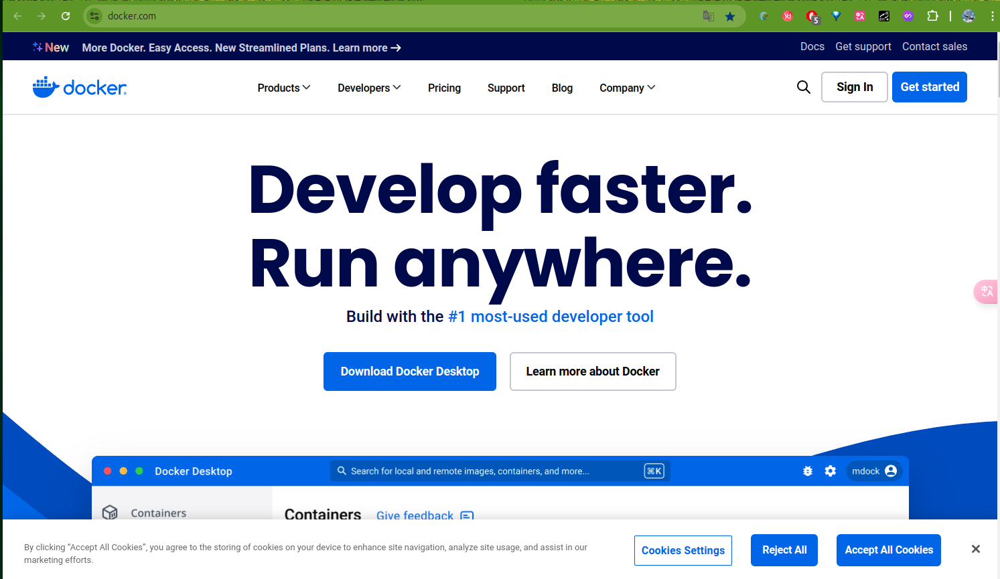
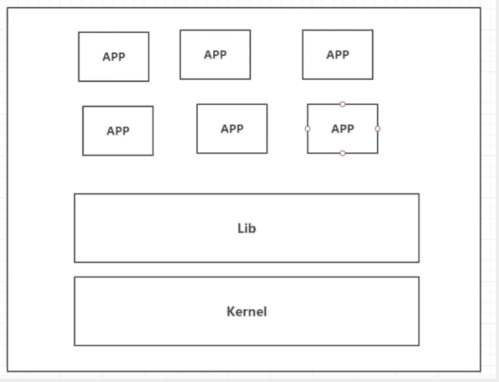
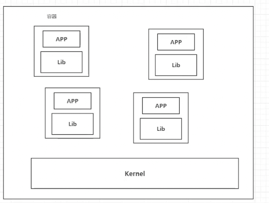

+++
title = "docker"
date = 2024-08-20T12:37:40+08:00
weight = 1
type = "docs"
description = ""
isCJKLanguage = true
draft = false

+++

# 狂神说Docker

​	B站唯一账号：遇见狂神说

​	唯一公众号：狂神说


​	给大家分享《三体》中的一句话，很有感触：弱小和无知不是生存的障碍，傲慢才是。

> Docker学习

- Docker概述

- Docker安装

- Docker命令
  - 镜像命令
  - 容器命令
  - 操作命令
  - ...

- Docker镜像
- 容器数据卷
- `Dockerfile`
- IDEA 整合Docker  -- 以上是必须掌握的
- Docker Compose
- Docker Swarm
- `CI\CD` Jenkins -- 以上是工作时必须会的


## Docker概述

### Docker为什么会出现？

​	一款产品：开发 - 上线，两套环境（应用环境，应用配置！）

​	开发 和 运维。问题：我在我的电脑上可以运行！版本更新，导致服务不可用！对于运维来说，考验就十分大！

​	环境配置是十分麻烦，每个机器都要部署环境（集群Redis、ES、Hadoop...）!费时费力。

​	发布一个项目（jar + （Redis MySQL jdk ES）），项目能不能都带上环境安装打包！

​	之前在服务器配置一个应用环境Redis MySQL jdk ES Hadoop，配置超麻烦，不能跨平台。

​	Windows，最后发布到Linux！

​	传统：开发来开发jar，运维来运维。

​	现在： 开发打包部署上线，一套流程做完！


​	java -- apk -- 发布（应用商店）-- 张三使用apk-- 安装即可用！

​	jav -- jar（环境）-- 打包项目带上环境（镜像）-- （Docker仓库：商店）-- 下载我们发布的镜像 -- 直接运行即可！


 	Docker给以上的问题，提出了解决方案！

​	

​	Docker的思想就来自于集装箱！

​	JRE -- 多个应用（端口冲突）-- 原来都是交叉的

​	隔离：Docker核心思想：打包装箱！每个箱子是相互隔离的。

​	水果，生化武器。

​	Docker通过隔离机制，可以将服务器利用到极致。

​	Tomcat、MySQL、Redis集群 都能够方便安装。

> 本质：所有技术都是因为出现了一些问题，我们需要去解决，才去学习！


### Docker的历史

​	2010年，几个搞IT 的年轻人，在美国 成立了一家公司`dotCloud`。做一些 pass的云计算服务！`LXC`有关的容器技术。他们将自己的技术（容器化技术）命名就是Docker！

​	Docker刚刚诞生的时候，没有引起行业的注意！`dotCloud`还是一家很小的公司，活不下去！于是想出`开源`！于是就在2013年开放源代码！

​	Docker越来越多的发现了docker的有点！火了，Docker每个月都会更新一个版本！

​	2014年4 日9日，Docker 1.0发布！

​	Docker为什么这么火？十分的轻巧！在容器技术出来之前，我们都是使用虚拟机技术！

​	虚拟机：在Windows装一个`VMware`，通过这个软件我们可以虚拟出来一台或者多台电脑！笨重！

​	虚拟机也是属于虚拟机技术，Docker容器及时，也是一种虚拟化技术！

​	

```sh
vm: linux centos 原生镜像（一台电脑）隔离，需要开启多个虚拟机！几个G！几分钟启动
docker：隔离，镜像（最核心的环境 4M + jdk + mysql）十分小巧，运行镜像就可以了！小巧！几个M 秒级启动
```

​	到现在，所有开发人员都必须会使用Docker！

> ​	聊聊Docker
>
> Docker是基于Go语言开发的！开源项目！
>
> 官网： [https://www.docker.com/](https://www.docker.com/)
>
> 
>
> 文档地址：[https://docs.docker.com/](https://docs.docker.com/) 详细！
>
> 镜像仓库地址：[https://hub.docker.com/](https://hub.docker.com/)

### Docker能做什么？

> 之前的虚拟机技术



​	

​	虚拟机技术缺点：

1. 资源占用十分多
2. 冗余步骤多
3. 启动很慢

> 容器化技术

​	`容器化技术是一个完整的操作系统。`



比较Docker和虚拟机技术的不同：

- 传统虚拟机，虚拟出一个硬件，运行一个完整的操作系统，然后在这个系统上安装和运行软件。
- 容器内的应用直接运行在宿主机内，容器是没有自己的内核的，也没有虚拟我们的硬件，所以就轻便了
- 每个容器间是相互隔离，每个容器内都有一个属于自己的文件系统，互不影响。


Docker 2 --> 30


> DevOps（开发、运维）

​	**应用可以更快速的交互和部署**

传统：一堆帮助文档，安装程序

Docker：打包镜像发布测试，一键运维

​	**更便捷的升级和扩缩容**

使用了Docker之后，我们部署应用就和搭积木一样！

项目打包为一个镜像，扩展 服务器A！服务器B

​	**更简单的系统运维**

在容器化之后，我们的开发、测试环境高度一致的。

​	**更高效的计算资源利用**

​	1核2G的服务器 --> 可运行多个容器

​	Docker是内核级别的虚拟化，可以在一个物理机上运行多个容器实例！服务器的性能可以被压榨到极致！


​	只要学不死，就往死里学！

## Docker安装


**镜像（image）:**

Docker镜像就好比是一个模板，可以通过这个模板来创建容器服务，tomcat镜像 --> run --> tomcat01容器（提供服务器），通过这个镜像可以创建多个容器（最终服务运行或者项目运行就是在容器中的）。


**容器（container）**

Docker利用容器技术，独立运行一个或者一组应用，通过镜像来创建的。

启动、停止、删除，基本命令

目前可以把这个容器理解为就是一个简易的Linux系统。

**仓库（repository）:**

仓库就是存放镜像的地方

仓库分为公有仓库和私有仓库

Docker Hub（默认是国外的）

阿里云....都有容器服务器（配置镜像加速）。

### 安装Docker

> 环境准备

1. 需要会Linux基础
2. Ubuntu 24.04
3. 使用`Xshell`连接远程服务器进行操作

> 环境查看

```sh
lx@lxm:~$ uname -r
6.8.0-47-generic
lx@lxm:~$ cat /etc/os-release 
PRETTY_NAME="Ubuntu 24.04.1 LTS"
NAME="Ubuntu"
VERSION_ID="24.04"
VERSION="24.04.1 LTS (Noble Numbat)"
VERSION_CODENAME=noble
ID=ubuntu
ID_LIKE=debian
HOME_URL="https://www.ubuntu.com/"
SUPPORT_URL="https://help.ubuntu.com/"
BUG_REPORT_URL="https://bugs.launchpad.net/ubuntu/"
PRIVACY_POLICY_URL="https://www.ubuntu.com/legal/terms-and-policies/privacy-policy"
UBUNTU_CODENAME=noble
LOGO=ubuntu-logo
lx@lxm:~$ 
```


> 安装

帮助文档：

- [https://docs.docker.com/engine/install/ubuntu/](https://docs.docker.com/engine/install/ubuntu/)

```sh
# 


```


